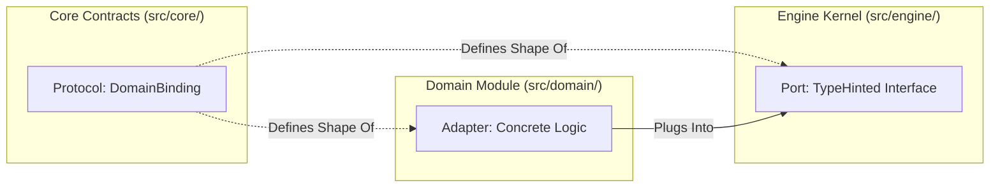
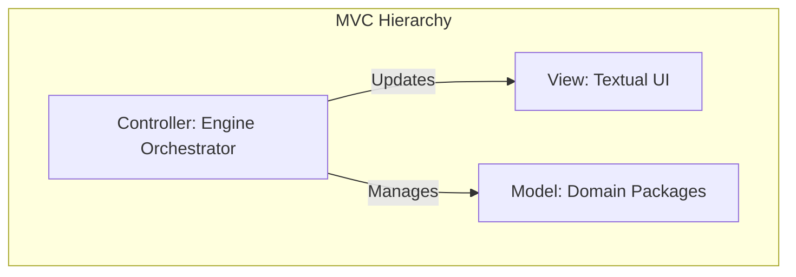
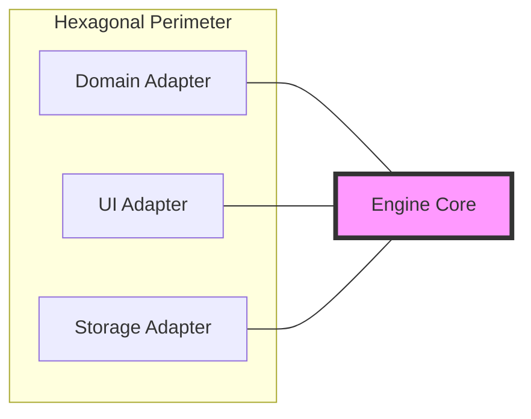

# Architectural Disambiguation

This document provides deep dives into the architectural concepts used in the Oregon Trail engine, focusing on disambiguating similar terms and explaining how multiple patterns (like MVC and Hexagonal) work together.

## 1. The Connective Lexicon: Plugs, Ports, and Adapters

In software engineering, these terms are often used interchangeably, but they have precise roles within a modular system. In this project, we use them to define how the **Engine (The Kernel)** talks to the **Domain (The Plugins)**.

| Term | Analogy | Project Context | Classification | Role |
| :--- | :--- | :--- | :--- | :--- |
| **The Protocol** | The **Plug-Shape** (Physical pins). | `src/core/contracts/domain/binding.py` | **Structural Pattern** | **Definition**: The technical blueprint for the connection. |
| **The Port** | The **Socket** (Hole in the wall). | The `DomainBinding` type hint in `src/engine/`. | **Hexagonal Architecture** | **Usage**: The functional entry point in the Engine. |
| **The Adapter** | The **Plug** (The specific device). | Your **Domain Packages** (e.g., `health`, `character`). | **Hexagonal Architecture** | **Implementation**: The concrete logic that fills the Port. |

### Visualizing the Connection



---

## 2. MVC vs. Hexagonal (Hybrid Architecture)

The Oregon Trail engine uses **Hexagonal Patterns** *inside* an **MVC Structure**. They are not mutually exclusive; instead, they work together to protect the internal layers of the application.

### MVC: The "Hierarchy" Pattern
MVC organizes code by **Internal Responsibility**. It tells us *what* a component is and how the layers are stacked.
- **The Engine (Controller)**: Sits "on top" and coordinates the flow.
- **The Domain (Model)**: Sits "below" and holds the data and logic.
- **The UI (View)**: Handles the presentation of the game state.



### Hexagonal: The "Perimeter" Pattern
Hexagonal (Ports & Adapters) organizes code by **External Boundary**. It tells us *how* components talk to each other through the system's "perimeter," ensuring that the **Core** remains isolated from its **Dependencies**.
- **The Core (Engine)**: Sits in the "middle" and defines **Ports** (Protocols).
- **The World (Domains/UI)**: Sits "outside" the core and provides **Adapters** (Plugins).



### The "Hybrid" Mapping in Oregon Trail

In this project, the layers map to each other to provide the clarity of MVC with the isolation of Hexagonal.

| Component | MVC Role | Hexagonal Role | Why this combination? |
| :--- | :--- | :--- | :--- |
| **Engine Kernel** | **Controller** | **The Core** | Orchestrates flow without knowing domain secrets. |
| **Domain Packages** | **Model** | **Adapters** | Holds logic (Health, Wagon) as pluggable modules. |
| **UI Components** | **View** | **Adapter** | Decouples the presentation layer from the core math. |
| **Protocols (UDB)** | **Contract** | **The Port** | The "Socket" that connects the two. |

```mermaid
graph TD
    subgraph "Hybrid Architecture"
        Kernel[Engine Kernel / Core]
        Binding[Domain Binding / Port]
        Domain[Domain Module / Adapter]
    end

    Kernel -->|Orchestrates| Binding
    Binding <|--| Domain
```

---

## 3. Nominal vs. Structural Typing

The "Domain Protocol" relies on **Structural Typing** to enforce its contracts.

### Nominal Typing (Traditional)
In languages like Java or C#, a class is only "of a type" if it explicitly says `implements MyInterface`. This is **Nominal** (named) typing. It is rigid and requires the domain to "know" about the interface by name.

### Structural Typing (The "Plug-Shape")
In Python, we use `typing.Protocol` for **Structural Typing** (also known as Static Duck Typing). A domain module is a "valid adapter" if it simply has the required methods (`orchestrate` and `transform`). 
- **The Benefit**: This allows the Engine to be completely agnostic of the Domain's identity. It only cares about the "Plug-Shape."
- **The Law**: "If it walks like a duck and quacks like a duck, the Engine can run it like a duck."
