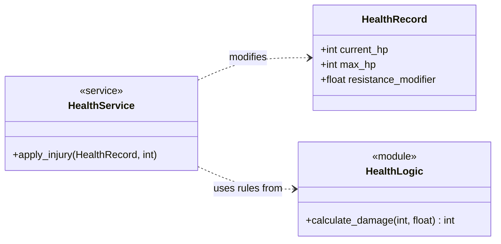

# Domain Service Pattern

The Domain Service pattern is a cornerstone of Domain-Driven Design (DDD). It is used when an operation or calculation doesn't naturally belong to a single "thing" (Entity), or when it involves complex business rules that would clutter your data-focused classes.

In this architecture, we further divide domain logic into two distinct roles: **Pure Logic** and **Coordinating Services**.

## 1. The Service-Logic Distinction

| Role | Responsibility | Location | Characteristics |
| :--- | :--- | :--- | :--- |
| **Logic (The "Rules")** | Pure math, stateless rules, and physics. | `logic.py` | Functional, No side effects, Zero dependencies. |
| **Service (The "Hand")** | State management, cross-service coordination. | `service.py` | Stateful, Modifies models, Injected dependencies. |

### Logic: The "Rules of Physics" (`logic.py`)
These are pure functions. They take data in, perform a calculation, and return a result. They do not care about the ServiceContainer or other domains.

```python
# src/domain/health/logic.py

def calculate_damage_after_resistance(base_damage: int, resistance: float) -> int:
    """Pure math: calculates damage reduction."""
    reduction = int(base_damage * resistance)
    return max(0, base_damage - reduction)

def is_critically_low(current_hp: int, max_hp: int) -> bool:
    """Pure rule: determines if state is critical."""
    return (current_hp / max_hp) < 0.2
```

### Service: The "Orchestrator" (`service.py`)
The Service is the entry point for the Engine. It coordinates state changes and uses the pure functions from `logic.py` to apply the rules of the game.

```python
# src/domain/health/service.py
from .models import HealthRecord
from . import logic

class HealthService:
    def apply_injury(self, record: HealthRecord, base_damage: int):
        """Coordinates a state change using pure logic."""
        # 1. Use pure logic for the math
        final_damage = logic.calculate_damage_after_resistance(
            base_damage, 
            record.resistance_modifier
        )
        
        # 2. Perform the state change (Side effect)
        record.current_hp -= final_damage
        
        # 3. Coordinate further actions if needed
        if logic.is_critically_low(record.current_hp, record.max_hp):
            self._notify_critical_status(record)
```

## 2. Implementation: The Relationship Structure

In this pattern, your Entities hold the identity and raw data, while the Service holds the verbs and coordination.



## 3. Why this fits your "Contract-First" and TDD approach

By separating logic from services, you gain two levels of testing:
1.  **Unit Tests for Logic:** Extremely fast, zero-setup tests for the "physics" of your game.
2.  **Integration Tests for Services:** Verifies that state changes and coordination happen correctly.

Example TDD Test for Logic:

```python
def test_damage_calculation():
    # No mocks, no setup, just pure math
    assert logic.calculate_damage_after_resistance(10, 0.5) == 5
```

## 4. Hierarchy and Dependency Injection

To avoid "Service Locator" anti-patterns, Services must never access the `ServiceContainer` directly. Instead, dependencies (like other services) are injected via the constructor by the **ServiceProvider**.

*   **Logic**: Zero dependencies.
*   **Service**: Injected dependencies (Protocols).
*   **ServiceProvider**: The "Glue" that resolves dependencies from the container.

## Summary

1.  **Logic** defines the *rules*.
2.  **Models** store the *state*.
3.  **Services** apply the *rules* to the *state*.
