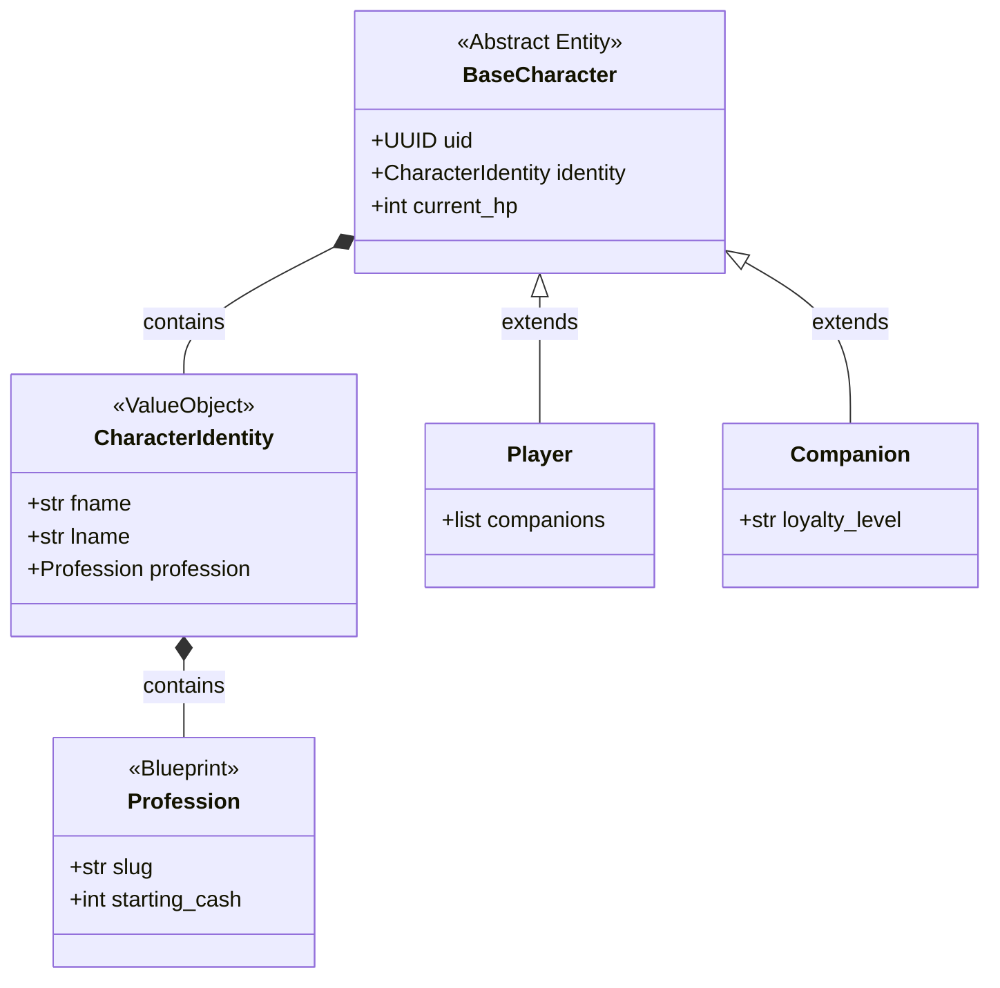
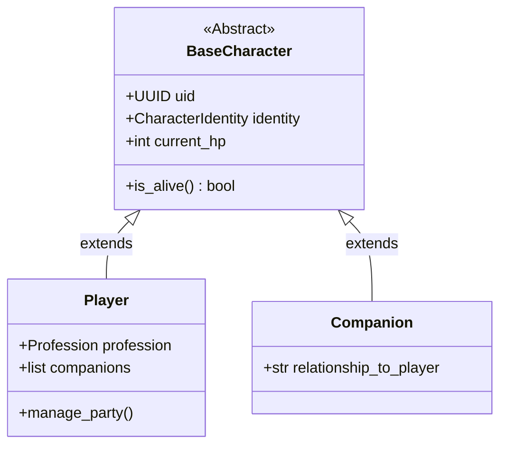
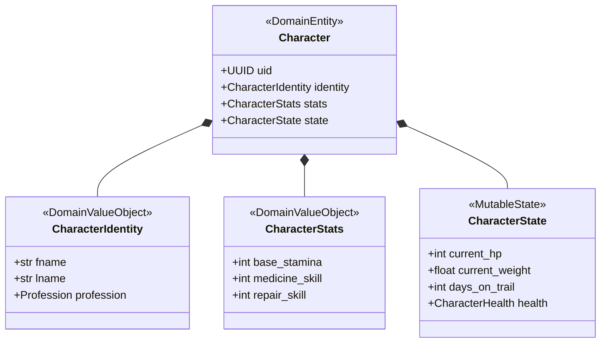
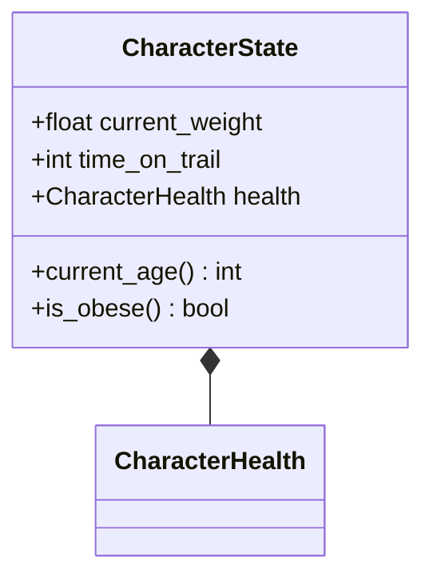
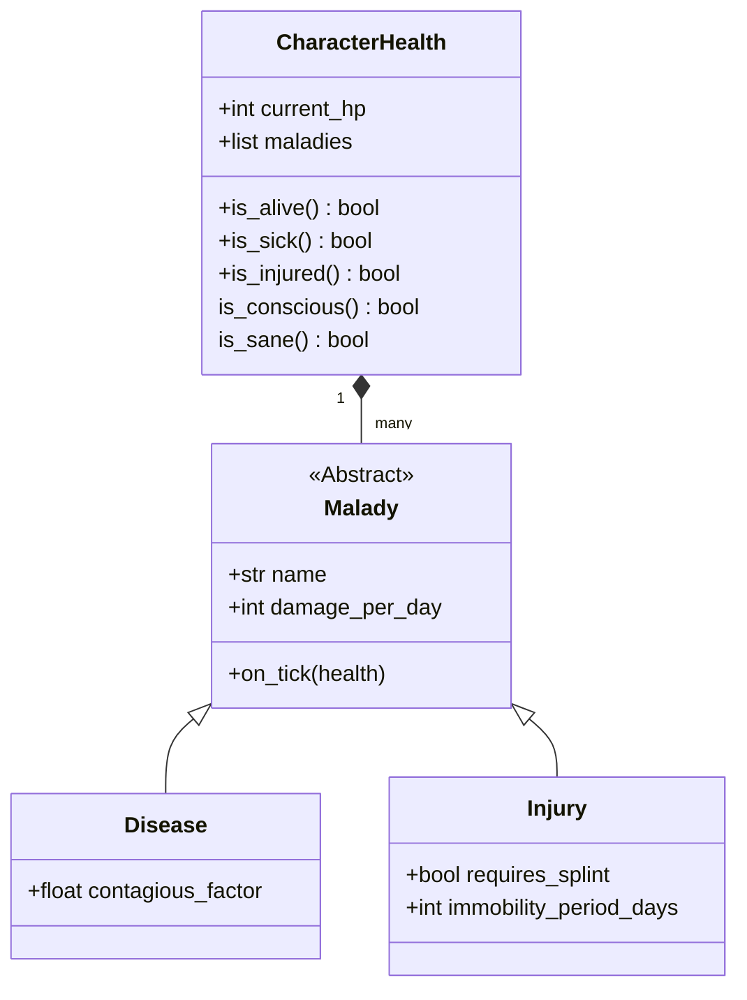
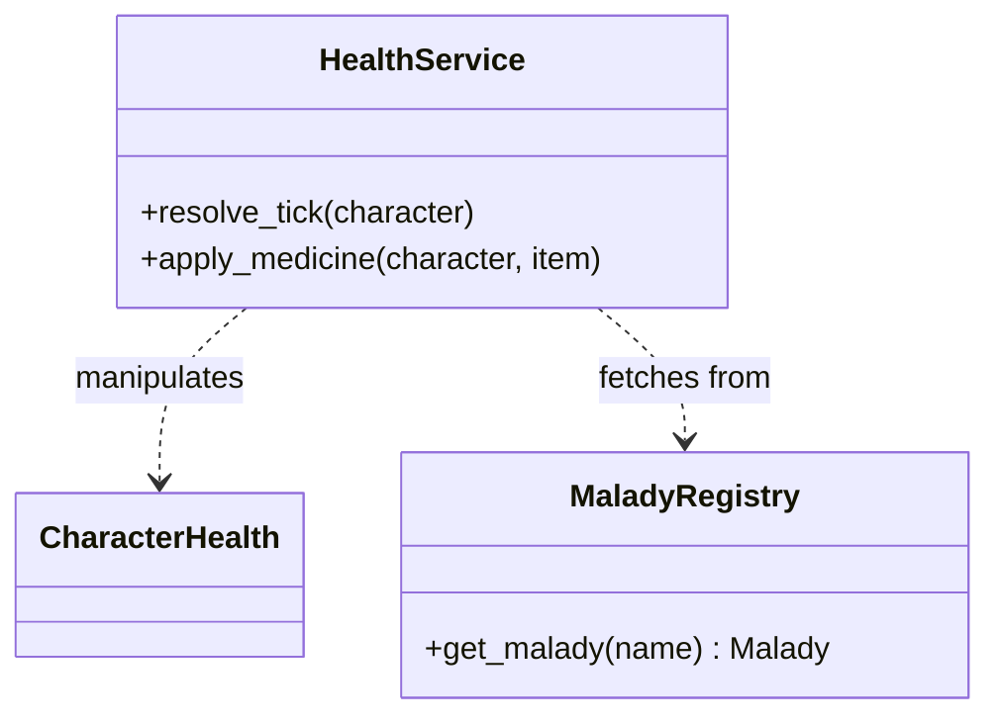
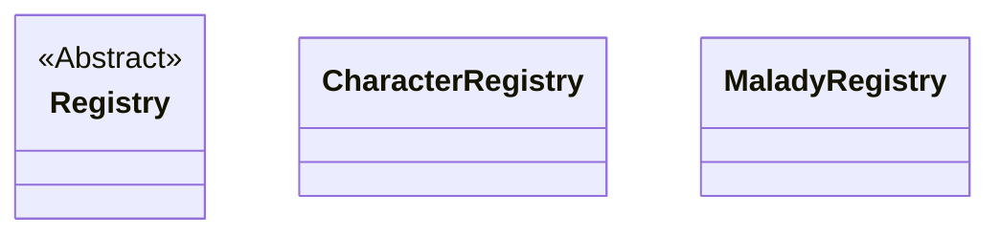
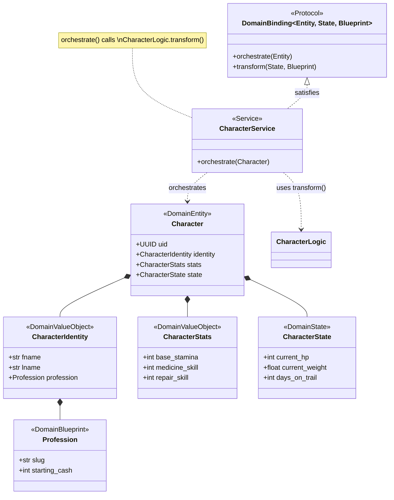
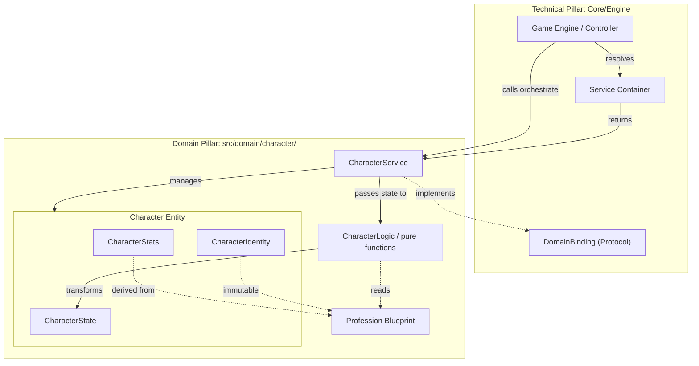

# Game Character Domains and Systems

## Charater Identity

### Questions

1. Should we treat `age` as an *indentity* or *state* property? 
> * `age` is a derived property from DOB

### Character DataClasses

### Notes

### Questions

1. Do we need to track coordinates/location?
    - Are coordinates/location part of "State"? Yes

## Character / player Relationship

## Top-Level Character diagram

> NOTE: Separation of Concerns
> * Stats represent Potential: *What can entity DO?*
> * Identity is static: *Who an entity IS?*
> * State is mutable: *How is an entity DOING?*

## Physical and Temporal Systems

## Medical and Malady System

### Health Infrastructure

## Infrastructural Entities

## Domain Binding

---

### Relationships and Technical Implementation

## Service Providers

> ## TODOs
> * Declare abstract Service
> * Declare abstract Protocol
