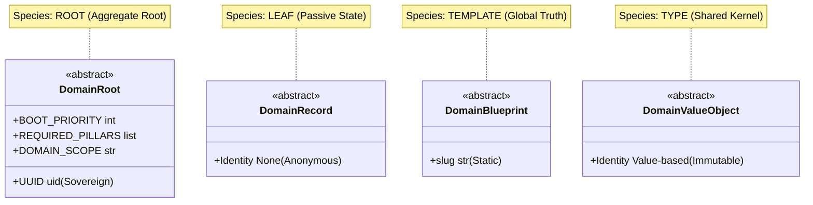
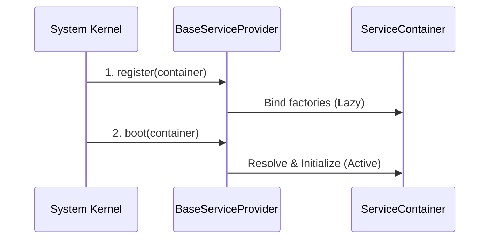
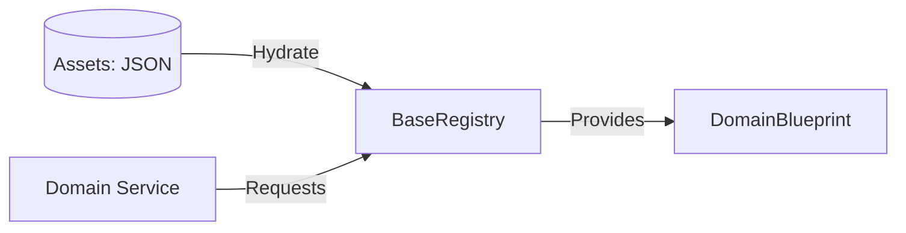
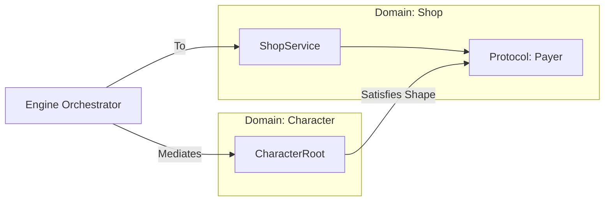

# Domain Contracts Design (The Spec)

This document defines the core contracts and interfaces that govern the **Taxonomy** and **Anatomy** of the Oregon Trail domain layer, as established in **ADR 001 through 007**.

## 1. The Fundamental Unit: The Package (ADR 004)
The fundamental unit of the domain is the **Package**, not a base entity class. Each package (e.g., `health`, `character`) is a Sovereign Bounded Context defined by its **Anatomy** and **Taxonomic Signatures**.

### Taxonomic Signatures (ADR 006)
Every domain package must declare its "Species" and "Intent" within its `__init__.py` facade to be discoverable by the System Kernel.

| Signature | Role | Example |
| :--- | :--- | :--- |
| `__DOMAIN_SPECIES__` | Structural Validation | `"ROOT"` or `"LEAF"` |
| `__DOMAIN_INTENT__` | Screaming Intent | `"Manage Character Vitality"` |
| `__SERVICE_PROVIDER__` | Bootstrap Pointer | `"health.providers.HealthProvider"` |
| `__all__` | Encapsulation | List of exported Nouns and Verbs. |

---

## 2. Domain Taxonomy (The Species)
Taxonomy is enforced through inheritance from core contracts in `src/core/contracts/domain/`. There is no common "DomainEntity" base; classes inherit the specific behavior required by their role (ADR 002, 005).



### Contract Specifications (ADR 005)

| Contract | Identity | Scope | Responsibility |
| :--- | :--- | :--- | :--- |
| **DomainRoot** | UUID | Aggregate Root | The Sovereign "Actor". Anchors a Bounded Context. |
| **DomainRecord** | None | Leaf State | Anemic, anonymous state fragments (Atoms). |
| **DomainBlueprint** | Slug | Template | Static "Global Truth" loaded from JSON. |
| **DomainValueObject** | Value | Shared Kernel | Semantic types (Money, Coord) in `domain/common`. |

---

## 3. Infrastructure Contracts
These contracts define the lifecycle and discovery mechanisms used by the **System Kernel** (ADR 006, 007).

### A. BaseServiceProvider
Manages the two-phase (Register -> Boot) lifecycle of a domain package.

**Path:** `src/core/contracts/provider.py`



### B. BaseRegistry
The exclusive provider of **DomainBlueprints**.

**Path:** `src/core/contracts/domain/registry.py`



---

## 4. Interaction via Duck Typing (ADR 002, 003)
Lateral interaction between Roots is strictly decoupled. Roots define their requirements via **Structural Protocols** rather than importing siblings.

```python
# Defined at the top of services.py in the consuming Root
class Payer(Protocol):
    balance: int
    def deduct(self, amount: int) -> bool: ...
```


