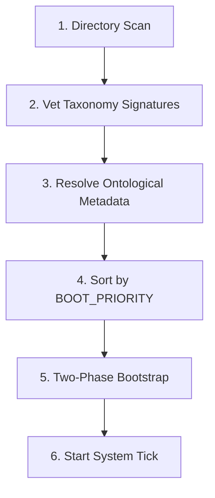
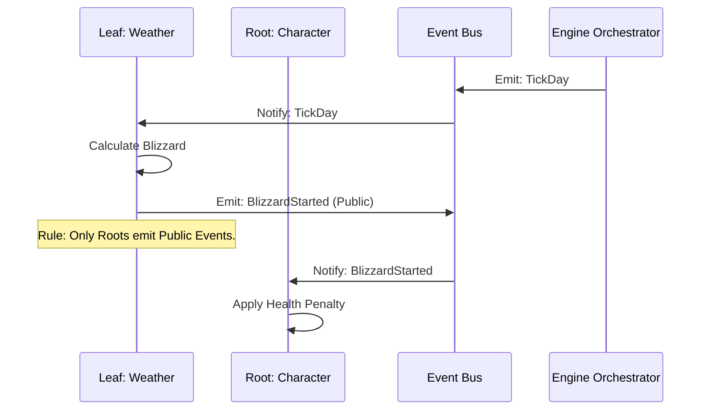
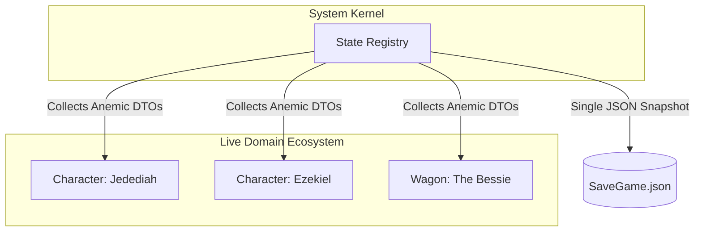
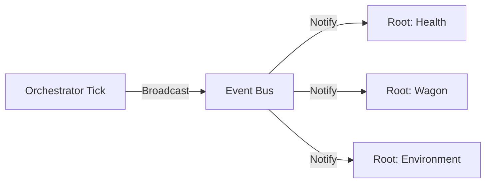

# Engine Orchestration Design (The Controller)

The Engine is the "Conductor" of the Oregon Trail ecosystem. It manages the lifecycle, movement, and interaction of domain packages while enforcing architectural boundaries (ADR 001, 006, 007).

## 1. The Domain Orchestrator (The Conductor)
The Orchestrator is the active component within the System Kernel that oversees the "Movement and Sequence" of the game world.

**Path:** `src/engine/orchestrator.py`

### Responsibilities
1. **Awareness:** Scans the `domain/` directory for `__DOMAIN_SPECIES__`.
2. **Registration:** Invokes `register()` on all `__SERVICE_PROVIDER__` classes.
3. **Sequencing:** Boots providers in order of their `BOOT_PRIORITY`.
4. **Mediation:** Facilitates Root-to-Root interaction via Structural Protocols.

---

## 2. The Nervous System (Event Bus)
The Event Bus allows decoupled interaction between sovereign domains. Siblings react to the "Environment" rather than calling each other directly (ADR 007).

**Path:** `src/core/events.py`

### Event Ownership Rules
- **Sovereignty:** Only a **Root Service** is allowed to broadcast a Public Event.
- **Silence:** Leaves must report changes to their parent Root; they remain silent to the outside world.

---

## 3. World State (State Registry)
The State Registry collects snapshots of every active `DomainRoot` for total serializability and "Save Game" functionality (ADR 003, 007).

**Path:** `src/engine/registry.py`

---

## 4. The Heartbeat (System Tick)
The Ecosystem relies on the progression of time. The Orchestrator emits a **Broadcast Event** to trigger "Metabolic" needs across all Roots.

- **Tick Priority:** Ties back to `BOOT_PRIORITY`. Ensures "Weather" is calculated before "Health" is penalized.
