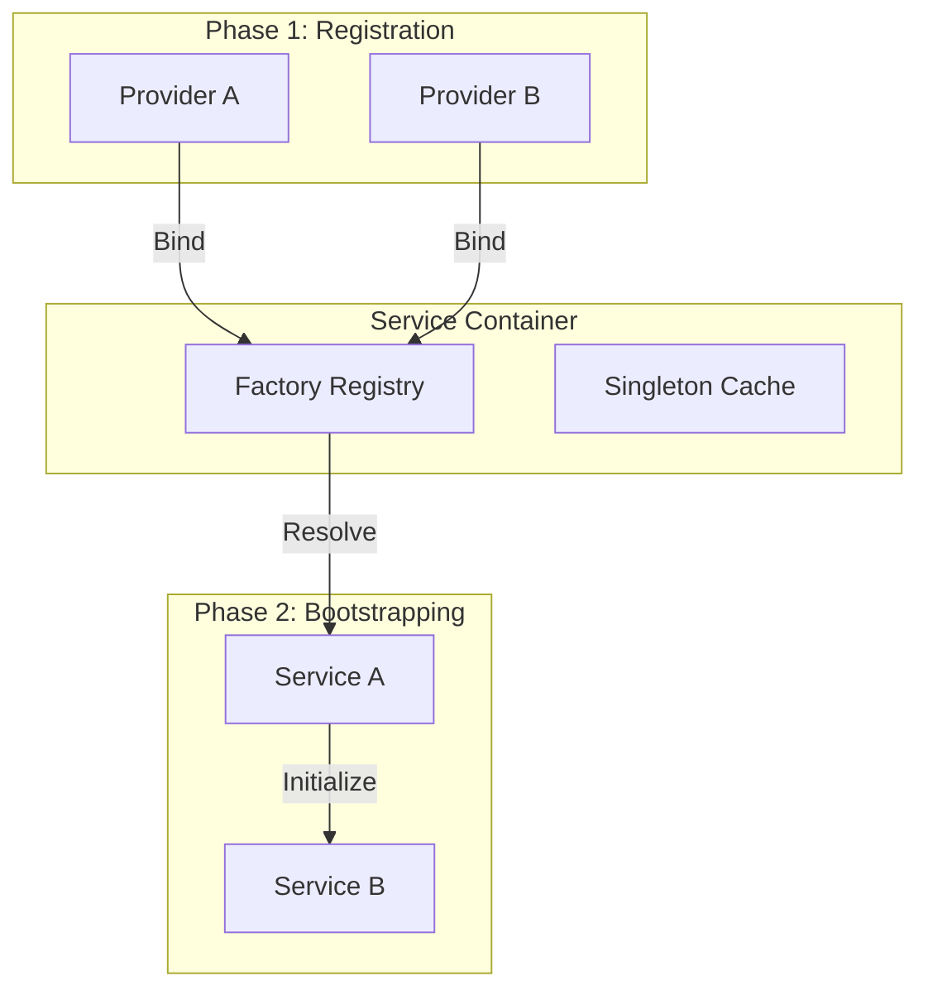

# System Kernel Design (The Spec)

The Kernel is the "Laws of Physics" for the Oregon Trail ecosystem. It provides the contracts and mechanisms for dependency injection, system bootstrapping, and boundary enforcement (ADR 001, 006).

## 1. The Service Container (The Hub)
The `ServiceContainer` is the central registry for all system and domain services. It enforces a strict "Register-then-Boot" lifecycle.

**Path:** `src/core/container.py`



### Lifecycle Enforcements
1. **Lazy Registration:** Factories are bound to the container during `register()`. No side effects are allowed.
2. **Deterministic Boot:** Services are instantiated during `boot()`. Resolution errors (missing dependencies) are caught here.
3. **Immutability:** Once the `boot` phase begins, no new services can be registered.

---

## 2. Pillar Isolation (Boundary Patterns)
The Kernel acts as the "Protective Shell" (Ports & Adapters) around the Screaming MVC core.

| Pillar | Role | Analogy | Boundary Rule |
| :--- | :--- | :--- | :--- |
| **Core (Spec)** | The Law. | `/etc/` / Kernel Specs | Shared by all; depends on none. |
| **Domain (Model)**| The Logic. | `/bin/` / Binaries | Pure logic zone. Forbidden from I/O. |
| **Engine (Controller)** | The Admin. | `init` / `systemd` | Orchestrates pillars. Manages lifecycle. |
| **UI (View)** | The TTY. | `stdout` / TTY | Agnostic of business math. |
| **Storage (Adapter)**| The Disk. | Block Device | Persistence mapping. Agnostic of logic. |

---

## 3. Dependency Guarding (Ontology)
The Kernel uses Ontological metadata defined in `DomainRoot` to ensure the system boots safely (ADR 006).

```mermaid
flowchart TD
    Check[Kernel Boot Check] --> Pillars{REQUIRED_PILLARS Healthy?}
    Pillars -- No --> Fail[Abort: System Error]
    Pillars -- Yes --> Sequence[Resolve Sequence via BOOT_PRIORITY]
    Sequence --> Boot[Call boot() on Provider]
```

### Required Pillars
If a domain requires `"Persistence"`, the Kernel verifies that the `StorageAdapter` is initialized and reachable before allowing the domain to wake up. This acts as a "Safety Fuse" to prevent the game from running in a corrupted or unstable state.
