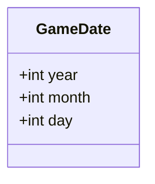

# Game World Domains

## Global Dataclasses

### Questions

1. What years will the game take place?
    - What rate will time progress?
    - What min and max year will we permit?

### Proposed Game Properties

