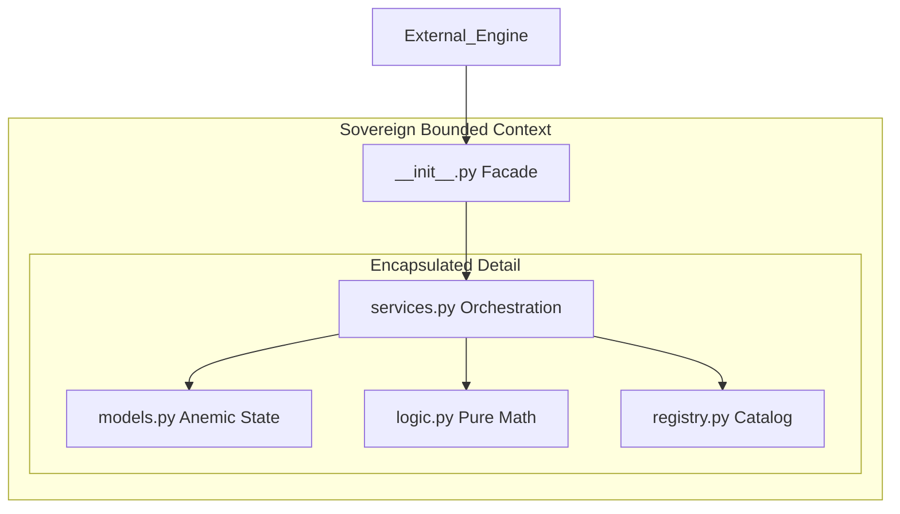
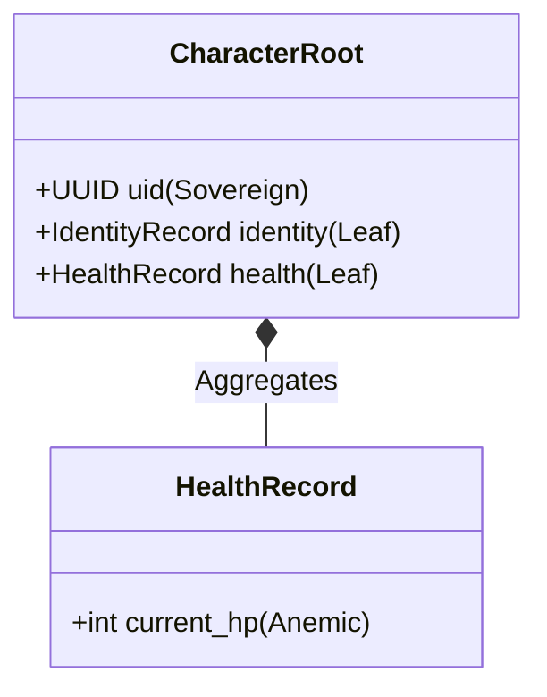

# Domain Layer Design (The Model)

The Domain layer is the "Screaming" heart of the game, organized into Sovereign Bounded Contexts. It follows the principles of **Anemic Aggregates** and **Structural Sibling** organization (ADR 001, 003, 004).

## 1. Package Anatomy (ADR 004)
Each domain package is a "Sovereign Bounded Context" with a strict internal structure that separates State, Math, and Orchestration.

**Path:** `src/domain/<package_name>/`

### Component Roles

| Component | File | Role | Behavioral Rule |
| :--- | :--- | :--- | :--- |
| **Model** | `models.py` | The Resource. | Pure DTOs. Zero logic. Inherits from `DomainRoot`/`DomainRecord`. |
| **Logic** | `logic.py` | The Metabolism. | Pure, stateless functions. The "Math" of the domain. |
| **Service** | `services.py` | The General. | Coordinates flow. Feeds Models into Logic. |
| **Registry** | `registry.py` | The Catalog. | Manages `DomainBlueprints` (Templates). |
| **Facade** | `__init__.py` | The Voice. | Manages Discovery and Encapsulation via `__all__`. |

---

## 2. Hierarchy & Sovereignty (ADR 003)
Packages are physically flat on the filesystem but logically hierarchical.

| Species | Directory | Responsibility |
| :--- | :--- | :--- |
| **Leaf** | `src/domain/leaves/` | **Atoms.** Granular, standalone logic (e.g., health, stats). |
| **Root** | `src/domain/roots/` | **Assemblies.** Aggregates multiple Leaf Records into a single identity. |

### Vertical Composition (Allowed)
Roots can explicitly import Leaf models to create complex data structures.

### Horizontal Isolation (Forbidden)
Roots cannot directly import other Roots. Leaves cannot import siblings. Interaction is handled via **Protocols** and mediated by the **Engine Orchestrator**.

---

## 3. Ontological Signatures (ADR 006)
To be recognized by the Kernel, every package must declare its "Nature of Being" in its `__init__.py` and `models.py`.

### Package-Level (Taxonomy)
Defined in `src/domain/<package>/__init__.py`:
- `__DOMAIN_SPECIES__`: `"ROOT"` or `"LEAF"`.
- `__DOMAIN_INTENT__`: Human-readable "Scream" of purpose.
- `__SERVICE_PROVIDER__`: Pointer to the `BaseServiceProvider` implementation.

### Class-Level (Ontology)
Defined in the `DomainRoot` class in `models.py`:
- `BOOT_PRIORITY`: Sequence control (e.g., Map: 1, Character: 5).
- `REQUIRED_PILLARS`: List of kernel services required (e.g., `["Events"]`).
- `DOMAIN_SCOPE`: `"Global"` vs `"Scene"` lifecycle.
