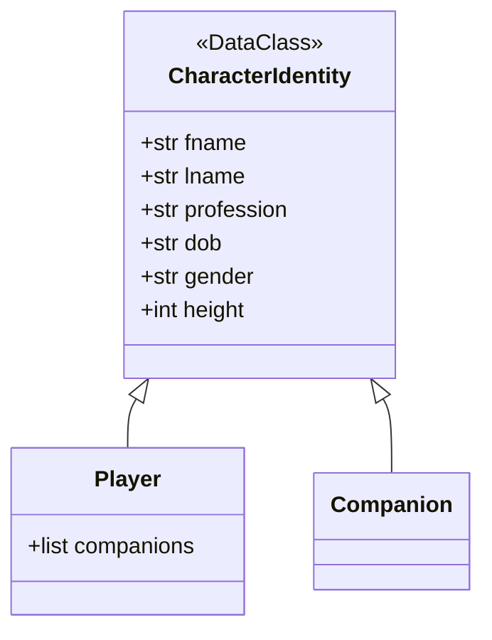
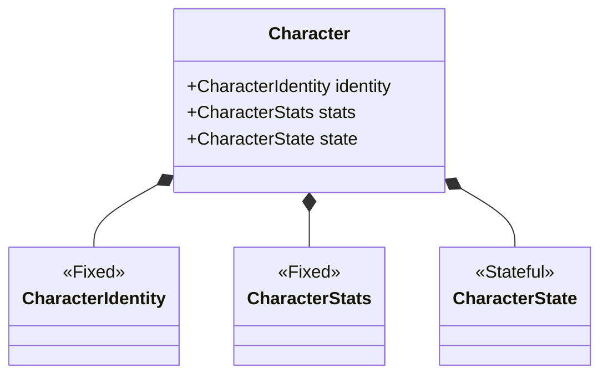
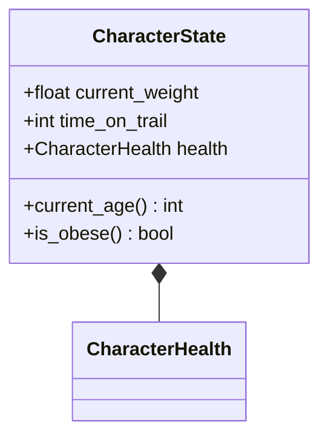
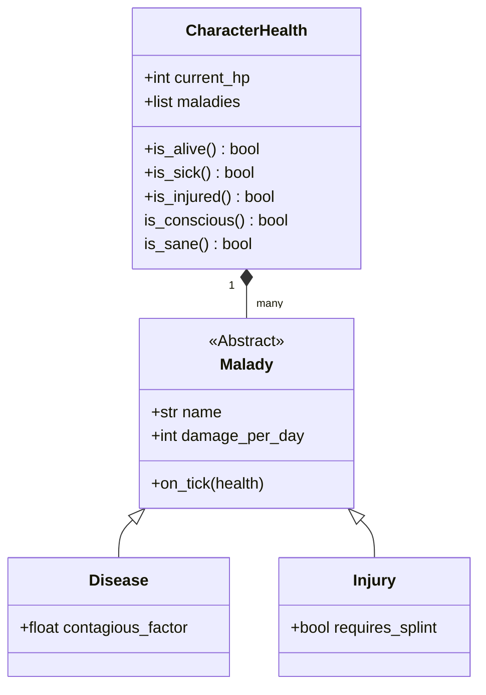
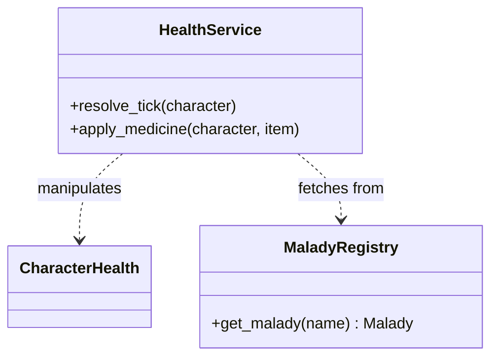
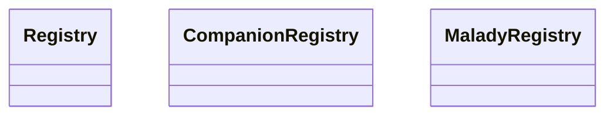

# Game Character Domains and Systems

## Charater Identity

### Questions

1. Should we treat `age` as an *indentity* or *state* property? 
> * `age` is a derived property from DOB

### Character DataClasses

### Notes

### Questions

1. Do we need to track coordinates/location?
    - Are coordinates/location part of "State"? Yes

## Top-Level Character diagram

## Physical and Temporal Systems

## Medical and Malady System

### Health Infrastructure

## Infrastructural Entities

## Service Providers