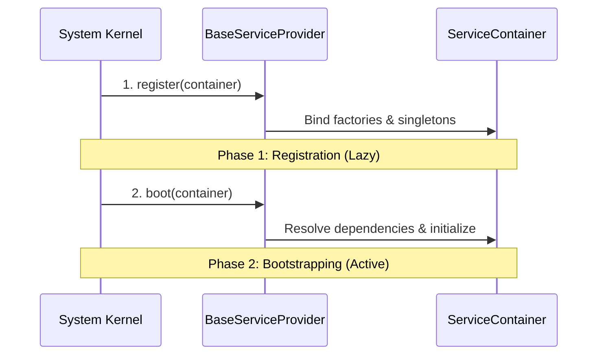
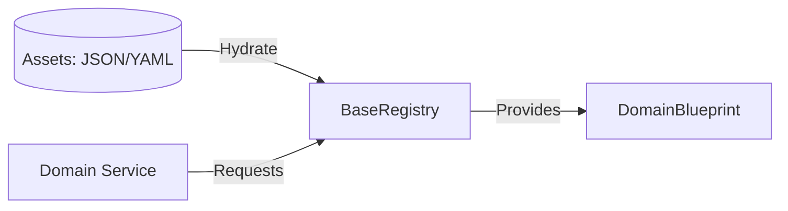
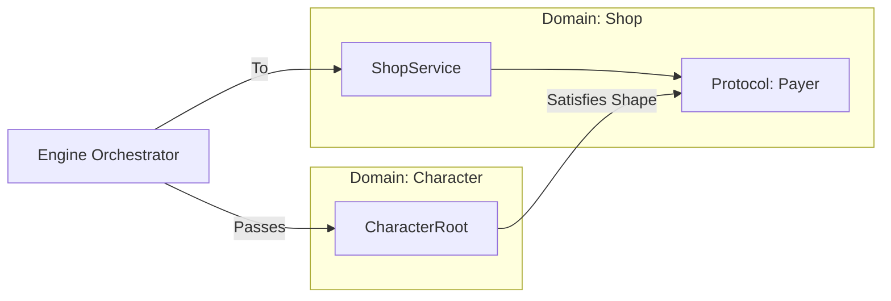

# Domain Contracts Design (The Spec)

This document defines the core contracts and interfaces that govern the **Taxonomy** and **Anatomy** of the Oregon Trail domain layer, as established in **ADR 002, 004, and 005**.

## 1. Domain Taxonomy (The Species)
Taxonomy defines "What a thing is" through nominal typing (inheritance) and structural constraints. All core contracts reside in `src/core/contracts/domain/`.

```mermaid
classDiagram
    class DomainEntity {
        <<abstract>>
        +UUID uid
        +dict metadata
    }
    class DomainRoot {
        <<abstract>>
        +UUID uid (Sovereign)
        +BOOT_PRIORITY int
        +REQUIRED_PILLARS list
        +DOMAIN_SCOPE str
    }
    class DomainRecord {
        <<abstract>>
        +Identity None (Anonymous)
    }
    class DomainBlueprint {
        <<abstract>>
        +slug str (Static)
    }
    class DomainValueObject {
        <<abstract>>
        +Identity Value-based (Immutable)
    }

    DomainEntity <|-- DomainRoot : "Taxonomy: ROOT"
    DomainEntity <|-- DomainRecord : "Taxonomy: LEAF"
    DomainEntity <|-- DomainBlueprint : "Taxonomy: TEMPLATE"
    DomainEntity <|-- DomainValueObject : "Taxonomy: TYPE"
```

### Contract Specifications

| Contract | Role | Key Constraint |
| :--- | :--- | :--- |
| **DomainRoot** | The Sovereign "Actor". | Must have a unique UUID. Anchors a Bounded Context. |
| **DomainRecord** | The Anemic "Status". | Passive data fragment. Identity is derived from its parent Root. |
| **DomainBlueprint** | The Global "Truth". | Read-only template loaded from assets. Never modified at runtime. |
| **DomainValueObject** | Semantic "Types". | Immutable. Replaced entirely when changed (e.g., Money, Coord). |

---

## 2. Infrastructure Contracts
These contracts define how the system discovers and interacts with the domain layer.

### A. BaseServiceProvider (ADR 006)
Every domain package must be associated with a Service Provider that manages its lifecycle within the `ServiceContainer`.

**Path:** `src/core/contracts/provider.py`



### B. BaseRegistry (ADR 005)
The Registry is the exclusive provider of **DomainBlueprints**. It prevents hardcoded "magic numbers" in the domain logic.

**Path:** `src/core/contracts/domain/registry.py`



---

## 3. Interaction Contracts (Structural Protocols)
To prevent circular dependencies between Roots, interaction is handled via **Static Duck Typing** (ADR 002, 003).

**Path:** `src/domain/common/contracts.py` (Shared) or top of `services.py` (Local).

```python
# Example: Shop Root defines what it needs from a Buyer
class Payer(Protocol):
    balance: int
    def deduct(self, amount: int) -> bool: ...
```


