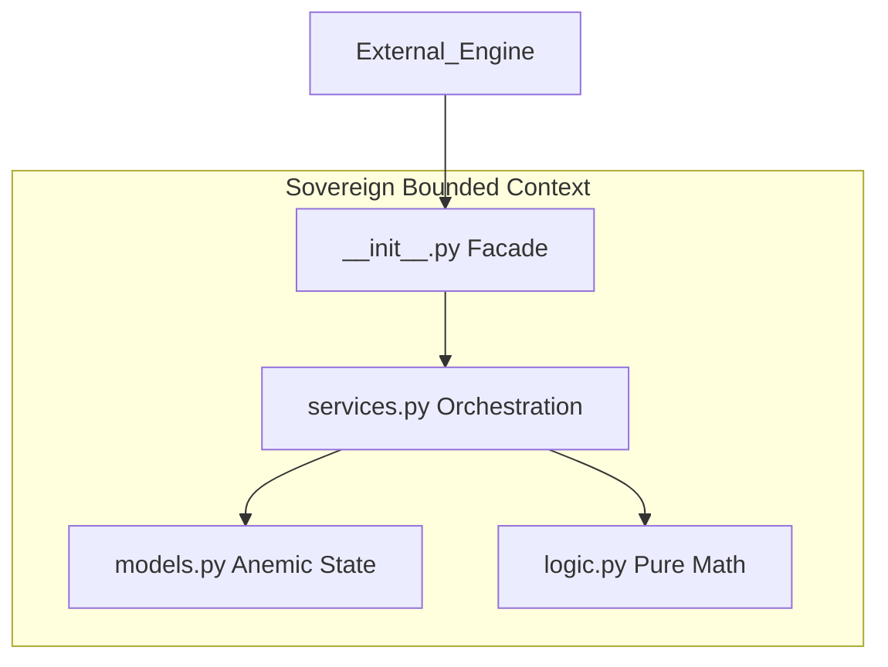
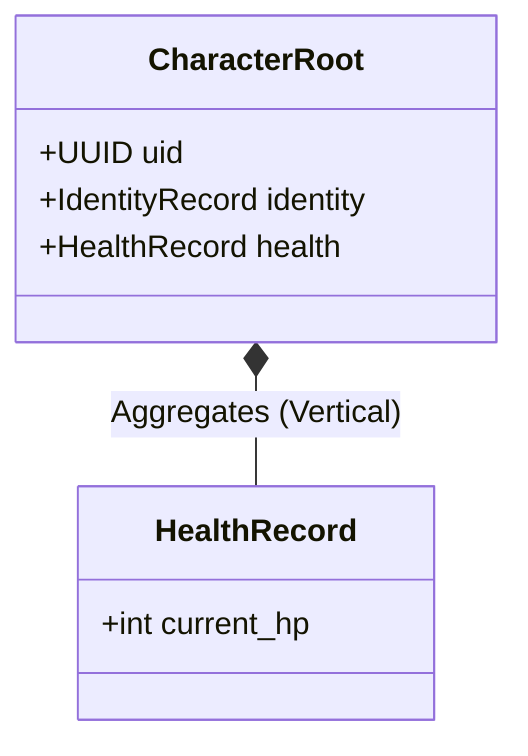
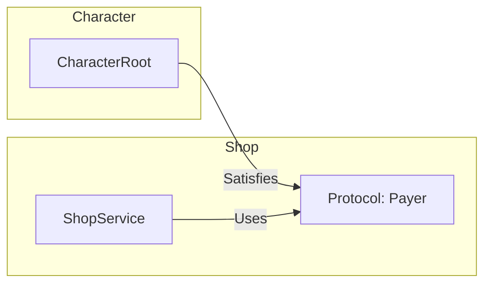

# Domain Layer Design (The Model)

The Domain layer is the "Screaming" heart of the game, organized into Sovereign Bounded Contexts.

## 1. Package Anatomy
Each domain package (e.g., `health`, `character`) follows a strict internal structure to maintain **Anemic Symbiosis**.

**Path:** `src/domain/<package_name>/`

| Component | Responsibility | Rule |
| :--- | :--- | :--- |
| **Model** | Holds data only. | Anemic DTO. No logic. |
| **Logic** | Transforms data. | Pure, stateless functions. |
| **Service** | Coordinates flow. | Singleton. Feeds Model to Logic. |
| **Facade** | The "Voice". | Flattened API for external use. |

## 2. Taxonomy (Roots vs. Leaves)
The filesystem hierarchy distinguishes between atoms and assemblies.

| Type | Directory | Rule |
| :--- | :--- | :--- |
| **Leaf** | `src/domain/leaves/` | **Zero-Dependency.** Cannot import other siblings. |
| **Root** | `src/domain/roots/` | **Vertical Composition.** Aggregates Leaf Records. |

**Composition Example:**

## 3. Lateral Interaction (Protocols)
To prevent circular imports between Roots, interaction is handled via **Static Duck Typing**.

**Path:** `src/domain/common/contracts.py`

**Implementation Directive:**
- Use `typing.Protocol` to define the "Shape" required.
- The Engine Orchestrator passes the Root across the boundary if it matches the protocol.
