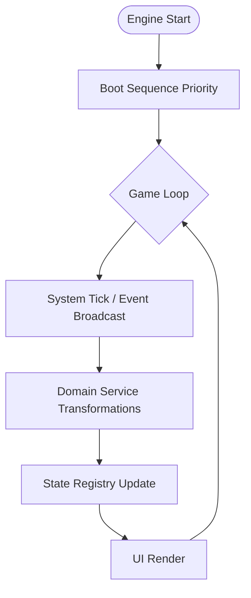
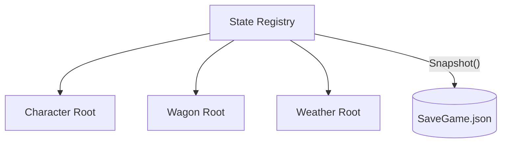

# Engine Orchestration Design (The Controller)

The Engine is the "Brain" of the game, responsible for movement, sequence, and system-wide signals.

## 1. Engine Orchestrator
The Orchestrator coordinates the lifecycle and the interaction between independent Domain Roots.

**Path:** `src/engine/orchestrator.py`

## 2. Event Bus (The Nervous System)
Facilitates decoupled communication across the ecosystem.

**Path:** `src/core/events.py`

| Rule | Description |
| :--- | :--- |
| **Sovereignty** | Only Roots may emit Public Events. |
| **Silence** | Leaves report to their parent Root; they do not broadcast. |
| **Decoupling** | The 'Blizzard' Root emits an event; 'Health' listens and reacts. |

## 3. State Registry (Snapshottability)
Ensures the entire world state can be serialized at any moment.

**Path:** `src/engine/registry.py`

**Implementation Directive:**
- The Registry maintains a list of all active `DomainRoot` instances.
- Since models are anemic DTOs, serialization is a simple recursive dump.
- **Persistence** is handled by the `Storage Pillar` using data provided by the Registry.

## 4. Heartbeat (The Tick)
A global broadcast that triggers "Metabolic" changes across all domains.

| Event | Source | Listener Action |
| :--- | :--- | :--- |
| `TurnAdvanced` | Engine | Domains consume rations, update health. |
| `DayStarted` | Engine | Weather shifts, distance calculated. |
