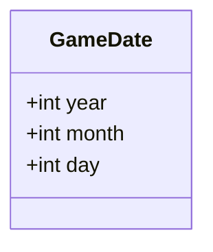
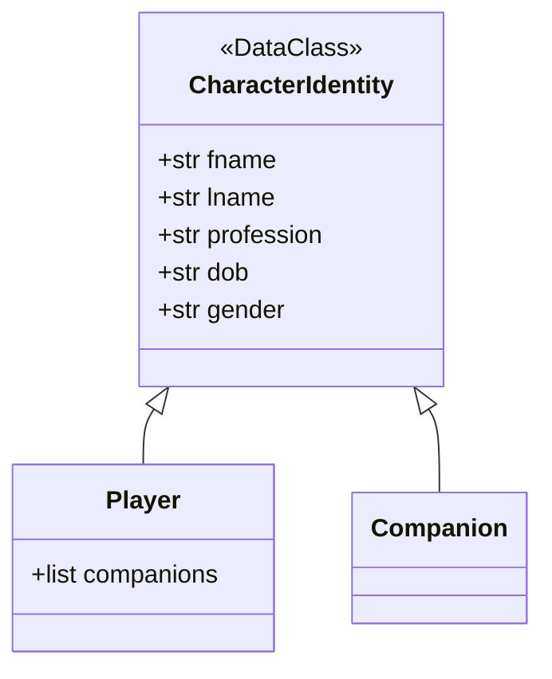
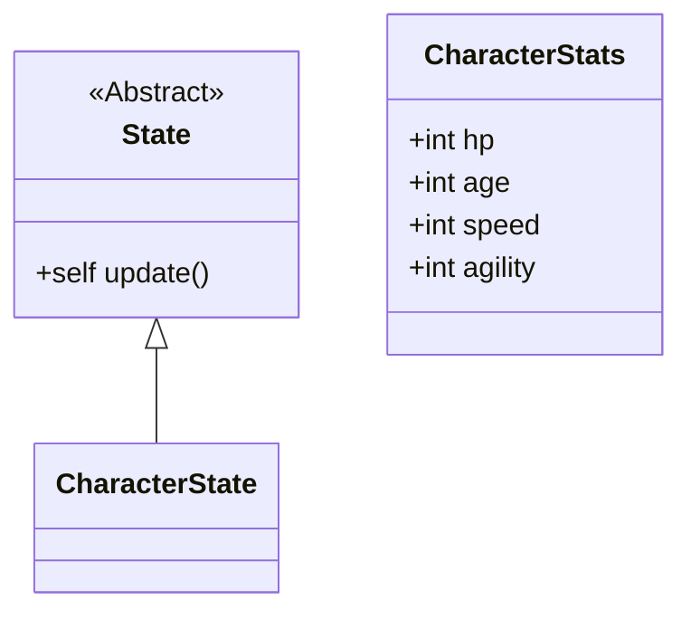
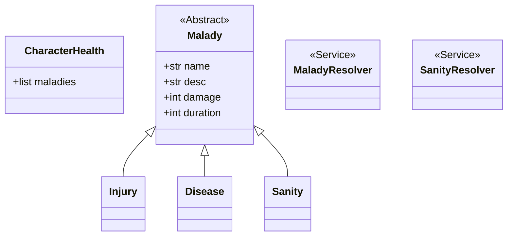

# Oregon Trail Objects 

## Global Dataclasses

### Questions

1. What years will the game take place?
    - What rate will time progress?
    - What min and max year will we permit?

### Proposed Game Properties

## Charater Related Dataclasses

### Questions

1. Should we treat `age` as an *indentity* or *state* property? 
> * `age` is a derived property from DOB

### Character DataClasses

### Notes

* `Age` is a derived property from `dob` (Date of Birth)

## State Management

### Questions

1. Do we need to track coordinates/location?
    - Are coordinates/location part of "State"?
2. Do we need an `is_alive` boolean?

### State Diagrams

### Health System

## Infrastructural Entities

## Service Providers