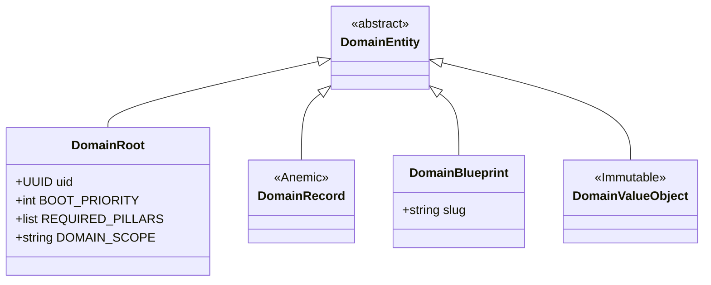
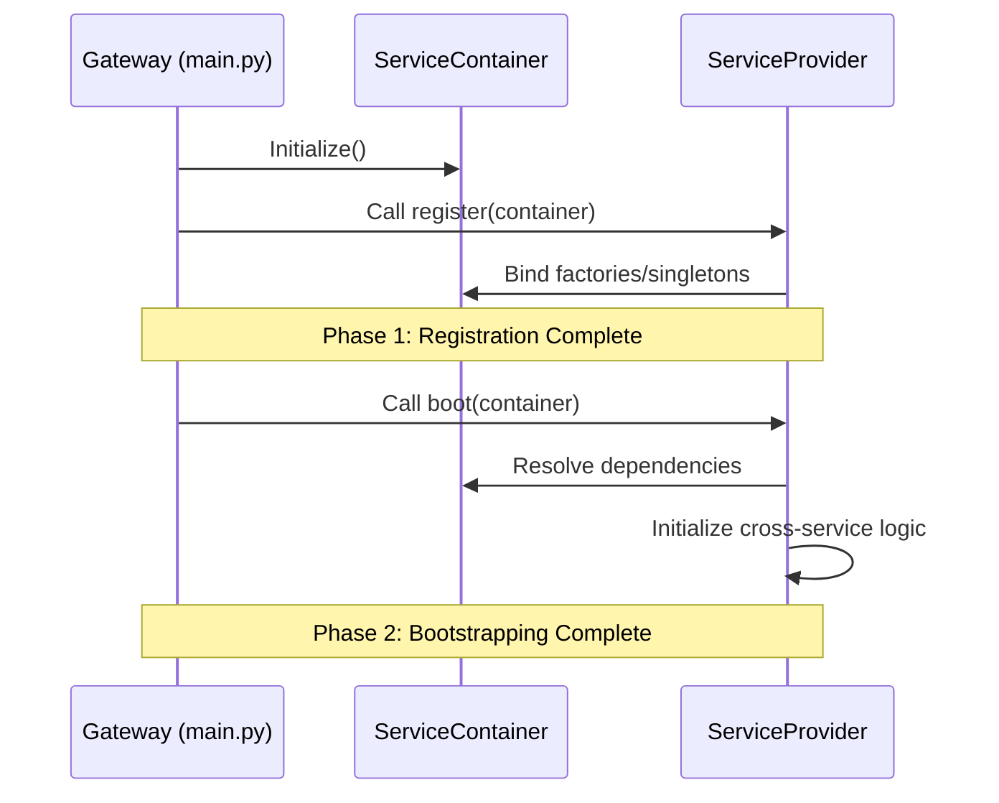

# System Kernel Design (The Spec)

The Kernel is the "Laws of Physics" for the Oregon Trail ecosystem. It provides the contracts and mechanisms for dependency injection and system lifecycle.

## 1. Core Contracts
All domain entities must inherit from these contracts to be recognized by the Orchestrator.

**Path:** `src/core/contracts/domain/`

## 2. Dependency Injection & Lifecycle
The `ServiceContainer` manages singletons and factory-based resolution.

**Path:** `src/core/container.py` and `src/core/contracts/provider.py`

## 3. Pillar Isolation
The Kernel enforces boundaries between functional pillars.

| Pillar | Responsibility | Path |
| :--- | :--- | :--- |
| **Domain** | Pure Logic & State | `src/domain/` |
| **Engine** | Orchestration & Rules | `src/engine/` |
| **UI** | Presentation (View) | `src/ui/` |
| **Storage** | Persistence Adapters | `src/storage/` |
