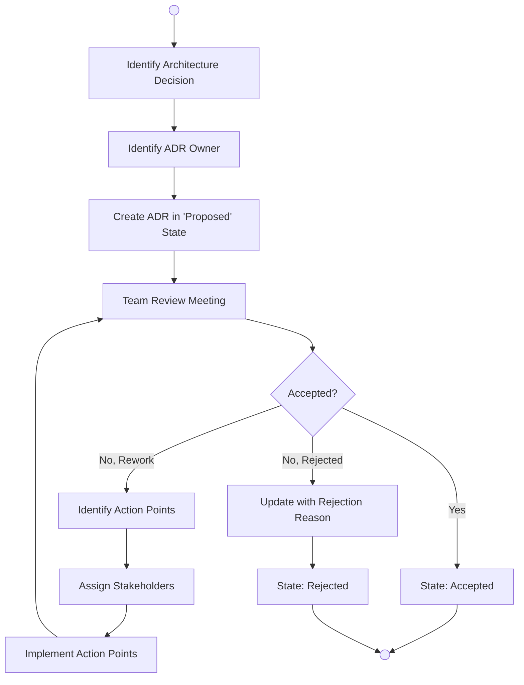
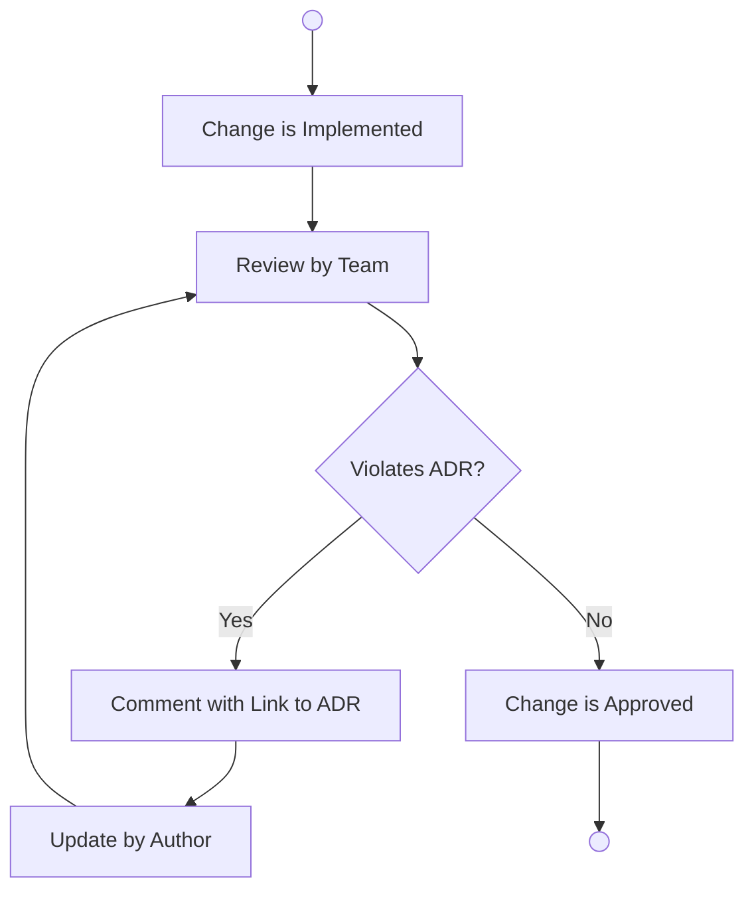
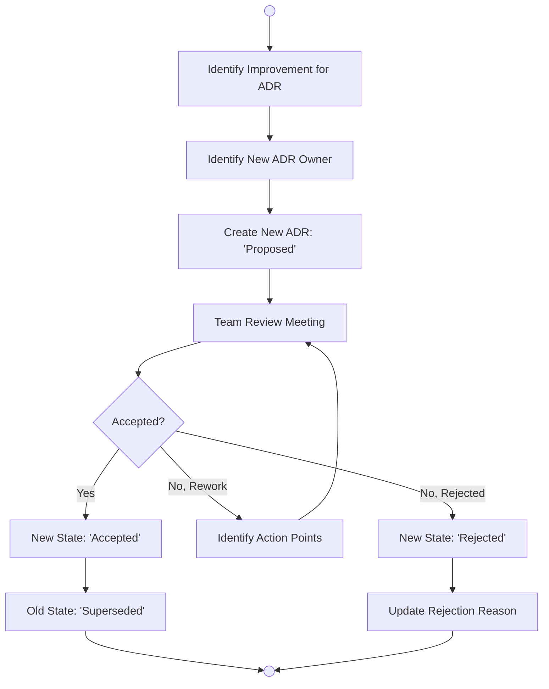

# Architectural Decision Records (ADR) Process

An Architectural Decision Record (ADR) is a short text file that captures a significant design choice, the context in which it was made, and its long-term consequences. Together, these documents form the Decision Log—an immutable history of the project's evolution.

## 1. Scope of the ADR Process

Not every change requires an ADR. Use them for "architecturally significant" decisions, including:

* **Structure:** Patterns (e.g., Hexagonal, Microservices, ETL streams).

* **Non-functional Requirements:** Security, high availability, or fault tolerance.

* **Dependencies:** External libraries, framework shifts, or component coupling.

* **Interfaces:** API contracts and published protocols.

* **Construction:** Tooling choices, languages (e.g., Python vs. PHP for a specific module), and development processes.

## 2. ADR Creation Lifecycle

Every team member can identify the need for an ADR. Once identified, an Owner is assigned to draft the document and shepherd it through the review process.

## 3. ADR Adoption & Compliance

ADRs are used during code reviews to ensure that new implementations align with agreed-upon patterns. If a code change violates an ADR, the reviewer provides a link to the relevant record for correction.

## 4. Updating and Superseding ADRs

Accepted ADRs are immutable. If a previous decision is no longer valid due to new insights or technical shifts, a new ADR must be created to supersede the old one.

## 5. Summary of States

| State | Description |
| :--- | :--- |
| Proposed | The initial draft; ready for team review and feedback. |
| Accepted | The current agreed-upon standard for the project. |
| Rejected | Decision was dismissed; includes a rationale to prevent future circular debate. |
| Superseded | A previously accepted decision that has been replaced by a newer ADR. |

