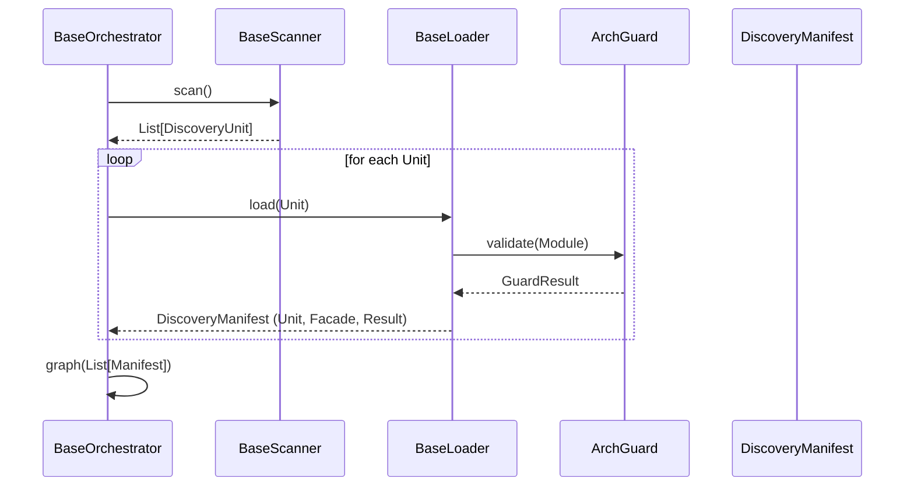

# TDD: Kernel Discovery System

## 1. Overview
The Kernel Discovery System provides the "Physics" for finding, loading, and validating components across all project pillars (Domain, UI, Storage). It decouples the act of filesystem scanning from the act of orchestration, ensuring that the Engine remains a lean coordinator.

## 2. Goals & Non-Goals
### Goals
*   **Pillar Agnostic:** Provide base contracts that can be implemented for any directory-based discovery.
*   **Separation of Concerns:** Distinct roles for Identification (Scanner), Interrogation (Loader), and Result (Manifest).
*   **Type Safety:** Utilize Python Generics to ensure manifests match their discovery units.
*   **Fail-Fast:** Validate discovery results immediately using the Architectural Guard (ArchGuard).

### Non-Goals
*   Does not handle the execution of discovered services (Orchestrator's job).
*   Does not handle the storage of discovered entities (Registry's job).

## 3. Proposed Design

### Component Interaction


## 4. Detailed Design

### 4.1 Discovery Physics (Core Contracts)
**Path:** `src/core/kernel/contracts/discovery.py`

```python
@dataclass(frozen=True)
class DiscoveryUnit:
    key: str
    path: Path
    namespace: str

@dataclass(frozen=True)
class DiscoveryManifest(Generic[T_Unit, T_Facade]):
    unit: T_Unit
    facade: T_Facade
    status: DiscoveryStatus
    errors: List[Exception] = field(default_factory=list)

class BaseScanner(ABC, Generic[T_Unit]):
    @abstractmethod
    def scan(self) -> List[T_Unit]: ...

class BaseLoader(ABC, Generic[T_Unit, T_Manifest]):
    @abstractmethod
    def load(self, unit: T_Unit) -> T_Manifest: ...
```

### 4.2 Orchestration Lifecycle
**Path:** `src/core/kernel/contracts/orchestration.py`

```python
class BaseOrchestrator(ABC, Generic[T_Unit, T_Manifest]):
    def __init__(self, scanner: BaseScanner, loader: BaseLoader):
        self.scanner = scanner
        self.loader = loader

    def orchestrate(self) -> Sequence[T_Manifest]:
        units = self.scanner.scan()
        manifests = [self.loader.load(u) for u in units]
        return self._graph(self._validate(manifests))

    @abstractmethod
    def _validate(self, manifests: List[T_Manifest]) -> List[T_Manifest]: ...

    @abstractmethod
    def _graph(self, manifests: List[T_Manifest]) -> Sequence[T_Manifest]: ...
```

## 5. Implementation Plan
1.  **Phase 1:** Implement Core Contracts in `src/core/kernel/`.
2.  **Phase 2:** Refactor `DomainScanner` to implement `BaseScanner`.
3.  **Phase 3:** Implement `DomainLoader` to encapsulate `importlib` logic.
4.  **Phase 4:** Refactor `DomainOrchestrator` to inherit from `BaseOrchestrator`.
