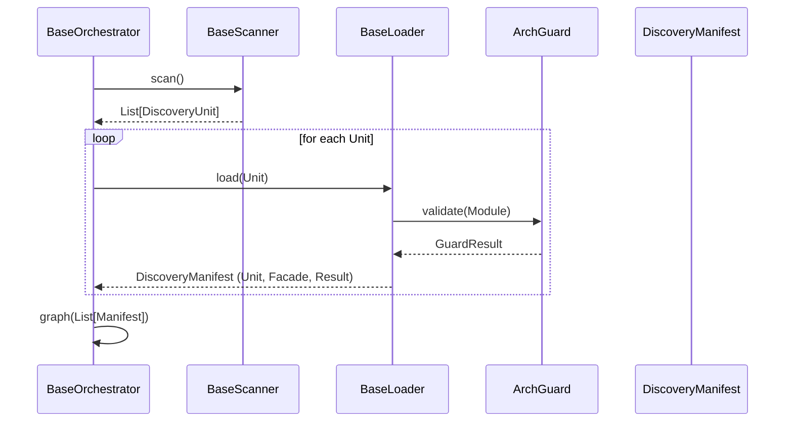

# TDD: Kernel Discovery System

## 1. Overview
The Kernel Discovery System provides the "Physics" for finding, loading, and validating components across all project pillars (Domain, UI, Storage). It decouples the act of filesystem scanning from the act of orchestration, ensuring that the Engine remains a lean coordinator.

## 2. Goals & Non-Goals
### Goals
*   **Pillar Agnostic:** Provide base contracts that can be implemented for any directory-based discovery.
*   **Separation of Concerns:** Distinct roles for Identification (Scanner), Interrogation (Loader), and Result (Manifest).
*   **Type Safety:** Utilize Python Generics to ensure manifests match their discovery units.
*   **Fail-Fast:** Validate discovery results immediately using the Architectural Guard (ArchGuard).

### Non-Goals
*   Does not handle the execution of discovered services (Orchestrator's job).
*   Does not handle the storage of discovered entities (Registry's job).

## 3. Proposed Design

### Component Interaction


## 4. Detailed Design

### 4.1 Discovery Physics (Core Contracts)
**Path:** `src/core/kernel/contracts/discovery.py`

```python
@dataclass(frozen=True)
class DiscoveryUnit:
    key: str
    path: Path
    namespace: str

@dataclass(frozen=True)
class DiscoveryManifest(Generic[T_Unit, T_Facade]):
    unit: T_Unit
    facade: T_Facade
    status: DiscoveryStatus
    errors: List[Exception] = field(default_factory=list)

class BaseScanner(ABC, Generic[T_Unit]):
    @abstractmethod
    def scan(self) -> List[T_Unit]: ...

class BaseLoader(ABC, Generic[T_Unit, T_Manifest]):
    @abstractmethod
    def load(self, unit: T_Unit) -> T_Manifest: ...
```

### 4.2 Orchestration Lifecycle
**Path:** `src/core/kernel/contracts/orchestration.py`

```python
class BaseOrchestrator(ABC, Generic[T_Unit, T_Manifest]):
    def __init__(self, scanner: BaseScanner, loader: BaseLoader):
        self.scanner = scanner
        self.loader = loader

    def orchestrate(self) -> Sequence[T_Manifest]:
        units = self.scanner.scan()
        manifests = [self.loader.load(u) for u in units]
        return self._graph(self._validate(manifests))

    @abstractmethod
    def _validate(self, manifests: List[T_Manifest]) -> List[T_Manifest]: ...

    @abstractmethod
    def _graph(self, manifests: List[T_Manifest]) -> Sequence[T_Manifest]: ...
```

## 5. Implementation Plan
1.  **Phase 1:** Implement Core Contracts in `src/core/kernel/`.
2.  **Phase 2:** Refactor `DomainScanner` to implement `BaseScanner`.
3.  **Phase 3:** Implement `DomainLoader` to encapsulate `importlib` logic.
4.  **Phase 4:** Refactor `DomainOrchestrator` to inherit from `BaseOrchestrator`.

## Addendum (2026-04-22): Architectural Rationale for Manifest Components

### 1. Why a Payload if DiscoveryUnit exists?
The Unit and Payload represent two different "Phases of Matter" in the lifecycle:
*   **DiscoveryUnit (Passive/Solid)**: It represents the component as it exists on the hard drive. It's just a path and a name. You can have 1,000 Units without consuming much memory because none of their code has been executed yet.
*   **DiscoveryPayload (Active/Fluid)**: It represents the component as it exists in memory. This is the result of the Loader opening the box, importing the modules, and instantiating the classes.
*   **Necessity**: You need the Payload because the Engine cannot "run" a Path. It needs the live objects (Services, Entities) that the Payload provides.

### 2. What is the metadata for?
If the Unit is the where and the Payload is the what, the metadata is the how.
*   It serves as a "Scratchpad" for the Orchestrator.
*   **Examples**: Calculating a dependency graph. The Orchestrator might determine that "Wagon" depends on "Map." It stores that link in metadata. 
*   **Separation**: We don't want to put "Engine logic" (like boot-order or dependency-count) inside the DiscoveryUnit (which should be pure filesystem data) or the Payload (which should be pure business logic). The metadata field allows the Orchestrator to manage the lifecycle without polluting the other two.

### 3. One record or multiple?
The DiscoveryManifest is intended to contain one record representing a single unit. 
*   The Orchestrator will produce a List[DiscoveryManifest].
*   **Rationale**: Granular Error Handling. If you have 10 domains and one is broken, that specific DiscoveryManifest will have a status of MALFORMED and its own private list of errors. The other 9 remains VALID. If the manifest contained multiple records, a single error could "poison" the entire collection.
