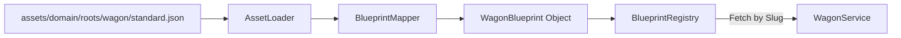
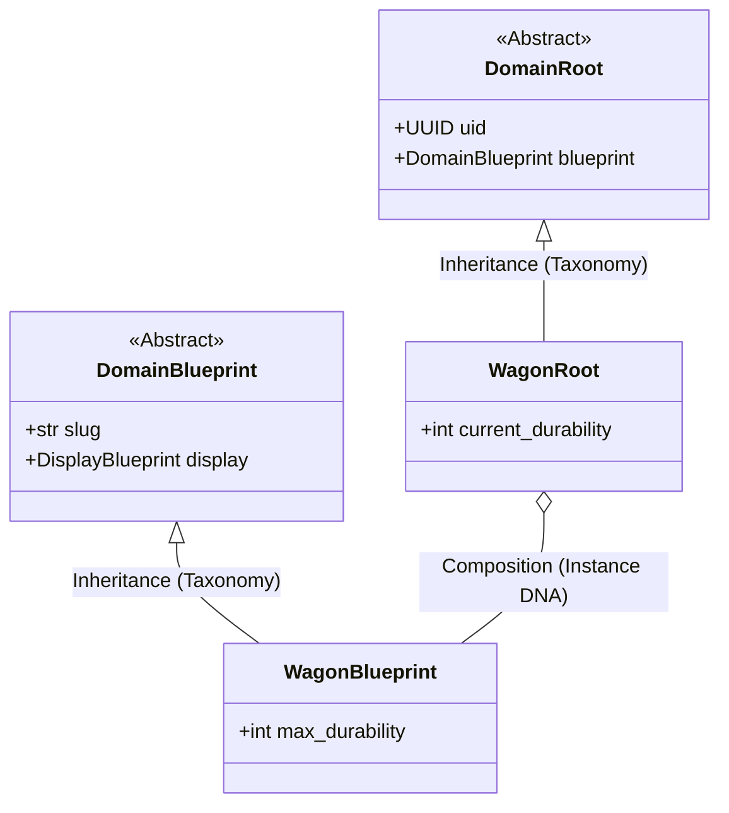

# TDD: DomainBlueprint Contract

## 1. Overview
The `DomainBlueprint` is the engineering realization of the **Global Truth** (ADR-005). It is a static, read-only template that defines the immutable "DNA" of a domain entity. It serves as the specification used by Services to initialize stateful `DomainRoot` or `DomainRecord` instances.

## 2. Goals & Non-Goals
### Goals
*   **Enforce Immutability:** Ensure templates cannot be modified at runtime.
*   **Slug-Based Identity:** Provide a unique, dot-notated string for global lookup and registry.
*   **Standardized UI Metadata:** Ensure every blueprint contains visual instructions for the UI layer.
*   **Asset Mirroring:** Facilitate automatic mapping between JSON files and Python DTOs (ADR-010).

### Non-Goals
*   Holding mutable state (delegated to `DomainRoot` or `DomainRecord`).
*   Possessing a unique UUID (Blueprints use Slugs; Instances use UUIDs).
*   Containing business logic (delegated to `logic.py`).

## 3. Proposed Design

### Data Schema (Core Fields)
All `DomainBlueprint` implementations must include:
*   **`slug: str`**: The unique identifier (e.g., `domain.roots.wagon.conestoga`).
*   **`display: DisplayBlueprint`**: A nested DTO containing UI hints.

### The Display Block
To satisfy the "UI Visibility" requirement, every blueprint must aggregate a `DisplayBlueprint`:
*   `label: str`: The player-facing name.
*   `icon: str`: A single character or emoji representation.
*   `description: str`: Detailed flavor text.
*   `color_hint: str`: A semantic key for terminal styling (e.g., "danger", "success").

### Constraints
1.  **Taxonomy:** Must inherit from `src/core/contracts/domain/blueprint.py:DomainBlueprint`.
2.  **Immutability:** Must be decorated with `@dataclass(frozen=True)`.
3.  **Discovery:** Slugs must follow the dot-notated path convention: `domain.<species>.<package>.<filename>`.

### Asset Interaction Diagram


## 4. Detailed Design

### The Base Contract
```python
from abc import ABC
from dataclasses import dataclass

@dataclass(frozen=True)
class DisplayBlueprint:
    label: str
    icon: str
    description: str
    color_hint: str = "default"

@dataclass(frozen=True)
class DomainBlueprint(ABC):
    slug: str
    display: DisplayBlueprint

    @property
    @abstractmethod
    def __species__(self) -> str:
        """Enforces abstraction and identifies the blueprint species."""
        pass
```

### Component Relationship (The Law of Composition)
In accordance with the Anemic Aggregate pattern, **Blueprints are never inherited by Roots or Records.** They are composed.

*   **Inheritance (Taxonomy):** Used ONLY to define a specific species of Blueprint (e.g., `WagonBlueprint` inherits from `DomainBlueprint`).
*   **Composition (Ecosystem):** A `DomainRoot` instance **aggregates** a reference to its `DomainBlueprint`.



## 5. Cross-Cutting Concerns
*   **Identity vs. DNA:** The Blueprint represents the **DNA** (Shared, Static). The Root represents the **Instance** (Unique, Stateful).
*   **Memory Efficiency:** Since Blueprints are shared singletons, using `frozen=True` dataclasses ensures minimal memory overhead when referenced by thousands of records.
*   **Validation:** The `AssetManager` must validate that the JSON "slug" matches the physical file path during the "Mirror Audit."
*   **Fail-Fast:** If a required field is missing from the JSON asset, the `TaxonomyMismatchError` must prevent the Engine from booting.

## 6. Diagnostic Goals
*   **Slug Integrity:** Automated test to ensure no two JSON files share the same slug.
*   **Mirror Audit:** Fitness function verifying that every Blueprint in `src/` has a corresponding JSON in `assets/`.
*   **Schema Enforcement:** Ensure every Blueprint implementation includes a `display` block.
