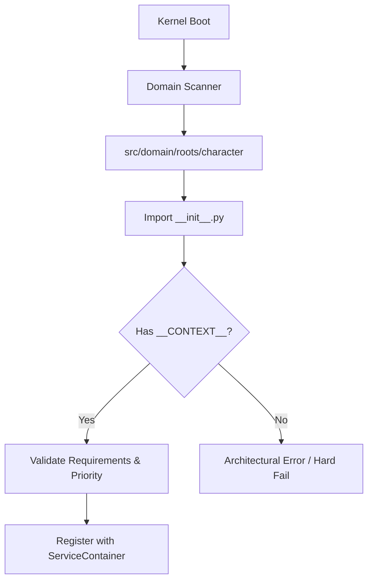
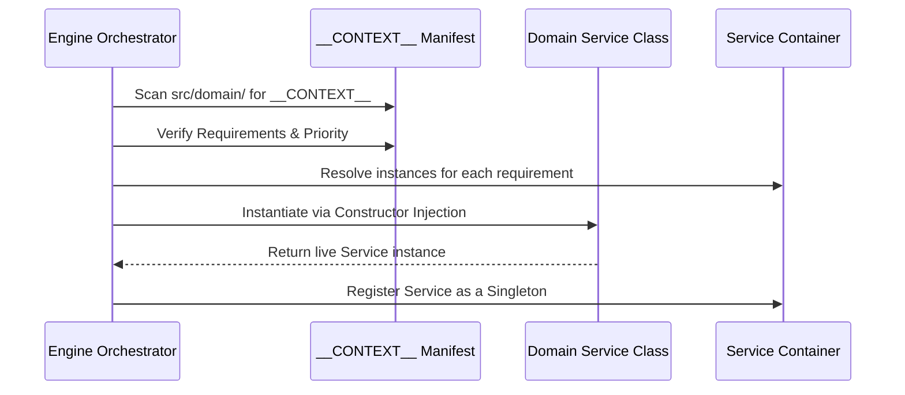

# TDD: DomainContext Contract

## 1. Overview
The `DomainContext` is the **Unified Context Manifest**. Every package in `src/domain/` must instantiate this object in its `__init__.py` as `__CONTEXT__`. It serves as the single source of truth for the Kernel during Discovery and Bootstrapping.

## 2. Goals & Non-Goals
### Goals
*   Standardize how Domain Packages "Scream" their identity to the Engine.
*   Enable automated Discovery of Root and Leaf packages.
*   Enforce the sequence of initialization through `priority` (0-100).
*   Decouple the package registration from the physical folder location.

### Non-Goals
*   Holding runtime state of game entities (delegated to `DomainRoot`).
*   Executing business math (delegated to `logic.py`).

## 3. Proposed Design

### Data Schema (Core Fields)
Every `DomainContext` manifest must include:
*   `family: DomainFamily`: Enum (`ROOT`, `LEAF`, or `SPORE`).
*   `intent: str`: Human-readable "Scream" of the package (e.g., "vitality").
*   `priority: int`: Sequential boot order (0-100, lower = earlier).
*   `requirements: List[KernelSubsystem]`: Required kernel subsystems (e.g., `KernelSubsystem.EVENTS`).
*   `service: Type[Any]|None`: The class reference for the package's primary Service (Required for `ROOT`).

### Constraints
1.  **Immutability:** Must be a `@dataclass(frozen=True)`.
2.  **Naming Convention:** Must be assigned to the variable `__CONTEXT__` in the package's `__init__.py`.
3.  **Anemic Purity:** The `service` class should only use constructor injection for items listed in `requirements`.
4.  **ROOT Enforcement:** All `ROOT` family packages MUST provide a `service` class.

### Package Integration
Every package defines its manifest in its `__init__.py`.

```python
# src/domain/roots/character/__init__.py
from src.core.contracts.domain.context import DomainContext, DomainFamily
from src.core.contracts.kernel import KernelSubsystem
from .services import CharacterService
from .models import CharacterRoot

__CONTEXT__ = DomainContext(
    intent="character",
    family=DomainFamily.ROOT,
    priority=5,
    requirements=[KernelSubsystem.EVENTS, KernelSubsystem.STATE],
    service=CharacterService
)

__all__ = ["CharacterService", "CharacterRoot", "__CONTEXT__"]
```

### Discovery & Integration Flow
The Kernel discovers contexts by scanning the `src/domain/` directory and inspecting the `__init__.py` of each package.





## 4. Diagnostic Goals
*   **Discovery Audit:** Verify that every folder in `src/domain/{roots,leaves}` contains a valid `DomainContext`.
*   **Priority Conflict Check:** Ensure no two Roots share the same `priority` to prevent race conditions.
*   **Requirement Validation:** Ensure all required subsystems (e.g., "Events") are registered and booted in the Container before the package service is instantiated.
