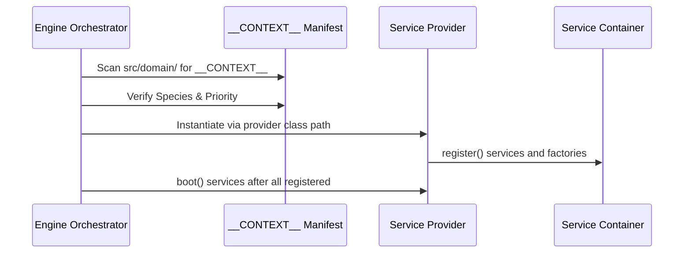

# TDD: DomainContext Contract

## 1. Overview
The `DomainContext` is the **Unified Context Manifest** (ADR-003 Addendum). Every package in `src/domain/` must instantiate this object in its `__init__.py` as `__CONTEXT__`. It serves as the single source of truth for the Kernel during Discovery and Bootstrapping.

## 2. Goals & Non-Goals
### Goals
*   Standardize how Domain Packages "Scream" their identity to the Engine.
*   Enable automated Discovery of Root and Leaf packages.
*   Enforce the sequence of initialization through `BOOT_PRIORITY`.
*   Decouple the package registration from the physical folder location.

### Non-Goals
*   Holding runtime state of game entities (delegated to `DomainRoot`).
*   Executing business math (delegated to `logic.py`).

## 3. Proposed Design

### Data Schema (Core Fields)
Every `DomainContext` manifest must include:
*   `species: DomainSpecies`: Enum (ROOT or LEAF).
*   `intent: str`: Human-readable "Scream" of the package (e.g., "Wagon Durability").
*   `priority: int`: Sequential boot order (0-100).
*   `pillars: List[str]`: Required kernel services (Events, State, Assets).
*   `provider: Type[BaseServiceProvider]`: The class responsible for DI registration.

### Constraints
1.  **Immutability:** Must be a `@dataclass(frozen=True)`.
2.  **Naming Convention:** Must be assigned to the variable `__CONTEXT__` in the package's `__init__.py`.
3.  **Ontology Verification:** The `Architectural Police` will verify that `priority` and `species` match the filesystem location.

### Interaction Sequence

## 4. Diagnostic Goals
*   **Discovery Audit:** Verify that every folder in `src/domain/{roots,leaves}` contains a valid `DomainContext`.
*   **Priority Conflict Check:** Ensure no two Roots share the same `BOOT_PRIORITY` to prevent race conditions.
*   **Pillar Validation:** Ensure all required pillars (e.g., "Events") are registered in the Container before the package boots.
