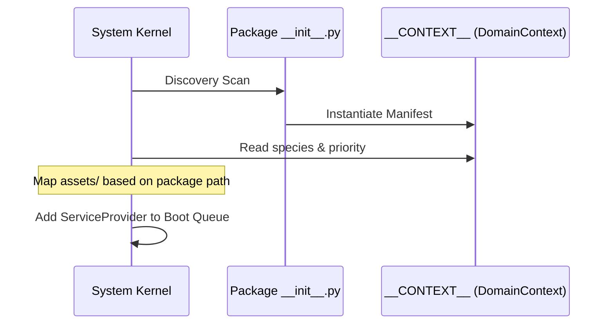

# TDD: DomainContext Contract

## 1. Overview
The `DomainContext` is the **Unified Context Manifest** (ADR-003 Addendum). Every package in `src/domain/` must instantiate this object in its `__init__.py` as `__CONTEXT__`. It serves as the single source of truth for the Kernel during Discovery and Bootstrapping.

## 2. Goals & Non-Goals
### Goals
*   Provide a type-safe interface for package metadata.
*   Centralize Taxonomical (Species) and Ontological (Priority) details.
*   Enable automated discovery and "Physical-to-Logical" asset mapping.

### Non-Goals
*   Containing domain state (delegated to Models).
*   Handling runtime orchestration (delegated to the Orchestrator).

## 3. Proposed Design

### Data Schema (The Manifest)
The `DomainContext` object must include:
*   `species: DomainSpecies`: Enum (ROOT | LEAF).
*   `intent: str`: Human-readable "Scream" of the domain's purpose.
*   `priority: int`: The Ontological boot priority (0-100).
*   `required_pillars: List[str]`: Essential Kernel services (e.g., "Events").
*   `service_provider: str`: The full class path to the `ServiceProvider`.

### Bootstrapping Lifecycle

### Constraints
1.  **Immutability:** The context must be read-only after instantiation.
2.  **Location:** Must reside in `src/domain/<roots/leaves>/<package>/__init__.py`.

## 4. Diagnostic Goals
*   **Ontology Audit:** Verification that the `species` matches the physical folder path (ROOT in roots, LEAF in leaves).
*   **Discovery Enforcement:** Fails the system boot if `__CONTEXT__` is missing from any domain package.
