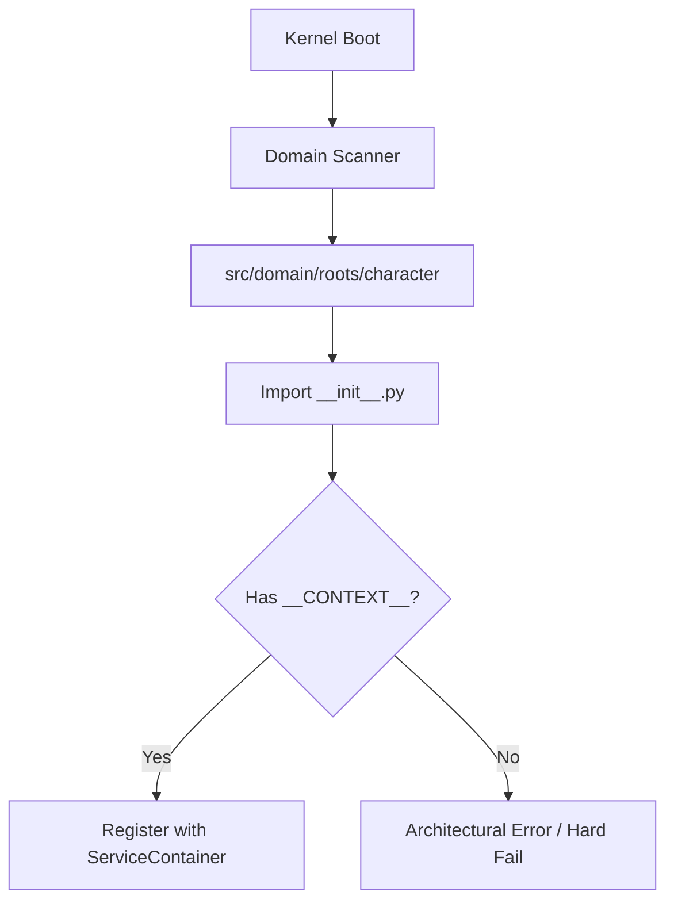

# TDD: Domain Context Manifest

## Overview
This document defines the implementation of the `DomainContext` manifest, a unified object that serves as the "Identity Card" for every Bounded Context in the Oregon Trail engine.

## Goals
- Unify fragmented metadata (`__DOMAIN_INTENT__`, `__DOMAIN_SPECIES__`) into a single object.
- Provide type-safe discovery for the Kernel's ServiceProvider and Orchestrator.
- Standardize the "Scream" of a package at the code level.

## Proposed Design

### 1. The Contract
The manifest is a frozen dataclass residing in the core contracts.

```python
# src/core/contracts/domain/context.py
from dataclasses import dataclass
from enum import Enum, auto

class DomainSpecies(Enum):
    ROOT = auto()
    LEAF = auto()

@dataclass(frozen=True)
class DomainContext:
    """
    The identity manifest for a Bounded Context.
    """
    intent: str           # The 'Scream' (e.g., 'vitality', 'character')
    species: DomainSpecies # ROOT or LEAF
    priority: int = 10    # Boot sequence priority (lower = earlier)
    version: str = "0.1.0"
```

### 2. Package Integration
Every package defines its manifest in `__init__.py`.

```python
# src/domain/roots/character/__init__.py
from src.core.contracts.domain.context import DomainContext, DomainSpecies
from .services import CharacterService
from .models import CharacterRoot

__CONTEXT__ = DomainContext(
    intent="character",
    species=DomainSpecies.ROOT,
    priority=5
)

__all__ = ["CharacterService", "CharacterRoot", "__CONTEXT__"]
```

### 3. Discovery Flow
The Kernel discovers contexts by scanning the `src/domain/` directory and inspecting the `__init__.py` of each package.



## Cross-Cutting Concerns
- **Validation:** The Architecture Testing Regime (Fitness Functions) will verify that `__CONTEXT__.intent` matches the physical folder name.
- **Serialization:** The manifest may be used by the State Registry to tag snapshot data with the correct version and intent.

## References
- [ADR 003: Anemic Aggregator Domains](../reports/adr/003_anemic_aggregator_domains.md)
- [ADR 006: Domain Behavioral Ontology](../reports/adr/006_domain_behavioral_ontology.md)
