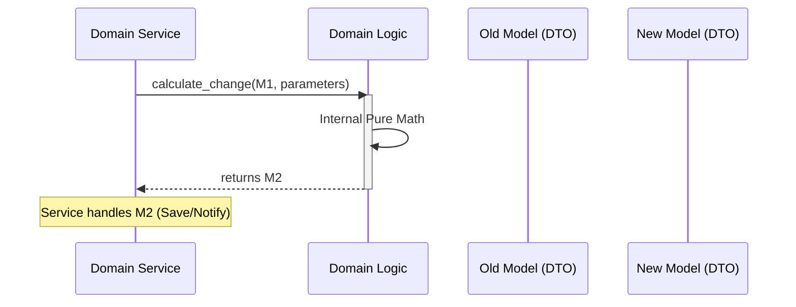

# TDD: Domain Logic Entities

## 1. Overview
This document defines the implementation standards for `logic.py` entities. Logic entities represent the **"Metabolism"** of a domain—pure, stateless mathematical transformations that govern the rules of the Oregon Trail world.

## 2. Goals & Non-Goals
### Goals
*   Enforce 100% functional purity (Input -> Output).
*   Ensure zero side effects to enable trivial unit testing.
*   Standardize the interaction between Models and Logic functions.

### Non-Goals
*   Handling I/O, persistence, or user input.
*   Orchestrating cross-domain interactions.
*   Managing application state or lifecycle.

## 3. Proposed Design

### The "Calculator" Pattern
Logic entities function as a stateless calculator. They do not know why they are being called; they only know how to transform data.

### Interaction Rules (Codified)
1.  **Purity:** Functions must be "Pure." Given the same input, they must always return the same output.
2.  **Statelessness:** No use of `global`, `nonlocal`, or instance state.
3.  **Isolation:** Private to the package. Never exported to horizontal siblings.
4.  **No I/O:** Forbidden from interacting with the file system, database, or network.
5.  **No Events:** Forbidden from emitting events to the global event bus.
6.  **Input-Driven:** Accepts Anemic Models (DTOs) and returns new Anemic Models.

### Detailed Design

#### Data Flow Sequence

#### Composition
*   **File:** `src/domain/<type>/<package>/logic.py`
*   **Structure:** A flat collection of independent functions.
*   **Signature Standard:** `def verb_noun(model: T, **kwargs) -> T:`

## 4. Diagnostic Goals
*   **Edge Case Exhaustion:** Logic must handle "Impossible" values (e.g., negative weight, zero-division) gracefully by returning valid "Sad Path" models or raising domain-specific exceptions.
*   **Illegal State Exclusion:** Logic functions are the gatekeepers of domain integrity. They must ensure that a returned Model never represents an illegal state (e.g., a dead character with "Healthy" status).

## 5. Cross-Cutting Concerns
*   **Performance:** Logic functions should minimize memory allocations by returning new DTOs only when changes occur.
*   **Testability:** 100% code coverage is required for all `logic.py` files, as they represent the risk-free "Core" of the game math.
