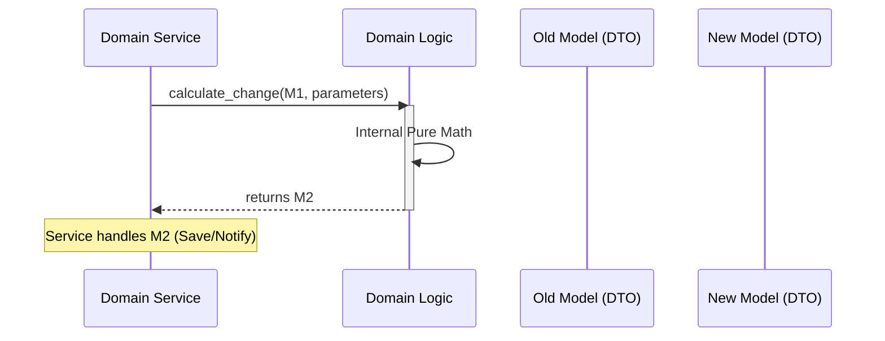

# TDD: Domain Logic Entities

## 1. Overview
This document defines the implementation standards for `logic.py` entities. Logic entities represent the **"Metabolism"** of a domain—pure, stateless mathematical transformations that govern the rules of the Oregon Trail world.

## 2. Goals & Non-Goals
### Goals
*   Enforce 100% functional purity (Input -> Output).
*   Ensure zero side effects to enable trivial unit testing.
*   Standardize the interaction between Models and Logic functions.

### Non-Goals
*   Handling I/O, persistence, or user input.
*   Orchestrating cross-domain interactions.
*   Managing application state or lifecycle.

## 3. Proposed Design

### The "Calculator" Pattern
Logic entities function as a stateless calculator. They do not know why they are being called; they only know how to transform data.

### Interaction Rules (Codified)
To qualify as "Logic" in this architecture, every function must share these four traits:
*   **Signatures are "Model-First":** Every primary logic function must accept a Domain Model (Root or Record) as its first argument.
*   **Immutability Enforcement:** They must **never** modify the input object. They must always return a **new instance** (clone) of the model with updated values.
*   **Determinism:** They must be "Pure." If you pass the same inputs, you must get the exact same output back, every single time.
*   **Internal Scope:** They are designed to be consumed **only** by the Service of their own package.

### 4. Type Enforcement & Bounded Context
Logic functions are the primary enforcers of the Bounded Context boundary:
*   **Primary Rule (The "Home" Model):** Within a package (e.g., `health`), the primary input and output **must** be the package's specific Model (`HealthRecord`).
*   **Type Enforcement:** Python type hints are mandatory.
    *   *Correct:* `def apply_damage(health: HealthRecord, amount: int) -> HealthRecord:`
*   **External Type Policy:**
    *   **Allowed:** Primitives (int, str, etc.) and Common Value Objects from `src/domain/common/`.
    *   **Forbidden:** Sibling Models. `health/logic.py` cannot accept an `InventoryRecord`.

### 5. Universal "CAN" vs. "PROHIBITED"

| What Logic CAN Do | What Logic is PROHIBITED from Doing |
| :--- | :--- |
| **Read Models:** Access any property on the DTO. | **I/O Operations:** No print, open, DB, or network calls. |
| **Clone Models:** Use `.clone()` to create new state. | **Global/Static State:** No `datetime.now()` or `random`. |
| **Perform Math:** Use standard math libraries. | **Importing Services:** Must never know `services.py` exists. |
| **Call Internal Logic:** Call helpers in the same file. | **Horizontal Imports:** Cannot import sibling packages. |
| **Raise Exceptions:** Raise `InvalidPhysicalStateError`. | **Emitting Events:** Cannot talk to the Event Bus. |

### 6. Summary Table for Logic Enforcement
| Feature | Enforcement Rule |
| :--- | :--- |
| **Input Type** | Must be the package's specific `DomainRoot` or `DomainRecord`. |
| **Output Type** | Must match the Input Type (Transformation). |
| **Context** | Strictly limited to the local package + `domain/common`. |
| **Side Effects** | Zero. Pure calculation only. |
| **Testing** | Must be testable with zero mocks/stubs. |

## 7. Detailed Design

#### Data Flow Sequence

#### Composition
*   **File:** `src/domain/<type>/<package>/logic.py`
*   **Structure:** A flat collection of independent functions.
*   **Signature Standard:** `def verb_noun(model: T, **kwargs) -> T:`

## 4. Diagnostic Goals
*   **Edge Case Exhaustion:** Logic must handle "Impossible" values (e.g., negative weight, zero-division) gracefully by returning valid "Sad Path" models or raising domain-specific exceptions.
*   **Illegal State Exclusion:** Logic functions are the gatekeepers of domain integrity. They must ensure that a returned Model never represents an illegal state (e.g., a dead character with "Healthy" status).

## 5. Cross-Cutting Concerns
*   **Performance:** Logic functions should minimize memory allocations by returning new DTOs only when changes occur.
*   **Testability:** 100% code coverage is required for all `logic.py` files, as they represent the risk-free "Core" of the game math.
