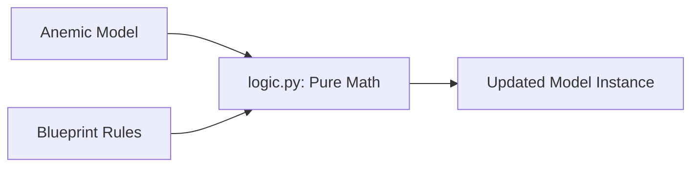

# TDD: Domain Logic Entities

## 1. Overview
This document defines the engineering standards for **Logic Entities** (The Metabolism) in the domain layer. Logic entities are pure, stateless mathematical transformers that implement the "Rules of the Trail" (ADR-004).

## 2. Goals & Non-Goals
### Goals
*   Enforce **Purity**: Ensure all logic functions are deterministic (same input = same output).
*   Enforce **Side-Effect Isolation**: Zero I/O, zero global state access, zero event emission.
*   Standardize **Atomic Transformations**: Logic takes a DO, applies math, and returns a new DTO instance.

### Non-Goals
*   Persisting data (delegated to Storage).
*   Orchestrating other services (delegated to `services.py`).
*   Holding state (delegated to `models.py`).

## 3. Proposed Design

### The "Calculator" Pattern
Logic functions should be treated as calculators. They do not have "hands" to change the world; they only return the result of a calculation.

**Interaction Flow:**
1.  Input: A `DomainRecord` or `DomainRoot`.
2.  Input: A `DomainBlueprint` (Rules/Constants).
3.  Process: Pure mathematical transformation.
4.  Output: A NEW instance of the DTO with updated values.

### Rules of Engagement
*   **Signature Standard:** `transform(state: T, rules: B) -> T`.
*   **Immutability:** Use the `replace()` or `clone()` method of the DTO. Never modify the input object.
*   **Type Safety:** Use strict type hinting for all inputs and outputs.

### Logic Anatomy Diagram

## 4. Diagnostic Goals
*   **Purity Check:** Linter-style scanning to ensure no imports from `core/events`, `core/assets`, or `storage/` exist in `logic.py`.
*   **Reference Integrity:** Ensure logic never modifies an object in-place.
*   **Test Coverage:** Mandatory 100% path coverage for all logic functions due to their stateless nature.
