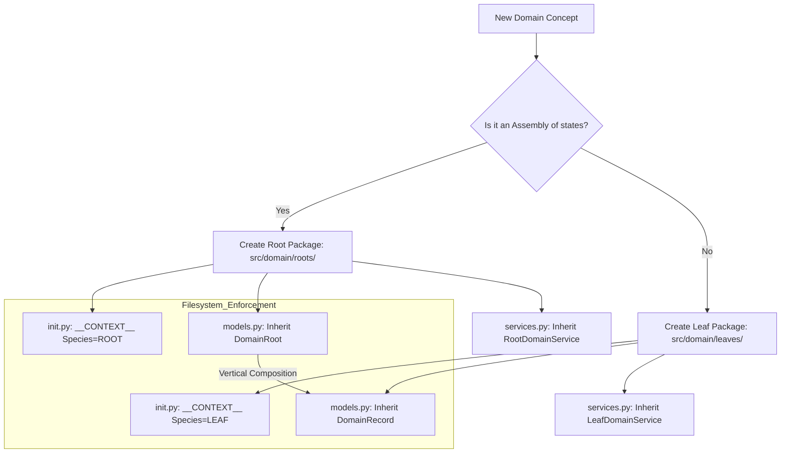

# TDD: Domain Package Entity

## 1. Overview
This document defines the **Domain Package** as the fundamental engineering unit of the Oregon Trail codebase. A Domain Package is not merely a folder; it is a **Sovereign Bounded Context** that encapsulates state, logic, and orchestration. This design ensures strict adherence to the **Screaming MVC** and **Anemic Aggregate** patterns.

## 2. The Anatomy of a Domain Package
Every package within `src/domain/` must function as a standalone concept.

### 2.1 Package Identification (The Facade)
Regardless of its species (Root or Leaf), every package MUST contain an `__init__.py` that acts as the **"Voice of the Domain."**

#### **The Unified Context Manifest (`__CONTEXT__`)**
Every package must instantiate a `DomainContext` manifest in its `__init__.py`. This object informs the Kernel of the package's "Identity" and "Place in the World."

| Property | Requirement | Role |
| :--- | :--- | :--- |
| `species` | **ROOT** or **LEAF** | Taxonomical classification for discovery. |
| `intent` | Human-readable string | The "Scream" (e.g., "Manage Wagon Health"). |
| `priority` | Integer | Ontological boot sequence order. |
| `pillars` | List of Strings | Required Kernel services (Events, Persistence). |
| `provider` | Class Path | The `ServiceProvider` for dependency injection. |

### 2.2 Shared Characteristics (Root AND Leaf)
*   **Physical Boundary:** Each is a directory in `src/domain/{roots,leaves}/`.
*   **Facade Encapsulation:** Only exports items via `__all__` in `__init__.py`.
*   **Standard Sub-Files:**
    *   `models.py`: Defines Anemic DTOs (`DomainRoot` or `DomainRecord`).
    *   `logic.py`: Pure mathematical transformation functions.
    *   `services.py`: The singleton "Operator" class.

### 2.3 Distinct Characteristics (Root OR Leaf)
| Feature | **Root Package** | **Leaf Package** |
| :--- | :--- | :--- |
| **Conceptual Role** | **Aggregate Root.** An assembly of states. | **Atom.** A granular, standalone state. |
| **Sovereignty** | High. Permitted to emit Public Events. | Silent. Restricted to internal logic. |
| **Identity** | Sovereign (Possesses a UUID). | Anonymous (Value-based membership). |
| **Dependencies** | Can import Leaf Models (Vertical). | Zero-Dependency Policy (Pure Actor). |

---

## 3. Structural Decision Flow
The following logic determines how a domain concept is realized in the filesystem and code.

---

## 4. Composition over Inheritance (The "Cobbling" Strategy)
Instead of traditional OOP inheritance (e.g., "Wagon is-a Vehicle"), this architecture favors **Composition by Assembly**. This prevents the "Big Ball of Mud" and ensures that every domain root remains a sovereign structural sibling.

### 4.1 Composition by Leaf (Shared Parts)
Instead of a "Vehicle" base class, we create a "Menu" of shared Leaf Packages (Atoms).
*   **Leaves (Atoms):** `durability`, `inventory`, `mobility`.
*   **The Wagon Root:** Composes `DurabilityRecord`, `InventoryRecord`, and `AxleRecord`.
*   **The Ox-Cart Root:** Composes `DurabilityRecord`, `InventoryRecord`, and `DraftAnimalRecord`.
*   **Role of Inheritance:** Zero. They are structural siblings assembled from the same "Ingredients."

### 4.2 Variation by Blueprint (Specification)
If two entities share 90% of their structure, they may occupy the same Root Package (e.g., `vehicle`), differentiated by a **DomainBlueprint**.
*   **The Process:** The **Domain Service** (The Factory) reads a JSON specification (e.g., `wagon.json`), hydrates the required Leaves based on that spec, and "cobbles" them into a single `VehicleRoot` DTO.

### 4.3 The Role of the "Shared Kernel" (domain/common)
Base classes for shared attributes (e.g., `name`, `weight`, `price`) belong in the **Shared Kernel**.
*   **Location:** `src/domain/common/models.py`
*   **The Rule:** `WagonRecord` and `OxCartRecord` may inherit from a `BasePhysicalDTO` in the Shared Kernel. This is permitted because `common` is the "Foundation Language," not a horizontal sibling.

### 4.4 Summary: The Lifecycle of Composition
| Step | Action | Entity Involved |
| :--- | :--- | :--- |
| **1. Define Parts** | Create shared atoms (e.g., health, weight). | **Leaf Packages** |
| **2. Define Spec** | Write a JSON file defining the "Wagon" stats. | **DomainBlueprint** |
| **3. Assembly** | Fetch data, run math, and build the DTO. | **Domain Service** |
| **4. Recognition** | The Engine sees it as a `DomainRoot`. | **Inheritance (Taxonomy)** |

### 4.5 The "Factory-Logic" Role
The **Domain Service** (`services.py`) acts as the **Factory**. It uses the `models.py` (Blueprints/Parts) and `logic.py` (Assembly Rules) to create the final sovereign aggregate.

### 4.6 Conclusion: The Role of Inheritance
Inheritance is used **ONLY for Taxonomy (Identity)**:
*   `WagonRoot` inherits from `DomainRoot` to identify as a **Sovereign Actor** with a UUID.
*   `HealthRecord` inherits from `DomainRecord` to identify as an **Anemic Data Fragment**.

Behavior is never inherited between Roots; it is encapsulated in a **Leaf** or **Common Logic** and "Composed" where required.

---

## 5. Internal Component Details

### 5.1 `models.py` (The Resource)
*   **DomainRoot (Roots):** A passive DTO anchoring a UUID. It aggregates multiple `DomainRecord` properties.
*   **DomainRecord (Leaves):** Anemic, passive state fragments. Must be cloneable and validatable.
*   **DomainBlueprint:** Read-only "Global Truth" templates loaded from assets.

### 5.2 `logic.py` (The Metabolism)
*   **Rules:** Pure functions only. No I/O. Input -> Output.
*   **Interaction:** Takes a model from `models.py`, transforms it, and returns a new instance.

### 5.3 `services.py` (The Nervous System)
*   **Rules:** Stateless Singletons.
*   **Responsibility:** Fetch Model -> Call Logic -> Save Model -> Notify System.

---

## 6. Formal Terminology (ADR-003 Alignment)

To maintain engineering clarity, the following terms are strictly defined:
*   **Root Package:** The physical directory in `src/domain/roots/`.
*   **Aggregate Root:** The conceptual DDD role of an assembly.
*   **DomainRoot:** The specific Python base class in `src/core/contracts/domain/`.
*   **Leaf Package:** The physical directory in `src/domain/leaves/`.
*   **DomainRecord:** The specific Python base class for anemic "Atoms."

## 6. Diagnostic Goals
*   **Taxonomy Check:** Automated validation that `models.py` inherits from the correct species-base-class.
*   **Import Audit:** AST-based scanning to ensure no Root-to-Root or Leaf-to-Leaf direct imports exist.
*   **Ontology Check:** Ensuring `__CONTEXT__` priority and species match the filesystem location.

---

## 8. UI Visibility & Presentation (The "Passive View")
To maintain the **Screaming MVC** separation, the Domain must remain "Pure" (free of I/O and rendering code). The UI interacts with the Domain as a "Passive Observer" through standardized metadata and protocols.

### 8.1 The "Passive Visibility" Principle
*   **Directional Flow:** The Domain NEVER calls the UI. The UI "looks into" the Domain using strictly defined read-only hooks.
*   **Encapsulation:** No rendering libraries (e.g., `rich`, `ncurses`) are permitted within `src/domain/`.

### 8.2 UI-Domain Anatomy
1.  **DisplayBlueprint (`models.py`):** Every `DomainBlueprint` should contain a `display` block defining its static visual identity.
    *   *Fields:* `label` (String), `icon` (String/Emoji), `description` (String), `color_hint` (String).
2.  **UIRenderable Protocol (`src/core/contracts/`):** The formal "Handshake" that allows the UI to read a Domain Root without knowing its specific species.
    *   *Methods:* `get_display()`, `get_status_summary()`, `get_alert_level()`.

### 8.3 The UI Adapter (ViewModel Mapping)
Complex "Presentation Logic" (e.g., changing a Wagon's icon to 🔥 when damaged) must live in the `src/ui/` layer.
*   **The Process:** The UI Adapter "wraps" a Domain Root, reads its anemic state, and transforms it into a **View Model** for the screen.
*   **The Benefit:** The Domain stays focused on math (Wagon health), while the UI stays focused on aesthetics (Icon selection).

### 8.4 Presentation Interaction Rules
*   **No UI in Logic:** `logic.py` must never return a string formatted for the screen. It returns raw data (Models).
*   **Explicit Metadata:** Any entity intended for player visibility MUST include a `DisplayBlueprint`.
*   **Protocol-Only Access:** The UI should ideally only interact with Domain Roots via the `UIRenderable` protocol to ensure a "Pedigree-Blind" rendering engine.
