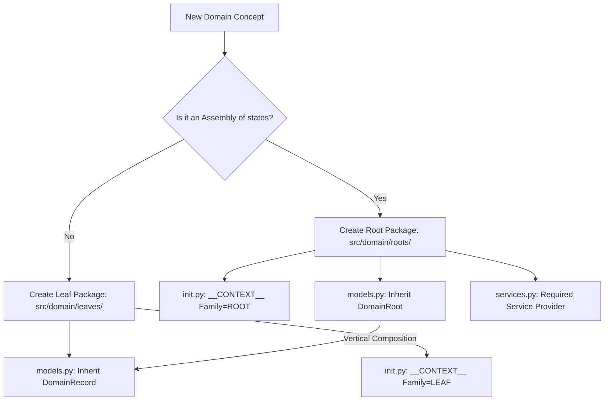

# TDD: Domain Package Entity

## 1. Overview
The **Domain Package** is the fundamental engineering unit of the Oregon Trail codebase. It is a **Sovereign Bounded Context** that encapsulates state, logic, and orchestration, ensuring strict adherence to **Screaming MVC** and **Anemic Aggregate** patterns.

## 2. Anatomy of a Domain Package

### 2.1 Package Identification (The Facade)
Every package MUST contain an `__init__.py` exposing a `DomainContext` manifest assigned to `__CONTEXT__`.

#### **The Unified Context Manifest (`__CONTEXT__`)**
Residing in `src/core/contracts/domain/context.py`, it defines the package's "Identity Card."

| Property | Requirement | Role |
| :--- | :--- | :--- |
| `family` | `DomainFamily.ROOT` \| `LEAF` | Taxonomical classification for discovery. |
| `intent` | `str` (Non-empty) | The "Scream" of the package (e.g., "vitality"). |
| `priority` | `int` (0-100) | Boot sequence order (lower = earlier). |
| `requirements` | `List[KernelSubsystem]` | Required services for injection (Events, State, etc.). |
| `service` | `Type[Any] | None` | The primary Service class (Required for `ROOT`). |

### 2.2 Standard Sub-Files
*   **`models.py`:** Anemic DTOs (`DomainRoot`, `DomainRecord`, or `DomainValueObject`).
*   **`logic.py`:** Pure, stateless mathematical transformations.
*   **`services.py`:** Stateless Singleton "Operator" (Coordinates logic and state).
*   **`__init__.py`:** The Facade. Lifts models and services to the top-level via `__all__`.

---

## 3. Structural Decision Flow

---

## 4. Hierarchy and Isolation Rules

### 4.1 DomainRoot (Aggregate Root)
- **Identity:** Sovereign (Must have a `UUID` as `uid`).
- **Isolation:** **Horizontal Isolation.** A `DomainRoot` cannot contain another `DomainRoot`.
- **Composition:** **Vertical Composition.** A `Root` aggregates multiple `DomainRecord` instances in its `records` dictionary.

### 4.2 DomainRecord (Leaf Model)
- **Identity:** Anonymous. Prohibited from containing `id`, `uuid`, or `uid` fields.
- **Isolation:** **Horizontal Isolation.** A `DomainRecord` cannot contain another `DomainRecord` as a property.
- **Purity:** Immutable and self-validating via `validate()`.

### 4.3 DomainValueObject (Shared Kernel)
- **Identity:** Value-based. Two instances are equal if their data matches.
- **Role:** Immutable data bundles used for shared semantic types (e.g., coordinates, name).

---

## 5. Composition by Assembly ("Cobbling" Strategy)
The architecture favors **Composition** over Inheritance. Roots are structural siblings assembled from a menu of shared Leaves.
*   **Variation by Blueprint:** A **Domain Service** (The Factory) reads a `DomainBlueprint` (JSON specification) and hydrates the required `DomainRecord` leaves to "cobble" a final `DomainRoot`.

---

## 6. Implementation Checklist
- [x] Implement `DomainRoot` base contract with Isolation Guards.
- [x] Implement `DomainRecord` base contract with Anonymity Guards.
- [x] Implement `DomainValueObject` base contract with Identity Purity Guards.
- [x] Implement `DomainContext` manifest with validation and family enums.
- [x] Implement `DomainBlueprint` and `DisplayBlueprint` core contracts.
- [ ] Implement Engine Orchestrator Discovery Scanner (ADR-014).
- [ ] Implement Architectural Police tool (TASK-022) to enforce boundary audits.

## 7. Acceptance Criteria
- [x] All core contracts reside in `src/core/contracts/domain/`.
- [x] `DomainRoot` and `DomainRecord` successfully fail-fast on Horizontal Isolation violations.
- [x] `DomainRecord` successfully fail-fast on Anonymity violations (no IDs).
- [x] `DomainContext` enforces priority bounds (0-100) and non-empty intent.
- [ ] Automated tests verify that a `ROOT` package without a `service` fails registration.

---

## 8. UI Visibility (Passive View)
The Domain remains "Pure" and unaware of the UI. Presentation is handled via standard read-only metadata.
*   **DisplayBlueprint:** Resides in `models.py` within the `DomainBlueprint`. Defines `asset_id`, `label`, and `description`.
*   **Directional Flow:** The Domain never calls the UI. The UI reads anemic models and transforms them into ViewModels.
