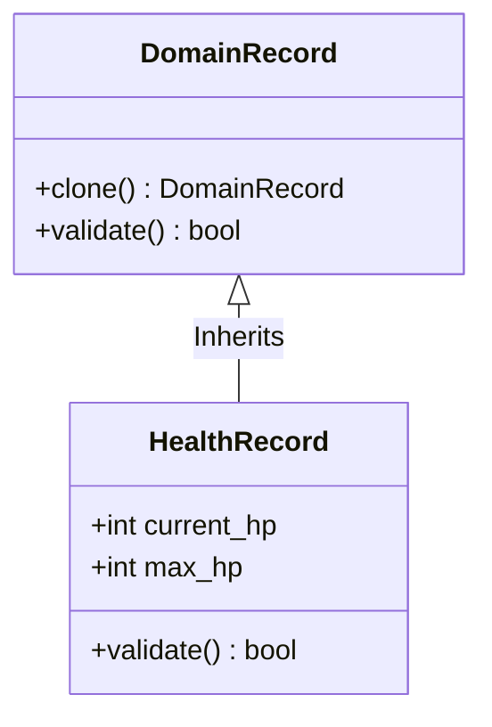

# TDD: DomainRecord Contract

## 1. Overview
The `DomainRecord` represents the **Atoms** of the domain (ADR-004). It is a passive, anemic fragment of state that describes a single dimension of an entity (e.g., its health, its inventory).

## 2. Goals & Non-Goals
### Goals
*   Enforce **Anonymity**: Records do not have their own persistent identity outside of the Root.
*   Enforce **Cloneability**: Ensure safe state transformation via immutability.
*   Enforce **Self-Validation**: Ensure state integrity at the data level.

### Non-Goals
*   Holding a UUID (delegated to `DomainRoot`).
*   Importing or interacting with other Records (Horizontal Isolation).

## 3. Proposed Design

### Data Schema (Core Fields)
All `DomainRecord` implementations must be:
*   **Anemic:** Strictly passive data structures.
*   **Cloneable:** Must support a deep-copy mechanism for safe Logic transformation.
*   **Validatable:** Must define specific constraints (e.g., `hp` cannot be negative).

### Constraints
1.  **Taxonomy:** Must inherit from `src/core/contracts/domain/blueprint.py:DomainRecord`.
2.  **Anonymous Identity:** Cannot include a `uid` or `id` field. Its context is provided by its parent Root.
3.  **Isolation:** Strictly prohibited from importing sibling Leaf models.

### Detailed Design

## 4. Diagnostic Goals
*   **Anemic Enforcement:** Linter check ensuring no complex methods exist in `models.py`.
*   **Isolation Audit:** Preventing illegal imports between sibling Leaf packages.
