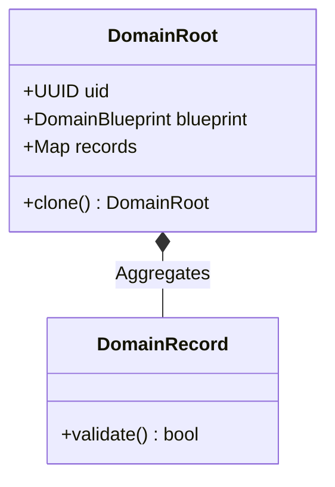

# TDD: DomainRoot Contract

## 1. Overview
The `DomainRoot` is the engineering realization of the **Aggregate Root** (ADR-003). It is a passive, anemic Data Transfer Object (DTO) that anchors a Bounded Context through a globally unique UUID.

## 2. Goals & Non-Goals
### Goals
*   Enforce a mandatory, persistent UUID for every sovereign actor.
*   Act as the primary "Container" for vertical composition (aggregating Leaves).
*   Ensure 100% serializability for world snapshotting.

### Non-Goals
*   Containing business logic (delegated to `logic.py`).
*   Emitting events (delegated to `services.py`).

## 3. Proposed Design

### Data Schema (Core Fields)
All `DomainRoot` implementations must include:
*   `uid: UUID`: Unique identifier assigned by the `IdentityService`.
*   `blueprint: DomainBlueprint`: The static template used for initialization.
*   `records: Dict[str, DomainRecord]`: A mapping of aggregated Leaf Records.

### Constraints
1.  **Taxonomy:** Must inherit from `src/core/contracts/domain/root.py:DomainRoot`.
2.  **Anemic:** Must be a `@dataclass(frozen=True)`. No methods other than `clone()` are permitted.
3.  **Sovereignty:** Only one `DomainRoot` is allowed per Root Package.

### Composition Diagram

## 4. Diagnostic Goals
*   **Identity Check:** Automated validation that the `uid` is never null or malformed.
*   **Composition Audit:** Ensuring that a `DomainRoot` only contains `DomainRecord` or `DomainValueObject` types.
