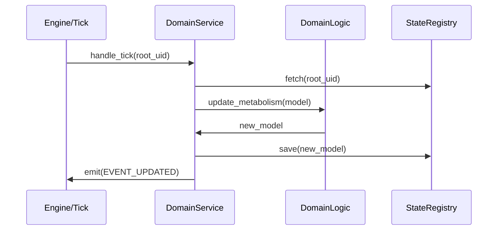

# TDD: Domain Service Entities

## 1. Overview
This document defines the standards for **Domain Services** (The Nervous System) in the domain layer. Services are the "Operators" that coordinate between Models and Logic, and manage interactions with the broader system (ADR-004).

## 2. Goals & Non-Goals
### Goals
*   Enforce **Statelessness**: Ensure Services do not hold data; they only process it.
*   Enforce **Sovereignty**: Ensure only Root Services can emit public events to the system.
*   Centralize **Side-Effects**: Use Services as the only place where I/O (Persistence) or System interaction (Events) occurs.

### Non-Goals
*   Implementing business math (delegated to `logic.py`).
*   Defining data structures (delegated to `models.py`).

## 3. Proposed Design

### The "Operator" Pattern
The Service acts as the hand that moves the data. It picks up the tool (Logic) and applies it to the material (Model).

**Interaction Sequence:**
1.  Fetch Model (from Storage or Input).
2.  Invoke Logic (Pure Math).
3.  Save Model (to Storage).
4.  Emit Event (if a Root Service).

### Rules of Engagement
*   **Dependency Injection:** Services must be registered in the `ServiceContainer` via a `ServiceProvider`.
*   **Event Sovereignty:** Leaf Services must remain silent. Only Root Services may use the `EventBus` to notify the world.
*   **Singleton Nature:** Services are instantiated as singletons by the Kernel.

### Service Orchestration Diagram

## 4. Diagnostic Goals
*   **Silence Audit:** Automated check verifying that no Leaf Package imports the `EventBus`.
*   **Statelessness Check:** Ensuring no instance variables (other than injected services) exist in the Service class.
*   **Composition Integrity:** Verify that Root Services only orchestrate their own leaves via lateral structurally-typed protocols.
