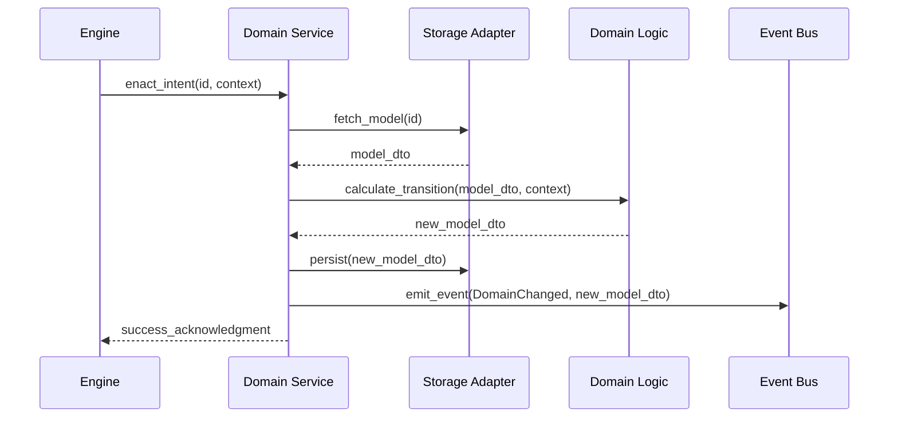

# TDD: Domain Service Entities

## 1. Overview
This document defines the implementation standards for `services.py` entities. Service entities represent the **"Nervous System"** or the **"General"** of a domain—the active orchestrators that coordinate state, logic, and side effects.

## 2. Goals & Non-Goals
### Goals
*   Provide a single, clear entry point for domain "Intent."
*   Encapsulate all side effects (I/O, Events).
*   Maintain "Snapshotability" by enforcing statelessness.

### Non-Goals
*   Containing complex mathematical rules (delegated to Logic).
*   Defining data structures (delegated to Models).
*   Directly rendering UI elements.

## 3. Proposed Design

### The "Operator" Pattern
Services act as the hands that hold the Logic Calculator. They understand the application context and manage the "Transaction" of changing state.

### Interaction Rules (Codified)
1.  **Orchestration:** Responsible for the lifecycle of a domain action: Fetch → Logic → Save → Notify.
2.  **Singleton Class:** Managed by the `ServiceContainer`.
3.  **No State Storage:** Forbidden from storing domain data in `self` (e.g., `self.wagon_health`).
4.  **Adapter Access:** Allowed to use dependency-injected adapters (Storage, Event Bus).
5.  **Public Interface:** The "Voice" of the domain; the only way for the Engine to enact change.
6.  **Sovereignty Rules:**
    *   **Roots:** Can emit public events.
    *   **Leaves:** Silent; restricted to internal coordination.

### Detailed Design

#### Orchestration Sequence

#### Dependency Graph
*   **Allowed Imports:** `models.py`, `logic.py`, `src/core/contracts/`, `src/domain/common/`.
*   **Forbidden Imports:** Any sibling `services.py` (Horizontal Isolation).

### 4. Service Mandates (The "Must-Haves")
Regardless of being a Root or a Leaf, all Services must fulfill these five core tasks:
*   **Encapsulate Logic:** Act as the "Operator" for their package's `logic.py`.
*   **Enforce Statelessness:** Never store instance state (to ensure 100% snapshotability).
*   **Manage Hydration:** Coordinate the transformation of raw data into anemic Models (DTOs).
*   **Handle Errors:** Translate technical/system errors into domain-specific outcomes.
*   **Observability:** Log significant domain transitions (Intent changes).

### 5. Unity & Differentiators
| Requirement | **Root Service** | **Leaf (Record) Service** |
| :--- | :--- | :--- |
| **Sovereignty** | High. Can emit events to the Global Event Bus. | None. Must remain silent (internal only). |
| **Identity** | Assigns UUIDs to `DomainRoot` DTOs. | Handles anonymous/value-based `DomainRecords`. |
| **Orchestration** | Coordinates multiple Leaf Services. | Coordinates internal atomic logic only. |
| **Ontology** | Defends its `BOOT_PRIORITY` and `SCOPE`. | Passive; exists as a "Skill" for a Root. |

### 6. Proposed Unity Model: Domain Service Taxonomy
To rationalize inheritance and ensure architectural conformity, services follow a three-tier hierarchy:

1.  **`BaseDomainService` (ABC):**
    *   **Registry:** Holds the `ServiceContainer`.
    *   **Interface:** Defines `abstract method execute_intent()`.
    *   **Commonality:** Provides standardized logging (`_log`) and error handling.
    *   **Persistence:** Standardized `_persist(model)` hook for the storage adapter.

2.  **`RootDomainService` (Inherits Base):**
    *   **Sovereignty:** Adds `emit_event(event_name, payload)` capability.
    *   **Identity:** Enforces `IdentityRegistry` checks for UUID assignment.
    *   **Dependencies:** Mandates an `IdentityService` dependency.

3.  **`LeafDomainService` (Inherits Base):**
    *   **Silence:** Disables/Shadows the `emit_event` method to enforce **Leaf Silence**.
    *   **Focus:** Specialized for atomic model hydration and logic-mapping.

## 7. Diagnostic Goals
*   **Circular Dependency Prevention:** Services must use **Protocols** or **Events** to communicate laterally. No direct imports of sibling services.
*   **Persistence Integrity:** Services must ensure that state is only persisted if the Logic transition was successful.

## 5. Cross-Cutting Concerns
*   **Observability:** Services should log major "Intent" shifts (e.g., `CharacterDied`, `TradeCompleted`).
*   **Error Handling:** Services must translate technical errors (e.g., `DiskFull`) into domain-appropriate responses or events.
