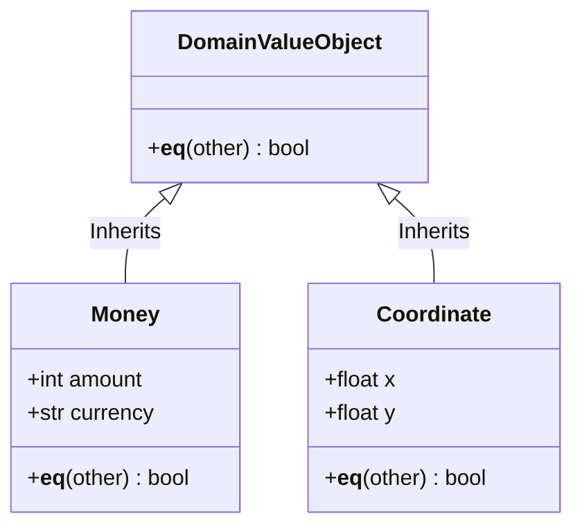

# TDD: DomainValueObject Contract

## 1. Overview
The `DomainValueObject` represents the **Shared Kernel** types (ADR-005). These are not Actors or status-carriers; they are "Semantic Types" that bundle primitives into business concepts (e.g., `Money`, `Coordinate`).

## 2. Goals & Non-Goals
### Goals
*   Enforce **Value Equality**: Two objects are equal if their internal data is identical.
*   Enforce **Immutability**: Once created, a Value Object never changes.
*   Centralize **Semantic Logic**: Ensure `Money(100, "USD")` is never confused with a raw `int`.

### Non-Goals
*   Holding a persistent ID or UUID.
*   Managing their own lifecycle (they are just data).

## 3. Proposed Design

### Interaction Model
Value Objects reside in `src/domain/common/`. They are the only domain-level objects allowed to be imported globally by any Root or Leaf without violating horizontal isolation.

### Constraints
1.  **Value-Based Identity:** No `uid` field. Equality is based on `__eq__` (e.g., `Money(10) == Money(10)`).
2.  **Immutability:** Must be implemented as `@dataclass(frozen=True)`.
3.  **Encapsulation:** Must include internal validation during `__post_init__` (e.g., `Coordinate(x,y)` must be within map bounds).

### Detailed Design

## 4. Diagnostic Goals
*   **Immutability Audit:** Verification that no Value Object can be modified after instantiation.
*   **Equality Enforcement:** Testing that two distinct instances with the same data are seen as equal by the system.
