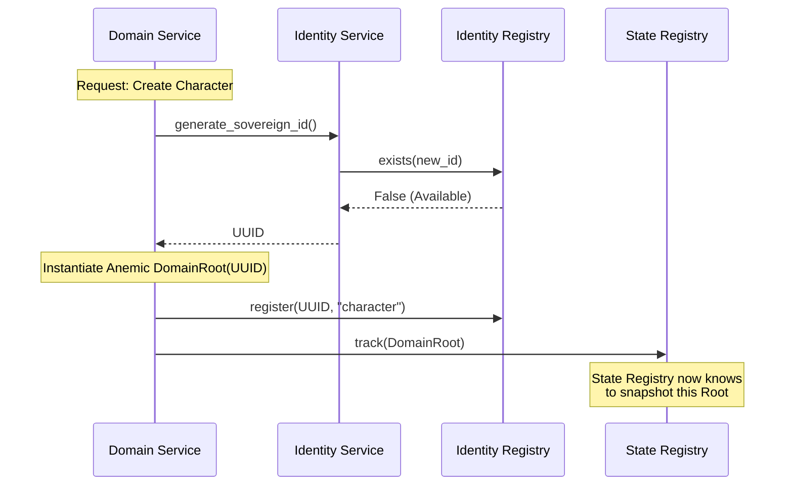

# TDD: Identity Service & Registry

## Overview
Identity management is split into two distinct components to adhere to the Single Responsibility Principle (SRP):
1. **`IdentityService`**: A stateless logic service for generating and validating UUIDs.
2. **`IdentityRegistry`**: A stateful concrete registry for tracking active sovereign identities.

## Goals
- **Separation of Concerns**: Logic (Verbs) remains separate from Storage (Noun).
- **Single Source of Truth**: Centralize ID generation and tracking to prevent duplicates.
- **Collision Safety**: Immediate "Hard Fail" on duplicate ID registration.
- **Simplified Contracts**: No redundant abstract classes; concrete implementations are used directly.

## Proposed Design

### 1. The `IdentityRegistry` (Noun/Storage)
A stateful ledger that tracks every active `DomainRoot` UUID in the ecosystem.

```python
# src/core/identity/registry.py
from typing import Dict, Optional
from uuid import UUID

class IdentityRegistry:
    """
    The concrete storage for all active sovereign identities.
    """
    def __init__(self):
        # Maps UUID -> Owner Info (e.g., 'domain.roots.character')
        self._active_ids: Dict[UUID, str] = {}

    def register(self, uid: UUID, owner_info: str) -> None:
        if uid in self._active_ids:
            raise IdentityCollisionError(f"UUID {uid} already exists for {self._active_ids[uid]}")
        self._active_ids[uid] = owner_info

    def release(self, uid: UUID) -> None:
        self._active_ids.pop(uid, None)

    def exists(self, uid: UUID) -> bool:
        return uid in self._active_ids

    def get_owner(self, uid: UUID) -> Optional[str]:
        return self._active_ids.get(uid)

    def all_active(self) -> Dict[UUID, str]:
        return self._active_ids
```

### 2. The `IdentityService` (Verb/Logic)
A stateless service responsible for identity-related "Math" and coordinating with the Registry.

```python
# src/core/identity/service.py
import uuid
from .registry import IdentityRegistry

class IdentityService:
    """
    Stateless logic service for identity generation and validation.
    """
    def __init__(self, registry: IdentityRegistry):
        self._registry = registry

    def generate_sovereign_id(self) -> uuid.UUID:
        """Generates a UUID and ensures it is not already in the registry."""
        new_id = uuid.uuid4()
        # Statistically impossible but architecturally safe collision check
        while self._registry.exists(new_id):
            new_id = uuid.uuid4()
        return new_id

    def is_valid_uuid(self, candidate: any) -> bool:
        """Validates the structure of a UUID."""
        return isinstance(candidate, uuid.UUID)
```

### 3. Orchestration Flow
The **Domain Service** (The General) coordinates with both the `IdentityService` and the `StateRegistry`.



## Cross-Cutting Concerns
- **Registry Lifespan**: The `IdentityRegistry` is a singleton instance within the `ServiceContainer`. It is wiped/re-hydrated during save-game load operations.
- **Testing**: The `IdentityRegistry` can be pre-populated with IDs for specific test scenarios to verify collision handling.

## References
- [ADR 003: Anemic Aggregator Domains](../reports/adr/003_anemic_aggregator_domains.md)
- [ADR 007: Domain Ecosystem](../reports/adr/007_domain_ecosystem.md)
