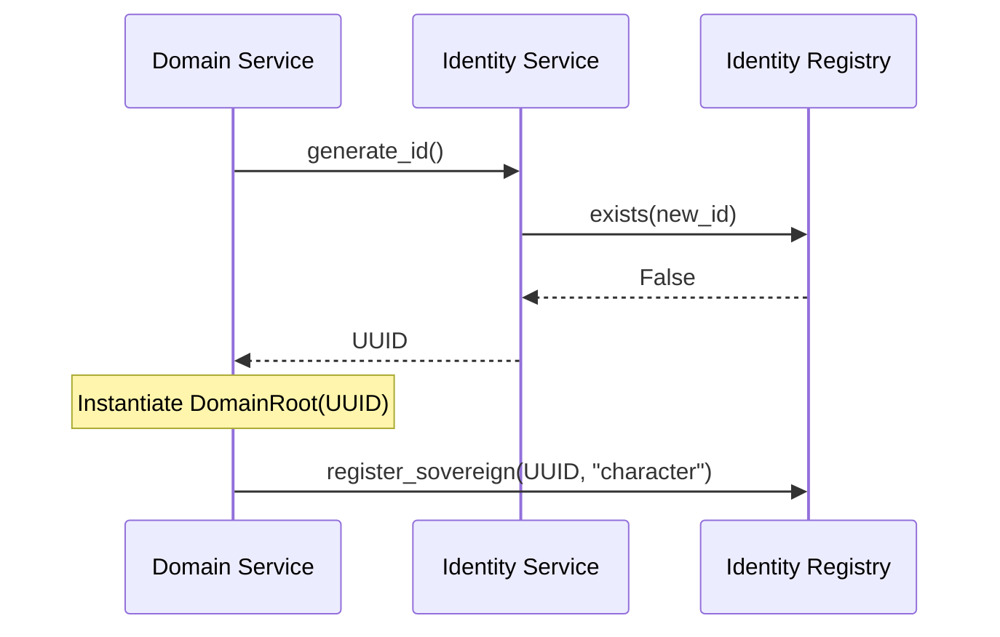

# TDD: Identity Service & Registry

## 1. Overview
Identity management is split into two distinct components to maintain the Single Responsibility Principle (SRP):
1.  **`IdentityService`**: A stateless logic service for generating and validating UUIDs.
2.  **`IdentityRegistry`**: A stateful registry (inheriting from `BaseRegistry`) for tracking active sovereign identities.

## 2. Goals
- **Separation of Concerns**: Verbs (Logic) are separated from Nouns (Storage).
- **Collision Safety**: Centralize ID generation to ensure system-wide uniqueness.
- **Traceability**: Track which domain owns which ID for debugging and snapshot integrity.

## 3. Proposed Design

### 3.1 The `IdentityRegistry` (Noun)
Inherits from `BaseRegistry[UUID]` to manage active IDs.

```python
# Proposed in src/core/identity/registry.py
from uuid import UUID
from src.core.contracts.registry import BaseRegistry

class IdentityRegistry(BaseRegistry[str]):
    """
    Tracks active identities. 
    Key: UUID (as string) 
    Value: Owner metadata (e.g., 'character', 'wagon')
    """
    def register_sovereign(self, uid: UUID, owner: str) -> None:
        if self.exists(str(uid)):
            raise ValueError(f"Identity Collision: {uid} already registered to {self.get(str(uid))}")
        self.register(str(uid), owner)
```

### 3.2 The `IdentityService` (Verb)
Stateless logic for ID operations.

```python
# Proposed in src/core/identity/service.py
import uuid
from .registry import IdentityRegistry

class IdentityService:
    def __init__(self, registry: IdentityRegistry):
        self._registry = registry

    def generate_id(self) -> uuid.UUID:
        new_id = uuid.uuid4()
        while self._registry.exists(str(new_id)):
            new_id = uuid.uuid4()
        return new_id
```

### 3.3 Orchestration Flow


---

## 4. Implementation Checklist
- [x] Implement generic `BaseRegistry` in `src/core/contracts/registry.py`.
- [ ] Create `IdentityRegistry` inheriting from `BaseRegistry`.
- [ ] Create `IdentityService` for collision-safe generation.
- [ ] Implement `IdentityServiceProvider` for automated injection.
- [ ] Add unit tests for collision detection and registration.

## 5. Acceptance Criteria
- [x] `BaseRegistry` supports generic type safety and explicit key registration.
- [ ] `IdentityRegistry` prevents duplicate registration of the same UUID.
- [ ] `IdentityService` returns a `UUID` type.
- [ ] `IdentityRegistry` can identify the "owner" (string intent) of a given UUID.

---

## 6. References
- [ADR-003: Anemic Aggregator Domains](../reports/adr/003_anemic_aggregator_domains.md)
- [TDD-002: DomainContext Contract](domain_context_contract.md)
