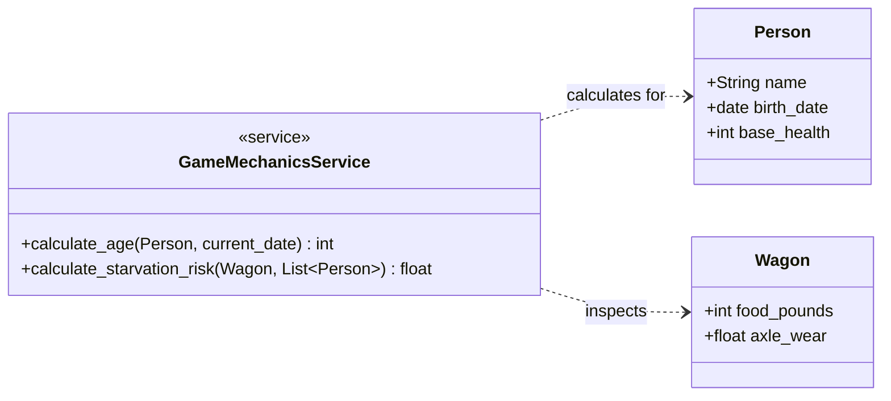

# Domain Service Pattern

The Domain Service pattern is a cornerstone of Domain-Driven Design (DDD). It is used when an operation or calculation doesn't naturally belong to a single "thing" (Entity), or when it involves complex business rules that would clutter your data-focused classes.

In your Hexagonal architecture, the Entities are your "dumb" data buckets (Dataclasses), and the Domain Service acts as the "referee" or "calculator" that understands the rules of the Oregon Trail.

## 1. The Relationship Structure

In this pattern, your Entities hold the identity and raw data, while the Service holds the verbs and logic.



## 2. Implementation: The Service and Its Entities

Here is how you would separate the "What" (Data) from the "How" (Logic) using two examples: Age and Starvation Risk.

### The Entities (The "What")

These stay clean, immutable, and easy to validate with Pydantic or standard dataclasses.

```python
from dataclasses import dataclass
from datetime import date
from typing import List

@dataclass(frozen=True)
class Person:
    name: str
    birth_date: date
    health_score: int  # 0 to 100

@dataclass(frozen=True)
class Wagon:
    food_lbs: int
    oxen_count: int
```

### The Domain Service (The "How")

This class contains pure functions. It doesn't store the current date or the wagon; it just takes them as arguments and returns a result.

```python
class GameMechanicsService:
    @staticmethod
    def calculate_age(person: Person, current_date: date) -> int:
        """Standardizes age calculation across the whole game."""
        return (current_date - person.birth_date).days // 365

    @staticmethod
    def calculate_daily_ration_shortfall(wagon: Wagon, party: List[Person]) -> int:
        """
        Example of complex logic: 
        Calculates how much food is missing based on party size.
        15 lbs needed per day, but if you have < 20 lbs, the 'risk' increases.
        """
        required_food = len(party) * 3  # 3 lbs per person
        shortfall = required_food - wagon.food_lbs
        return max(0, shortfall)
```

## 3. Why this fits your "Contract-First" and TDD approach

By using a Domain Service, your "Contract" is the function signature. You can test the entire physics of your game without ever launching the game loop or a UI.

Example TDD Test (Linux environment):

```python
def test_starvation_logic():
    service = GameMechanicsService()
    wagon = Wagon(food_lbs=10, oxen_count=2)
    party = [Person("Gabe", date(1820, 1, 1), 100), Person("Jane", date(1822, 1, 1), 100)]
    
    # We expect 2 people to need 6 lbs. We have 10. Shortfall should be 0.
    assert service.calculate_daily_ration_shortfall(wagon, party) == 0
```

## 4. Strategies for Centralization

As your project grows, you can split your Domain Service into specialized units:

*   **HealthService**: Calculates disease contraction, healing rates, and death probabilities.
*   **MovementService**: Calculates how many miles the wagon moves based on oxen health, weather, and terrain.
*   **TimeService**: Handles the calendar, seasons, and leap years.

## Summary of Relationships

1.  The **Controller** asks the **Service** for a calculation.
2.  The **Service** requests the necessary **Entities** (Wagon, Person) as inputs.
3.  The **Service** returns a value (int, float, or even a new "Status" object).
4.  The **Controller** then decides what to do with that value (e.g., update the Model or trigger a View update).

This keeps your "Person" class from becoming a 500-line monster file full of math!
