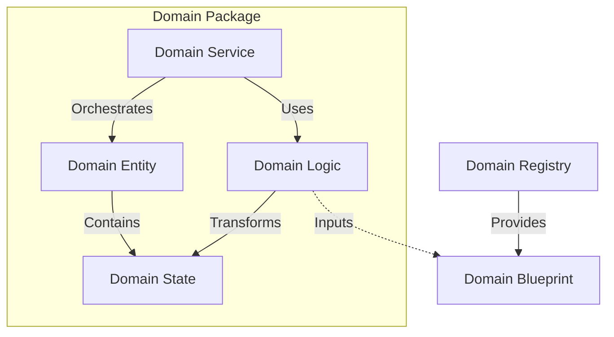
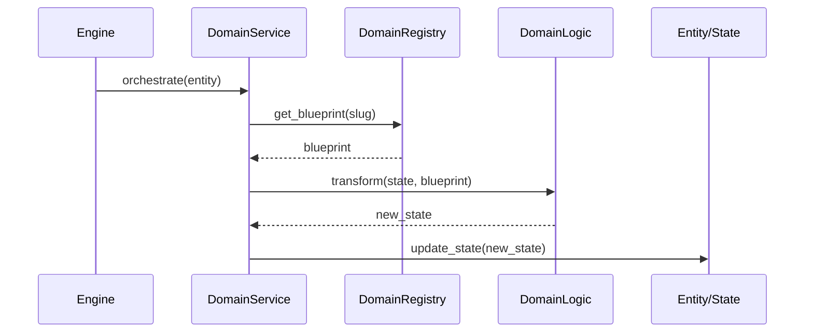

# Domain Architecture Contract

The **Domain Protocol** is the architectural specification that dictates how domain objects interact within the Oregon Trail engine. It ensures a strict separation of concerns by defining "plug shapes" for every component, preventing leakage between state, logic, and orchestration.

## 1. Governance & Documentation

Architectural decisions are governed by **Architectural Decision Records (ADRs)** and enforced through a combination of static typing and automated testing. This ensures that the system evolves predictably and maintains its structural integrity over time.

## 2. Core Domain Contracts

The protocol is built on four fundamental contracts, each with a distinct role and constraint set. These contracts are defined in `src/core/contracts/domain/`.

| Contract | Role | Constraint |
| :--- | :--- | :--- |
| **DomainBlueprint** | Immutable Template | Read-only; defined in assets; never modified at runtime. |
| **DomainState** | Mutable Data | Owned by an Entity; represents current status; "Anemic". |
| **DomainEntity** | Identity Holder | The only component with a UID; root for state and value objects. |
| **DomainValueObject** | Property Container | Identitiless; immutable; replaced entirely when updated. |

## 3. Interaction Model (The "Plugs")

The "Protocol" defines how these contracts connect. By standardizing these "plugs," we ensure that the Engine can interact with any domain (Health, Character, Wagon) through a uniform interface.

### A. The Registry ↔ Blueprint Plug (The Source)
The **Registry** is the exclusive provider of **Blueprints**. 
- **Rule**: Services must request Blueprints from a Registry; they cannot instantiate them directly.
- **Benefit**: Centralizes "game balance" data and prevents hardcoded magic numbers.

### B. The Logic ↔ State Plug (The Transformation)
**Domain Logic** consists of pure functions that transform **State** using a **Blueprint**.
- **Rule**: Logic functions are stateless; they take `(State, Blueprint)` and return a new or modified `State`.
- **Benefit**: Enables high-performance TDD without infrastructure overhead.

### C. The Service ↔ Entity Plug (The Orchestration)
**Domain Services** manage the lifecycle and interaction of **Entities**.
- **Rule**: Services coordinate the flow: fetch Entity -> fetch Blueprint -> call Logic -> update Entity.
- **Benefit**: Keeps high-level "Game Rules" separate from low-level "Math."



## 4. Enforcement Mechanisms

The protocol is enforced through multiple layers of "Code Contracts" to prevent architectural drift.

### A. Abstract Contracts (ABCs)
We use **Abstract Base Classes (ABCs)** to define mandatory interfaces for core components like Service Providers and Registries. This ensures that any new domain implementation satisfies the basic requirements of the engine lifecycle.

```python
from abc import ABC, abstractmethod

class BaseServiceProvider(ABC):
    @abstractmethod
    def register(self) -> None:
        """Every provider MUST implement a registration phase."""
        pass

    @abstractmethod
    def boot(self) -> None:
        """Every provider MUST implement a bootstrapping phase."""
        pass
```

### B. Structural Typing (Protocols)
Using `typing.Protocol`, we define the "plug shapes" for domain interaction. This is **Static Duck Typing**: if an object "walks and quacks" like a domain service, the type-checker accepts it, even without formal inheritance.

```python
@runtime_checkable
class DomainBinding(Protocol[E, S, B]):
    """
    The Protocol defining the structural interface for a Domain Pillar.
    """
    def orchestrate(self, entity: E) -> None: ...
    def transform(self, state: S, blueprint: B) -> S: ...
```

### C. Generics & Immutability
- **Generics**: Bound `TypeVars` ensure that a `HealthService` can only accept `CharacterState`, preventing "cross-wiring" of unrelated domains.
- **Immutability**: `frozen=True` on Blueprints and Value Objects ensures that data sources remain pristine and prevents accidental side effects.

## 5. Architectural Lifecycle

Every game interaction follows a standardized "Plug" flow:

1. **Trigger**: The Engine (Controller) calls `process_tick()`.
2. **Resolution**: The `ServiceContainer` resolves the appropriate `DomainService`.
3. **Fetch**: The Service retrieves the target `Entity` and required `Blueprint` (from the Registry).
4. **Execution**: The Service passes the Entity's `State` and the `Blueprint` into the `Logic`.
5. **Update**: The Logic returns the transformed `State`, which the Service applies back to the `Entity`.



## 6. Testing Regime: Fitness Functions

The most robust layer of enforcement is the **Architecture-as-Code** suite. These tests automatically discover every domain package and verify it against our Universal Domain Blueprint (UDB).

For details on the automated enforcement suite, see:
[Domain Testing Regime: Fitness Functions](./domain_testing_regime.md)
