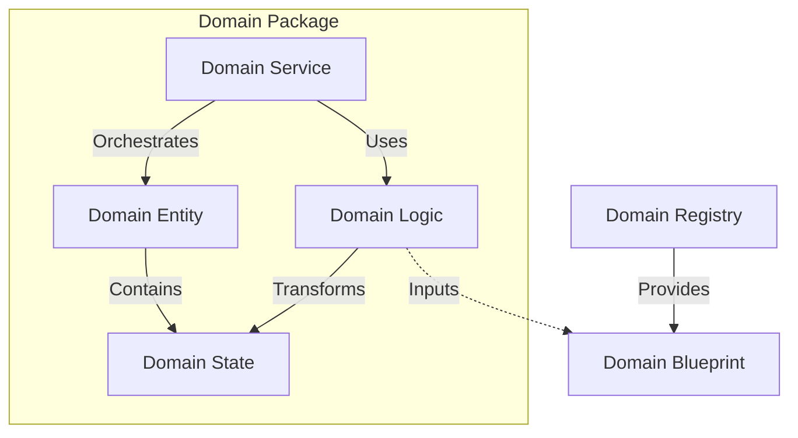
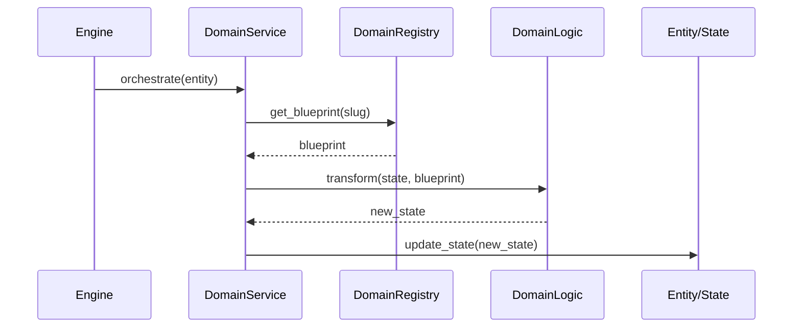

# Domain Architecture Contract

The **Domain Protocol** is the architectural specification that dictates how domain objects interact within the Oregon Trail engine. It ensures a strict separation of concerns by defining "plug shapes" for every component, preventing leakage between state, logic, and orchestration.

## 1. Core Domain Contracts

The protocol is built on four fundamental contracts, each with a distinct role and constraint set. These contracts are defined in `src/core/contracts/domain/`.

| Contract | Role | Constraint |
| :--- | :--- | :--- |
| **DomainBlueprint** | Immutable Template | Read-only; defined in assets; never modified at runtime. |
| **DomainState** | Mutable Data | Owned by an Entity; represents current status; "Anemic". |
| **DomainEntity** | Identity Holder | The only component with a UID; root for state and value objects. |
| **DomainValueObject** | Property Container | Identitiless; immutable; replaced entirely when updated. |

## 2. Interaction Model (The "Plugs")

The "Protocol" defines how these contracts connect. By standardizing these "plugs," we ensure that the Engine can interact with any domain (Health, Character, Wagon) through a uniform interface.

### A. The Registry ↔ Blueprint Plug (The Source)
The **Registry** is the exclusive provider of **Blueprints**. 
- **Rule**: Services must request Blueprints from a Registry; they cannot instantiate them directly.
- **Benefit**: Centralizes "game balance" data and prevents hardcoded magic numbers.

### B. The Logic ↔ State Plug (The Transformation)
**Domain Logic** consists of pure functions that transform **State** using a **Blueprint**.
- **Rule**: Logic functions are stateless; they take `(State, Blueprint)` and return a new or modified `State`.
- **Benefit**: Enables high-performance TDD without infrastructure overhead.

### C. The Service ↔ Entity Plug (The Orchestration)
**Domain Services** manage the lifecycle and interaction of **Entities**.
- **Rule**: Services coordinate the flow: fetch Entity -> fetch Blueprint -> call Logic -> update Entity.
- **Benefit**: Keeps high-level "Game Rules" separate from low-level "Math."



## 3. The DomainBinding Meta-Contract

To ensure every domain package "fits" the Oregon Trail engine, we use the `DomainBinding` protocol (`src/core/contracts/domain/binding.py`). This is a structural type that defines the "Recipe" for a valid domain pillar.

```python
@runtime_checkable
class DomainBinding(Protocol[E, S, B]):
    """
    The Protocol defining the structural interface for a Domain Pillar.
    It binds the Orchestrator (Service) to the Transformer (Logic).
    """
    def orchestrate(self, entity: E) -> None: 
        """Implementation found in the Domain Service."""
        ...

    def transform(self, state: S, blueprint: B) -> S:
        """Implementation found in the Domain Logic."""
        ...
```

### Relationship Lexicon

| Interaction | Nature | Semantic Clarity |
| :--- | :--- | :--- |
| **Service ↔ Entity** | Managerial (External) | "The HealthService manages the character's recovery process." |
| **Logic ↔ State** | Mathematical (Internal) | "The Logic calculates the result of the infection on the health state." |

## 4. Architectural Lifecycle

Every game interaction follows a standardized "Plug" flow:

1. **Trigger**: The Engine (Controller) calls `process_tick()`.
2. **Resolution**: The `ServiceContainer` resolves the appropriate `DomainService`.
3. **Fetch**: The Service retrieves the target `Entity` and required `Blueprint` (from the Registry).
4. **Execution**: The Service passes the Entity's `State` and the `Blueprint` into the `Logic`.
5. **Update**: The Logic returns the transformed `State`, which the Service applies back to the `Entity`.



## 5. Enforcement Mechanisms

The protocol is enforced through Python's type system to prevent architectural drift.

- **Generics**: Bound `TypeVars` ensure that a `HealthService` can only accept `CharacterState`, preventing "cross-wiring" of unrelated domains.
- **Protocols**: `runtime_checkable` protocols allow for dynamic discovery and validation of domain packages during initialization.
- **Immutability**: `frozen=True` on Blueprints and Value Objects ensures that data sources remain pristine and prevents accidental side effects.

### Example Implementation Structure

```python
# logic.py (Pure Domain Logic)
def calculate_starvation(state: CharacterState, blueprint: MaladyBlueprint) -> CharacterState:
    # Pure transformation: State + Blueprint -> State
    return state.clone(hp=state.hp - blueprint.tick_damage)

# services.py (The Orchestrator)
class HealthService(BaseDomainService[CharacterEntity]):
    def orchestrate(self, character: CharacterEntity) -> None:
        # The Service manages the ENTITY and coordinates the flow
        blueprint = self.registry.get("starvation")
        
        # The LOGIC manages the STATE
        character.state = calculate_starvation(character.state, blueprint)
```

By following this protocol, you aren't just writing code; you are building a platform where new mechanics can be "plugged in" without modifying the core engine.
