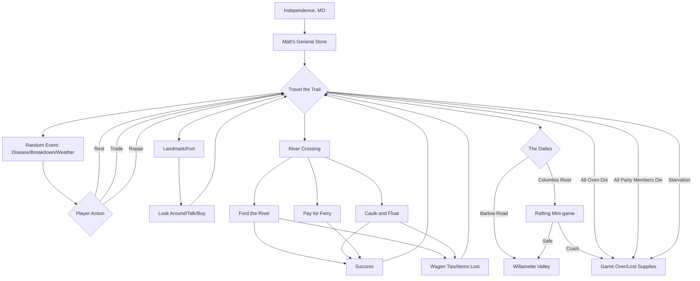

# The Story of the Oregon Trail

This document outlines the narrative arc and user progression of the 1985 Oregon Trail game.

## Narrative Arc
The story is set in **1848**. The player is a pioneer leading a family/party from **Independence, Missouri** to the **Willamette Valley, Oregon Territory**. The narrative is one of survival against the elements, geography, and disease. It is a race against time to reach the destination before the winter snows make the mountain passes impassable.

## User Progression and Deviations (Mermaid)

## Possible Deviations
- **The Month Factor:** Starting in July makes it much more likely to hit winter snows in the mountains, leading to death. Starting in March may mean less grass for oxen early on.
- **River Risks:** Choosing to ford a deep river can lead to immediate loss of a huge portion of inventory.
- **The "Shortcut" Mentality:** Pushing at a Grueling pace to make up time often leads to a "Death Spiral" where health fails and the party dies just miles from the end.
- **Resource Specialization:** A player may choose to buy almost no food and rely entirely on hunting, which is risky if game is scarce in certain regions.
