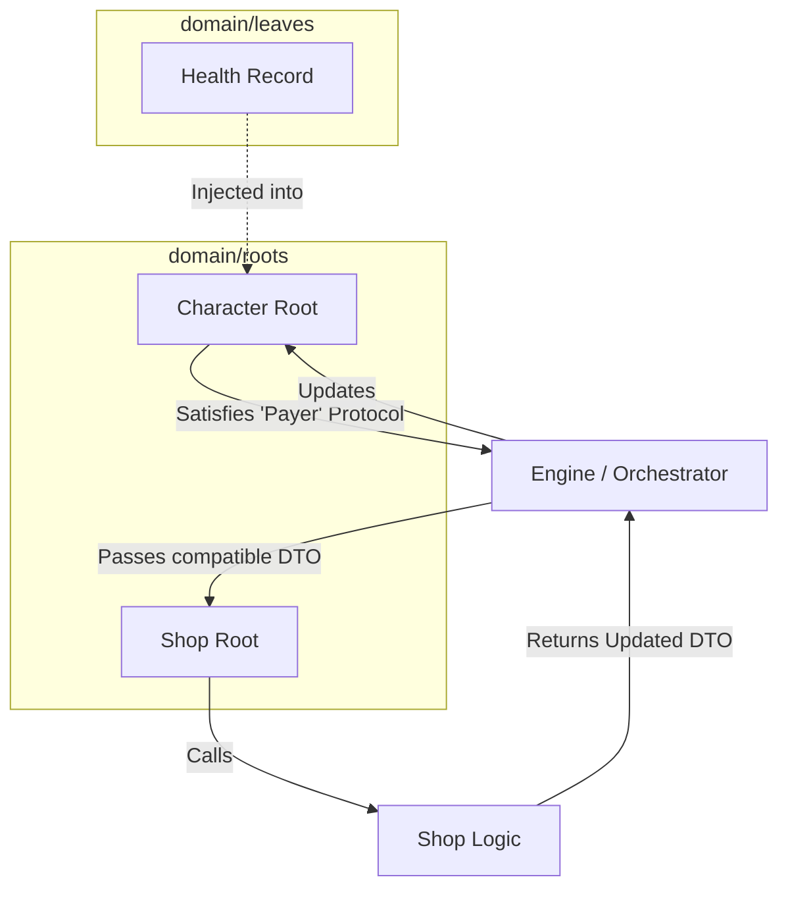

# ADR 002: Domain Hierarchy

The Oregon Trail Domain Level Architecture must be rationalized with Anti-Patterns and zones of Mutual-Exclusivity resolved.

## Context

The "split personality" of the Domain layer resulted from a conflict between the need for rigid structural safety and the need for decoupled, flexible interactions.

**Typing Resolution:** We have adopted a Normal-Structural Hybrid strategy.

1. **Normal Typing (Inheritance):** Used for Taxonomy (Species Identification). All entities must inherit from core/contracts/domain (DomainRoot, DomainRecord) to be recognized by the Kernel.

2. **Structural Typing (Protocols):** Used for Lateral Interaction. Roots interact with other Roots via typing.Protocol (Duck Typing) to prevent circular imports.

**Lexicon Standardization:** The hierarchy now recognizes four distinct "Species" of data, each with specific responsibilities toward the Orchestrator and ServiceContainer.

## Decision

### 1. Lexicon and Responsibility Mapping

We categorize the hierarchy based on Identity and Sovereignty:

| Entity | Identity | Scope | Responsibility |
| :--- | :--- | :--- | :--- |
| **DomainRoot** | UUID | Aggregate Root | The Sovereign "Actor." Anchors a Bounded Context. |
| **DomainRecord** | None | Leaf State | Anemic, anonymous state fragments (Atoms). |
| **DomainValueObject** | Value-based | Shared Kernel | Semantic types (Money, Coord) in `domain/common`. |
| **DomainBlueprint** | Slug | Template | Static "Global Truth" loaded from JSON. |

### 2. The Hierarchy of Authority: Atoms vs. Assemblies

We move away from a "flat mud" structure to a Directed Hierarchy:

* **Leaf Packages (The Atoms):** These are Structural Siblings with a Zero-Dependency Policy. They provide granular "Skills" (e.g., health, inventory). They are strictly sibling-blind.

* **Root Packages (The Assemblies):** These are the Aggregate Roots. They possess Conceptual Hierarchy over Leaves. They compose multiple `DomainRecords` into a single `DomainRoot`.

### 3. The Anatomy of Anemic Symbiosis

We adopt the **Anemic Domain Model** at the Package Level.

* **The Model (model.py):** The Resource. Passive DTO inheriting from DomainRoot or DomainRecord.

* **The Logic (logic.py):** The Metabolism. Pure, stateless functions that transform Models.

* **The Service (service.py):** The Nervous System. Coordinates the transformation and interacts with the ServiceContainer.

* **The Facade `__init__.py`:** The Voice. Only exposes the "Scream" (Intent) to the outside world.

### 4. Lateral Interaction via Duck Typing

To resolve the Root-to-Root dependency issue:

1. A Root (e.g., Shop) that requires another Root (e.g., Character) to perform a task will define a Structural Protocol.

2. The Orchestrator ensures the object satisfies the protocol before passing it across the boundary.

**Orchestration Flow**

## Consequences

### 1. Zero-Dependency Leaf Enforcement

The Zero-Dependency Leaf Policy is not mutually exclusive with Aggregate Roots; it is the requirement for them. Roots are the only entities allowed to "Assembly" the Atoms. This is enforced via the Testing Regime.

### 2. Bounded Context and Sovereignty

Every Aggregate Root defines a Bounded Context. Interactions between these contexts must happen through the Orchestrator/Event Bus. Direct imports between `domain/roots/A` and `domain/roots/B` are a "Hard Fail" in CI.

### 3. Testing Regime Refactoring

The testing suite is promoted to an Architectural Police role:

* **Taxonomy Check:** Verifies all models.py inherit from the correct core/contracts.

* **Import Audit:** Scans for illegal horizontal imports (Leaf-to-Leaf or Root-to-Root).

* **Ontology Verification:** Ensures `__SERVICE_PROVIDER__` and `BOOT_PRIORITY` are present in all Roots.

## Status

**Adopted** 2026-04-16
## Addendum: Service vs. Provider Clarification (2026-04-16)

To prevent architectural leakage, the following distinction is formalized:
1. **The Service (services.py):** The business logic Actor. It is a Stateless Singleton registered into the ServiceContainer.
2. **The ServiceProvider (providers.py):** The Kernel-level Factory. It handles the registration and bootstrapping of the Service. It is NOT part of the Domain Logic.

## Addendum: Structural Protocols & Import Audits (2026-04-16)

To support lateral interaction and automated architectural enforcement:
1. **Structural Protocols:** Lateral interaction between Roots is enforced via `typing.Protocol`. Consumers define the contract; providers satisfy it via Duck Typing (no inheritance from the Protocol is required).
2. **Import Audits:** Illegal horizontal imports (Leaf-to-Leaf or Root-to-Root) will be enforced via AST (Abstract Syntax Tree) parsing in the `pytest` suite, ensuring that "Zero-Dependency" and "Isolation" policies are not violated by manual code changes.
