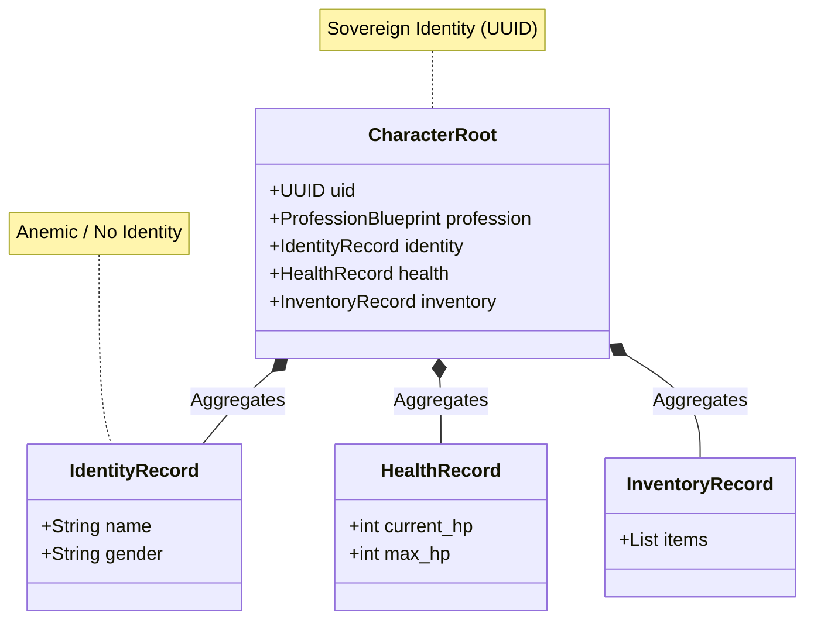
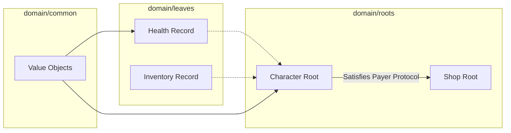
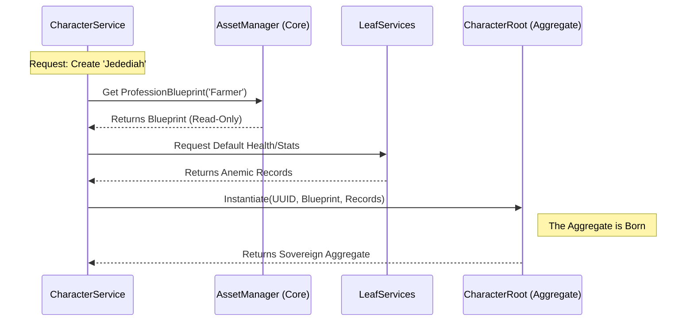
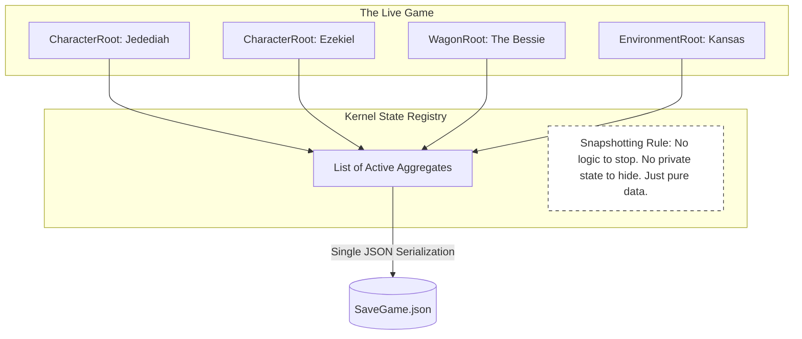

# ADR 003: Anemic Aggregator Domains: Roots and Leafs

The Oregon Trail Domain needs a Comprehensive Structural Digest which outlines the rules and composition of *Packages* within `domain/` (the Model Concern of the established [Screaming MVC Architecture](./001_screaming_mvc.md))

## Context

The Planned Architecture MUST:

1. Maintain **Structural Siblings**

    * `domain/` directory will maintain a flat structure divided into `leafs` and `roots`

    * Allows for a *leaf* to be accessed in a **Conceptual Hierarchy** by many *roots*. Therefore a *leaf* can be re-used by any *roots* which need it.

2. Allow for **Conceptual Hierarchy**: 

    * An Aggregator *Root* can contain multiple *Leaf* properties; e.g. a Character (root) has leafs: health, inventory, identity

    * An Aggregator Root can interact with another Root as a functional sub-component via Structural Protocols.

3. Establish the *Package* **Fascade** in `domain/<package_name>/__init__.py`

4. Definition of the **Fundamental Unit**; [See Domain Package Anatomy](004_domain_package_anatomy.md)

## Decisions

### 1. The Anemic Aggregate Definition

An Aggregate Root is a DTO (Data Transfer Object) that acts as a container for a Bounded Context.

* **The "Anemic" Rule:** Aggregates MUST NOT contain business logic or methods that mutate their state. They are strictly "Passive Data Structures."

* **The "Aggregator" Rule:** A Root's primary purpose is to group related DomainRecords (Leaves) and DomainBlueprints into a single unit of identity.

*This illustrates the "Aggregator" rule: how a single Identity (Root) anchors multiple anonymous states (Leaves).*

### 2. Compositional Hierarchy (Vertical vs. Horizontal)

To maintain the "Structural Sibling" flat directory while allowing hierarchy:

* **Vertical Composition (Allowed):** A DomainRoot (e.g., Character) may explicitly import and include DomainRecord types from Leaf packages (e.g., HealthRecord, InventoryRecord) as properties.

* **Horizontal Interaction (Protocol-Based):** A Root MUST NOT explicitly import another Root's Model class. If a Shop (Root) needs a Character (Root) to act as a Shopkeeper, it must define a Structural Protocol (Duck Typing) that the Character happens to satisfy.

*This visualizes the "Firewall." It shows that while vertical nesting is allowed (importing a Leaf), horizontal nesting is replaced by a "Protocol Handshake" (Duck Typing).*

### 3. Identity and Ownership

* **Sovereign Identity:** Every DomainRoot must possess a globally unique UUID.

* **Leaf Membership:** DomainRecords (Leaves) do not possess their own independent identity within the Ecosystem; their identity is derived from the Root that aggregates them.

### 4. The Hydration Flow

The assembly of an Aggregate is the responsibility of the Domain Service:

1. The Service fetches a Blueprint (The Template).

2. The Service requests Records from required Leaf packages.

3. The Service "Aggregates" these into the DomainRoot instance.

*This shows the "Assembly Line" where the Service (The General) acts as the builder.*

## Consequences

### 1. Total Snapshottability (The "Save Game" Win)

Because the Aggregates are anemic DTOs, the State Registry can take a "World Snapshot" simply by collecting the active Roots. There are no hidden private states or complex method chains to serialize.

*This highlights why anemic aggregates are superior for state management: the Registry just sees a list of DTOs.*

### 2. Forced Engine Mediation

Since Roots cannot "reach into" each other (Horizontal Isolation), the Engine Orchestrator must act as the "Middleman." 

This increases the amount of "glue code" but guarantees that a change in the Shop logic can never accidentally corrupt the Character state.

### 3. Boilerplate vs. Purity

This pattern requires more "assembly" steps in the Service layer compared to a "Rich Domain Model" where objects handle themselves. 

However, it ensures that Logic is 100% testable and State is 100% predictable.

### 4. Structural Clarity

The "Screaming" nature of the filesystem is preserved. A developer can see the "Menu" of the game just by looking at the roots/ folder, knowing that those are the only entities with true Sovereign Identity.

## Status

**Adopted** 2026-04-16