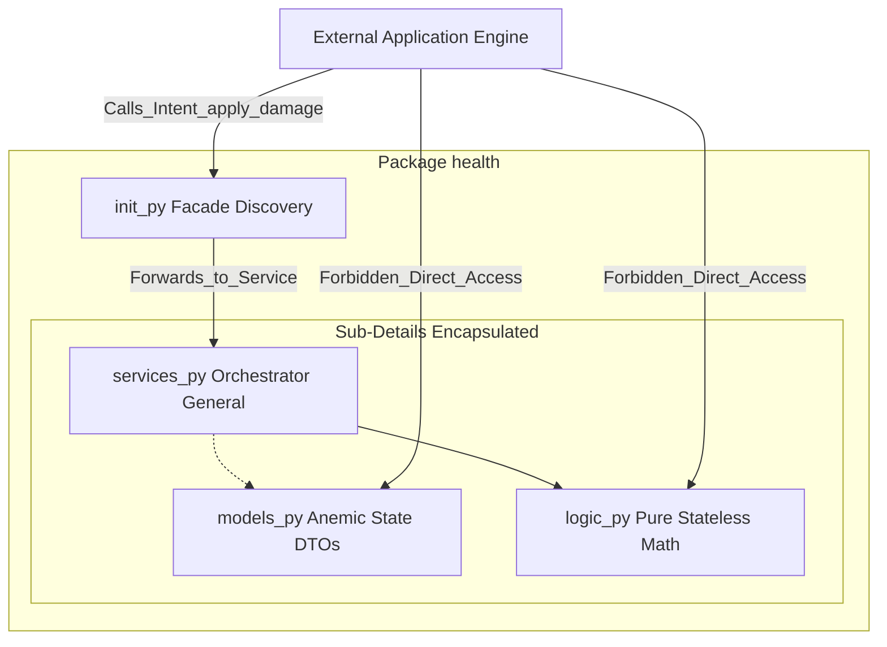
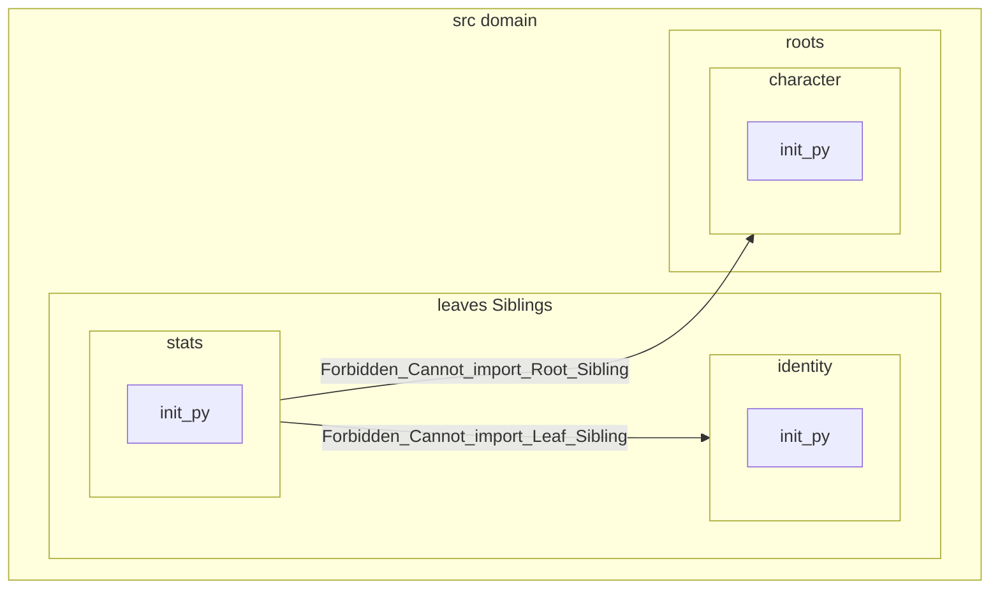
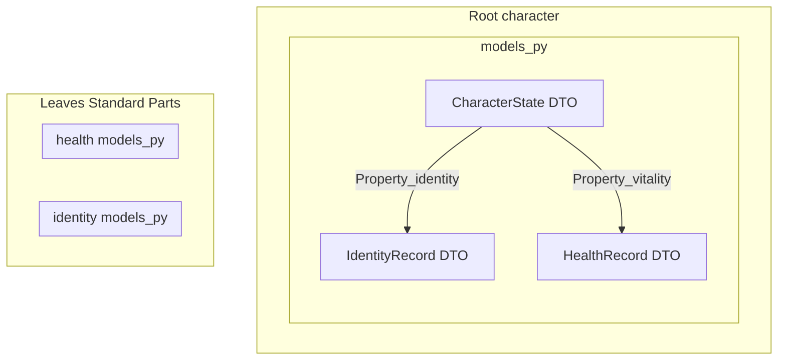
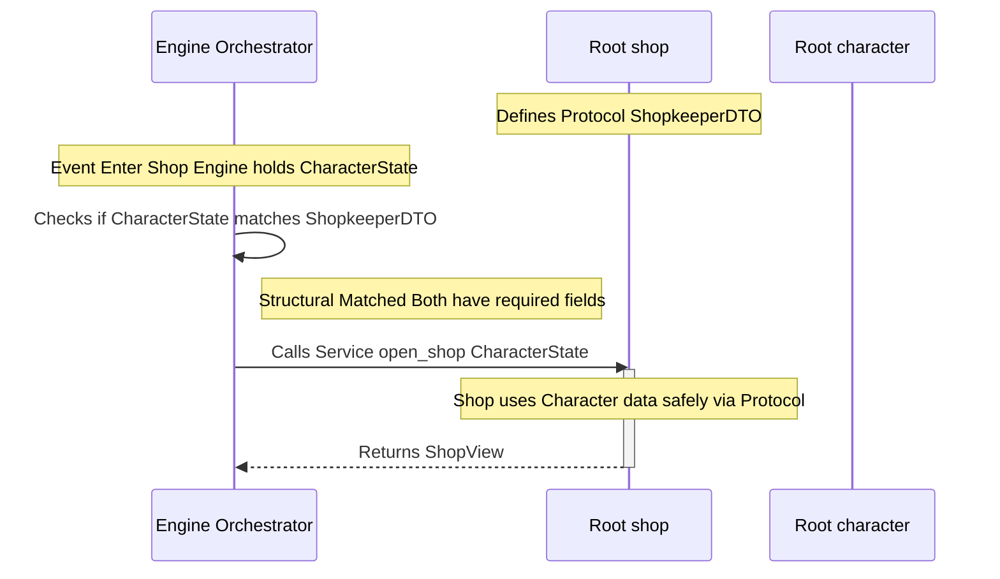

# ADR 004: Domain Package Anatomy

This ADR is the *Structural Blueprint* that ties the **Taxonomy** (WHAT things are) and the **Ontology** (HOW they sit in the world) into a physical folder structure. It is the most *Screaming* part of the architecture.

## Context

An Anatomy with strict definitions is necessary to explicitly maintain architecture patterns.

**Interaction within the Anatomy (Model/Logic/Service)**

Inside a single package (like health), the internal components live in a state of Anemic Symbiosis:

* **The Model (State):** Is the Resource. It holds the data but is paralyzed; it cannot change itself.

* **The Logic (Math):** Is the Metabolism. It is pure and stateless. It knows how to change data but has no data to work on.

* **The Service (Orchestration):** Is the Nervous System. it has no data and no math; it only has "Intent."

* **The Symbiosis:** The Service "feeds" the Model into the Logic. The Logic performs the "Metabolism" and returns a new Model. The Service then saves that Model. Each component is useless alone, but together they form a functioning Sovereign Domain.

## Decisions

### 1. The Fundamental Unit: The Package

A Package is any directory located within src/domain/<package_name>/. It represents a Standalone Concept and a Sovereign Bounded Context.

* **The Facade `__init__.py`:** Every package MUST contain an `__init__.py`. This file is the "Voice" of the domain. It manages Discovery (lifting important functions to the top level) and Encapsulation (hiding internal noise).

* **The Scream:** Package names must explicitly declare their Domain Intent - e.g. `domain/health`

* **Explicitly:** Use of `__all__` in every `__init__.py` is REQUIRED for ease-of-testing and in-order-to contain leaks.


**Fundamental Unit: Package Diagram**


### 2. The Anatomy of an Anemic Aggregate

Every package is composed of three primary sub-details that separate State, Math, and Orchestration.

| Component | File | Role | Behavioral Rule |
| :--- | :--- | :--- | :--- |
| **Model** | `models.py` | Anemic State | Pure DTOs. Zero logic. Cannot manipulate their own state. |
| **Logic** | `logic.py` | Domain Verbs | Pure, stateless functions. The "Math" of the domain. |
| **Service** | `services.py` | Orchestration | The "General." Coordinates data flow and external interactions. |

### 3. Structural Sibling Classification

All packages are **Structural Siblings** on the filesystem but are classified into two categories to govern dependency flow.

1. **Leaf Packages** (The Atoms)

    * **Definition:** Granular, standalone functional units (e.g., identity, stats).

    * **Zero-Dependency Leaf Policy:** A Leaf is strictly prohibited from importing or depending on any other Leaf or Root. It is a "Pure Actor."

**Diagram of Leaf**



2. **Root Packages** (The Assemblies)

    * **Definition:** Conceptual Aggregate Roots that cluster associated objects into a single unit (e.g., character, shop).

    * **The Parent Rule:** Roots CAN import and depend on Leaf Models to facilitate Conceptual Hierarchy through DTO-Import.

**Root Package Diagram**



### 4. The Laws of Dependency & Interaction

**Rule 1: Vertical Composition (Allowed)**

Roots may import Models from Leaves to create complex data structures.

    Example: CharacterState (Root) can contain a HealthRecord (Leaf).

**Rule 2: Horizontal Isolation (Forbidden)**

Leaves cannot see Siblings. Roots cannot see Roots via direct import. This prevents the "Big Ball of Mud" and circular dependencies.

**Rule 3: Root-to-Root Contracts (Protocols)**

When a Root needs to interact with another Root, it MUST NOT import that root. It must declare a Structural Protocol (in a contracts.py or within services.py) to define the "Shape" it requires.

    Example: Shop defines a Shopkeeper Protocol which the Character DTO happens to satisfy.

**Root-to-Root Diagram**



**Rule 4: Services are Singletons**

**Services** are Singletons/Stateless. They should NOT hold a specific `CharacterState` as an internal property; they should receive the state as a parameter, transform it via Logic, and return it. This prevents "Stale State" bugs across the ecosystem.

**Rule 5: Orchestration via Engine**

The Engine (Controller) is the primary mediator. It moves anemic state between isolated logic blocks. If Sibling A needs to affect Sibling B, the Engine fetches the state from A and passes it to the Service of B.

> NOTE: All packages (Leaves and Roots) are permitted to import from src/domain/common/ from the **Shared Kernel**. These are the "Common Language" of the ecosystem and do not count as horizontal sibling dependencies.

### 5. Philosophical Anchors

* **Encapsulation over Visibility:** We hide the "How" (sub-details) to protect the "What" (Intent).

* **Discovery over Complexity:** The Facade ensures the Engine sees a clean API, not a directory maze.

* **Anemic over Rich:** We favor stateless, testable logic and simple, serializable data over stateful objects.

### 6. Duck Typing Protocols

**Duck Typing** (specifically via Python's typing.Protocol) serves as the third and final tier of enforcement: Interaction-Level Capability.

While **Taxonomy** and **Ontology** focus on Identity and Existence, Duck Typing focuses on Compatibility. [See Domain Behavioral Ontology](008_domain_behavioral_ontology.md)

**How it covers gaps in Taxonomy and Ontology**

Taxonomy and Ontology are Top-Down enforcements. Duck Typing is Lateral enforcement. It solves three specific conditions that the other two cannot:

1. **The "Zero-Import" Handshake**: If the Shop Root needs to check if a Buyer has enough money, it shouldn't import the Character Root.

    * **The Problem:** Taxonomy requires an import to check isinstance(obj, Character).

    * **The Duck Solution:** The Shop defines a Payer Protocol. Any object passed into the shop is checked against the Protocol. If it has a .wallet, the shop can proceed. The Shop never needs to know the Character class exists.

```py
from typing import Protocol

class Payer(Protocol):
    balance: int
    def deduct(self, amount: int) -> bool: ...

# The Shop doesn't care if it's a Character, an NPC, or a Wagon.
# It only cares if the object satisfies the 'Payer' shape.
def process_purchase(buyer: Payer, cost: int):
    if buyer.balance >= cost:
        buyer.deduct(cost)
```

2. **Cross-Species Behavior (Ad-hoc Traits)**: Taxonomy is rigid. A Wagon and a Character are different species (Roots). However, they might both be "Repairable."

    * **The Problem:** You don't want to force Wagon and Character into a shared inheritance tree just to share one trait.

    * **The Duck Solution:** You define a Repairable Protocol. Your Blacksmith service can now interact with both, as long as they provide the required methods.

3. **External "Injected" Dependencies**: Sometimes the System Kernel or a Pillar (like UI) needs to interact with a Domain.

    * **The Problem:** The UI shouldn't be "Ontologically aware" of every single leaf record.

    * **The Duck Solution:** The UI defines a Renderable Protocol (needs a .label and .icon). The Orchestrator passes domain data to the UI; if the data "quacks" like a Renderable, the UI displays it.

4. **Location:** Shared protocols go to `domain/common/contracts.py`

    * For local protocols (specific to one interaction),place them at the top of the `services.py` file of the consuming Root. This keeps the "Dependency Scream" right where the code is being used.

## Consequences

### 1. Pytest Regime for Package Facades

*Facade* `__init__.py` handles **Discovery** and **Encapsulation**. Therefore, the testing regime MUST:

1. Define exactly what the Facade is allowed to export.

2. ONLY export the Service Class, the Root/Record Model, and Public Logic functions.

3. KEEP internal helpers, private constants, and sub-models hidden within the sub-files

### 2. Root-to-Root Structured Protocols

1. Clarify where these Protocols live.

    If a Protocol is used by many roots, it goes to domain/common/contracts.py.

    If a Protocol is specific to one interaction, it stays in the services.py of the root requiring it.

2. Utilize *Duck* Typing and determine what the Contract will be.

### Summary: The Final Layer of the Ecosystem

In this Oregon Trail clone:

    Taxonomy ensures the package is built correctly (Physical).

    Ontology ensures the package starts correctly (Systemic).

    Duck Typing ensures the packages can play together safely (Behavioral).

## Status

**Pending** 2026-04-16
## Addendum: Stateless Service Mandate (2026-04-16)

Services in this architecture are mandated to be **Stateless Singletons**.
- **Constraint:** Services MUST NOT hold instance state (e.g., character data, health points).
- **Reasoning:** All state must reside in anemic Models (DTOs) to ensure 100% snapshotability for persistence and to prevent "Stale State" bugs in the singleton lifecycle.
