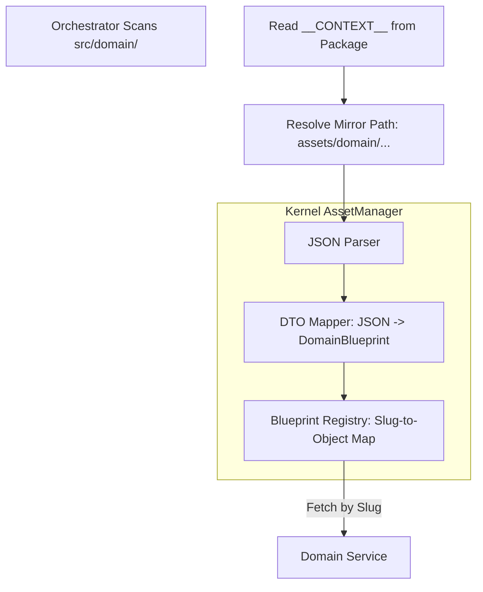

# ADR 010: Asset Management & Directory Mirroring

## Context
The Oregon Trail clone relies on **DomainBlueprints** (static "Global Truths") to hydrate its anemic state. To maintain the **Screaming MVC** philosophy, we need a system that decouples data from code while ensuring their relationship is discoverable, predictable, and strictly enforced.

Without a formal mirroring strategy, assets become a "junk drawer," making it impossible for the Kernel to automatically pair a `WagonRoot` with its `standard.json` configuration.

## Decision

### 1. The Directory Mirroring Mandate
We adopt a **Strict Physical Mirroring** strategy. The `assets/` directory must be a structural reflection of the `src/domain/` directory.

*   **Code Path:** `src/domain/{roots,leaves}/<package_name>/`
*   **Asset Path:** `assets/domain/{roots,leaves}/<package_name>/`

**The "Slug" Convention:**
Assets are identified by a dot-notated slug derived from their path:
`domain.<species>.<package>.<filename>` (e.g., `domain.roots.wagon.conestoga`).

### 2. The Asset Pipeline (The Bridge)
The connection between JSON and Python DTOs is facilitated by a central **AssetManager** service in the Kernel.

#### **The Loading Process**

### 3. Core Entities & Services

| Entity | Location | Role |
| :--- | :--- | :--- |
| **AssetManager** | `src/core/assets.py` | Central service for loading and retrieving blueprints. |
| **DomainBlueprint** | `src/core/contracts/` | The base class that JSON data must satisfy. |
| **AssetLoader** | `src/core/loaders/` | The low-level utility that reads files from the disk. |

---

## 4. Enforcement & Testing

### 4.1 Fitness Function: The "Mirror Audit"
A `pytest` suite will be implemented to enforce mirroring:
1.  **Scan:** Iterate through every package in `src/domain/`.
2.  **Verify:** Check if the corresponding path exists in `assets/`.
3.  **Validate:** Ensure every JSON file in the asset path successfully maps to the package's `DomainBlueprint` class.

### 4.2 Failure Protocol (The "Hard Fail" Policy)
If an asset is missing or the schema is invalid, the system follows a **Fail-Fast** workflow:

1.  **AssetNotFoundError:** If a mandatory asset (e.g., `default.json`) is missing during bootstrap, the `AssetManager` raises a `CriticalKernelError`.
2.  **TaxonomyMismatchError:** If the JSON keys do not match the `DomainBlueprint` fields, the loader fails immediately.
3.  **SystemHang:** The **Engine Orchestrator** will refuse to transition from the "Register" phase to the "Boot" phase if any mirrored asset path is empty or corrupt.

---

## 5. Consequences

### Pros
*   **Predictability:** Developers always know exactly where to put or find data.
*   **Automation:** The Kernel can "Auto-wire" blueprints based on path conventions.
*   **Validation:** Centralized loading ensures data integrity before the game ever starts.

### Cons
*   **Rigidity:** Moving a package in `src/` requires a corresponding move in `assets/`.
*   **Boilerplate:** Even a simple leaf must have a mirrored directory, even if empty initially.

## Status
**Proposed** 2026-04-17
