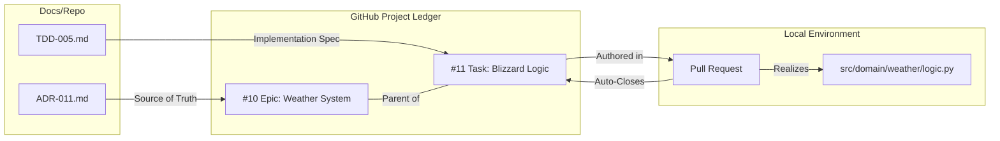

# ADR 011: Development Lifecycle and Workflow

## Context
As the Oregon Trail clone grows in complexity, the risk of "Architectural Drift" increases. To maintain the integrity of the **Screaming MVC** and **Anemic Aggregate** patterns, we require a rigorous, traceable workflow that ensures every line of code in `src/` is an intentional realization of an approved architectural decision.

We need to bridge the gap between **Documentation** (The "Why" and "How") and **Project Management** (The "When" and "Who") while ensuring that technical specs are detailed enough for autonomous implementation.

## Decision

### 1. The Four Laws of Oregon Trail Engineering
We enshrine the following mandates as the constitutional basis for all development:

*   **The Law of Provenance:** No code enters the `src/` directory unless it can be traced back to an **Issue**, which traces back to a **TDD**, which traces back to an **ADR**. Code without a lineage is considered "dark matter" and is subject to immediate removal.
*   **The Law of the Spec:** A Technical Design Document (TDD) is considered "Done" only when its **Detailed Design** contains enough information for an LLM or another developer to write the class stubs and method signatures without asking clarifying questions.
*   **The Law of Atomic PRs:** One Issue = One Branch = One Pull Request. Developers must not bundle unrelated systems (e.g., "Weather" and "Health") in the same sitting.
*   **The Law of Verification:** Every PR must pass the "Architectural Police" tests (Taxonomy, Ontology, and Isolation checks) before it is eligible for merge into `main`.

### 2. Hierarchy of Concerns
We decouple the **Documentation Layer** from the **Project Management Layer** to allow for flexible scheduling while maintaining rigid design integrity.

| Documentation Layer | Project Management Layer | Scale | Responsibility Example |
| :--- | :--- | :--- | :--- |
| **ADR** | **Epic** | Large / Strategic | "We will use an Event Bus for interaction." |
| **TDD** | **User Story / Feature** | Medium / Tactical | "The Health Domain must handle damage events." |
| **Contract Spec** | **Issue / Task** | Small / Operational | "Create the HealthRecord dataclass." |

### 3. Tracking and Traceability (The Metadata Ledger)
To realize the Law of Provenance, we utilize a **GitHub Project (v2)** as the authoritative ledger. This ledger syncs the Documentation Layer with the Execution Layer using custom fields and standardized frontmatter metadata.

#### **3.1 Frontmatter Requirements**
All documentation must include specific metadata to ensure the "Chain of Custody" is auditable both on and offline.

**For ADR Documents:**
*   **id**: (Required) The unique identifier (e.g., `ADR-011`).
*   **epic_link**: (Required) The URL to the corresponding GitHub Epic Issue. This bridges the Documentation Layer to the Project Management Layer.

**For TDD Documents:**
*   **id**: (Required) The unique identifier (e.g., `TDD-005`).
*   **parent_adr**: (Required) The ID or path of the ADR that authorized this design (e.g., `ADR-011`). This is the "Provenance" link.
*   **feature_link**: (Required) The URL to the corresponding GitHub Feature/User Story Issue.
*   **component**: (Required) The "Screaming" domain this design belongs to (e.g., `domain:health`, `core`, `engine`). This allows automated tools to verify that a TDD in a specific folder claims the correct component.

#### **3.2 Example Frontmatter**

**ADR Example:**
```yaml
id: ADR-011
title: "Development Lifecycle and Workflow"
status: proposed
epic_link: "https://github.com/user/repo/issues/10"
component: core
...
```

**TDD Example:**
```yaml
id: TDD-005
parent_adr: ADR-011
title: "TDD: DomainBlueprint Contract"
status: pending
feature_link: "https://github.com/user/repo/issues/11"
component: core
```

#### **3.3 Custom Fields (GitHub Project)**
The GitHub Project board must be configured with the following custom fields:

| Field Name | Type | Purpose |
| :--- | :--- | :--- |
| **Type** | Single Select | Categorize as Epic (ADR-level) or Task (TDD-level). |
| **ADR Link** | Text/URL | Direct link to the `docs/explanation/reports/adr/ADR-XXX.md` file. |
| **TDD Link** | Text/URL | Direct link to the `docs/explanation/design/TDD-XXX.md` file. |
| **Component** | Single Select | The "Screaming" Domain (e.g., health, weather, core). |
| **Cycle** | Iteration | Tracks which 2-week "Sprint" the work belongs to. |

#### **3.2 Hierarchical Mapping (Parenting)**
We utilize GitHub's **Tasklist** feature to enforce the hierarchy:
1.  **Epic Issue:** A "Placeholder" issue labeled `Epic` represents an ADR. The description contains the link to the ADR.
2.  **Child Issues:** Individual coding tasks (linked to a TDD) are added to the Epic's Tasklist.
3.  **Visual Progress:** GitHub automatically displays progress bars (e.g., "4 of 6 tasks") on the Epic, providing at-a-glance status of the ecosystem.

#### **3.3 The Chain of Custody (Visualized)**


### 4. Automated Workflow "Laws"
To minimize the "Maintenance Burden," we utilize GitHub's native automation:
1.  **The "Linked PR" Requirement:** No PR may be merged unless it uses the `Closes #ISS` keyword. This automatically moves the Issue to **Done** in the Project Ledger.
2.  **Status Sync:** When an Issue is moved to "In Progress" on the board, GitHub can automatically create a branch with the correct naming convention (e.g., `42-health-record-dataclass`).

### 5. The "Screaming" Board Views
The GitHub Project should include three specific views to monitor compliance:
*   **The Roadmap (Strategic):** Filters by `Type: Epic`. Shows high-level progression of ADRs.
*   **The Kanban (Operational):** Filters by `Status`. The daily "Builder" view for moving tasks.
*   **The Audit (Compliance):** A table view that highlights any Issue where the `TDD Link` or `ADR Link` is empty, enforcing the Law of Provenance.

## Proposed Artifacts
*   **`docs/explanation/reports/status/issue_ledger.md`**: (Optional) A local registry for tracking the cross-references between ADRs, TDDs, and Issues.

## Consequences

### Pros
*   **Zero Drift:** Ensures code never outpaces design.
*   **Visualizes Metabolism:** GitHub's automated progress bars provide a "Heartbeat" for the project.
*   **Eliminates "Dark Matter":** The Audit View makes it impossible for code to sneak in without documentation.
*   **Auditability:** Every bug or feature has a clear paper trail to the original decision.

### Cons
*   **Overhead:** Requires more "Up-front" work before a single line of code is written.
*   **Initial Setup:** Requires manually adding links to the GitHub Project fields for every new design.
*   **Rigidity:** Slows down "Spike" development or rapid prototyping.

## Status
**Proposed** 2026-04-17
