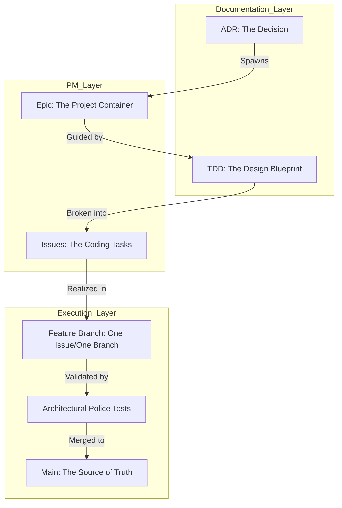

# ADR 011: Development Lifecycle and Workflow

## Context
As the Oregon Trail clone grows in complexity, the risk of "Architectural Drift" increases. To maintain the integrity of the **Screaming MVC** and **Anemic Aggregate** patterns, we require a rigorous, traceable workflow that ensures every line of code in `src/` is an intentional realization of an approved architectural decision.

We need to bridge the gap between **Documentation** (The "Why" and "How") and **Project Management** (The "When" and "Who") while ensuring that technical specs are detailed enough for autonomous implementation.

## Decision

### 1. The Four Laws of Oregon Trail Engineering
We enshrine the following mandates as the constitutional basis for all development:

*   **The Law of Provenance:** No code enters the `src/` directory unless it can be traced back to an **Issue**, which traces back to a **TDD**, which traces back to an **ADR**. Code without a lineage is considered "dark matter" and is subject to immediate removal.
*   **The Law of the Spec:** A Technical Design Document (TDD) is considered "Done" only when its **Detailed Design** contains enough information for an LLM or another developer to write the class stubs and method signatures without asking clarifying questions.
*   **The Law of Atomic PRs:** One Issue = One Branch = One Pull Request. Developers must not bundle unrelated systems (e.g., "Weather" and "Health") in the same sitting.
*   **The Law of Verification:** Every PR must pass the "Architectural Police" tests (Taxonomy, Ontology, and Isolation checks) before it is eligible for merge into `main`.

### 2. Hierarchy of Concerns
We decouple the **Documentation Layer** from the **Project Management Layer** to allow for flexible scheduling while maintaining rigid design integrity.

| Documentation Layer | Project Management Layer | Scale | Responsibility Example |
| :--- | :--- | :--- | :--- |
| **ADR** | **Epic** | Large / Strategic | "We will use an Event Bus for interaction." |
| **TDD** | **User Story / Feature** | Medium / Tactical | "The Health Domain must handle damage events." |
| **Contract Spec** | **Issue / Task** | Small / Operational | "Create the HealthRecord dataclass." |

### 3. Tracking and Traceability
#### **Identification and Numbering**
*   **Documentation IDs:** Use the three-digit sequential prefix (e.g., `ADR-011`, `TDD-005`).
*   **Project Management IDs:** Use a `#` prefix for GitHub/Local Issues (e.g., `ISS-42`).
*   **Mapping:** The link is maintained via **Frontmatter** in documentation and **Task Lists** in TDDs.

#### **The Chain of Custody (Visualized)**

### 4. Association Management
To prevent the "Lost Work" problem, we adopt two tracking methods:
1.  **Parenting:** In the Project Management tool, every Issue MUST be parented to an Epic.
2.  **The TDD Task List:** Every TDD must include an **Implementation Section** that lists the specific Issue numbers created to fulfill the design.

## Proposed Artifacts
*   **`docs/explanation/workflow.md`**: An "Understanding-oriented" guide explaining this philosophy to new contributors.
*   **`docs/explanation/reports/status/issue_ledger.md`**: (Optional) A local registry for tracking the cross-references between ADRs, TDDs, and Issues.

## Consequences

### Pros
*   **Zero Drift:** Ensures code never outpaces design.
*   **Autonomous Implementation:** TDDs are detailed enough for AI/Dev assistance without friction.
*   **Auditability:** Every bug or feature has a clear paper trail to the original decision.

### Cons
*   **Overhead:** Requires more "Up-front" work before a single line of code is written.
*   **Rigidity:** Slows down "Spike" development or rapid prototyping.

## Status
**Proposed** 2026-04-17
