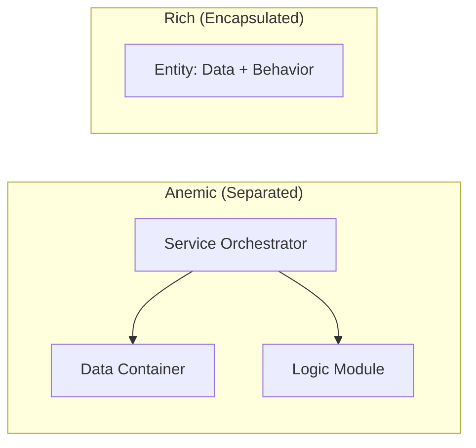

# Anemic vs. Domain Driven Models

This document clarifies the difference between **Anemic Domain Models** and **Domain Driven (Rich) Models**, and why this project intentionally chooses the Anemic approach.

## 1. The Anemic Domain Model (Current Project Approach)

In an Anemic model, state and behavior are strictly separated. The Entities (Models) are simple data containers, while the logic resides in separate Service or Logic modules.

### Characteristics:
-   **Entities**: Python dataclasses with no methods other than structural validation.
-   **Logic**: Pure, stateless functions that take models as input and return new states or values.
-   **Services**: Orchestrate the application of logic to state.

### Python Example:
```python
# models.py (The State)
@dataclass
class HealthRecord:
    current_hp: int
    max_hp: int

# logic.py (The Math/Rules)
def calculate_damage(record: HealthRecord, damage: int) -> int:
    return max(0, record.current_hp - damage)

# service.py (The Hand/Orchestrator)
class HealthService:
    def apply_injury(self, record: HealthRecord, damage: int):
        record.current_hp = logic.calculate_damage(record, damage)
```

---

## 2. The Domain Driven / Rich Model

In a Rich model, behavior and state are encapsulated within the same class. This is the classic Object-Oriented approach favored by traditional Domain-Driven Design (DDD).

### Characteristics:
-   **Entities**: Classes that hold data and implement the "verbs" (methods) that act on that data.
-   **Encapsulation**: The internal state is often protected, and changes must go through the entity's methods.

### Python Example:
```python
# models.py (State + Behavior)
class HealthRecord:
    def __init__(self, hp: int):
        self._current_hp = hp
        self._max_hp = hp

    def apply_injury(self, damage: int):
        """The logic lives inside the data container."""
        self._current_hp = max(0, self._current_hp - damage)
        
    @property
    def current_hp(self):
        return self._current_hp
```

---

## 3. Visual Comparison



---

## 4. Why Oregon Trail Uses the Anemic Model

While "Anemic" is often used pejoratively in DDD circles, it offers significant advantages for this specific engine:

1.  **Testability**: Pure logic functions (in `logic.py`) are trivial to unit test without any setup or mocking.
2.  **Serialization**: Simple dataclasses are much easier to save/load (JSON) than complex objects with internal methods and hidden state.
3.  **Functional Purity**: It encourages a functional programming style that reduces side effects and makes game state transformations more predictable.
4.  **Decoupling**: The "physics" of the game (Logic) is completely decoupled from the "plumbing" of the game (Services).
