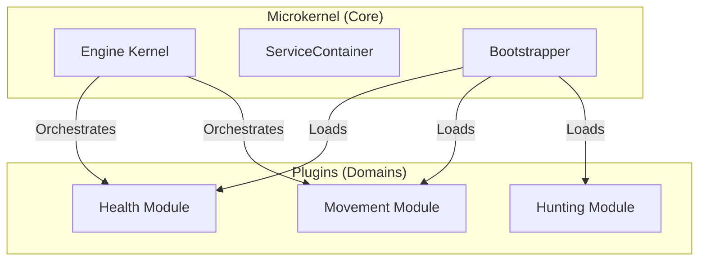

# Microkernel Architecture

**Microkernel Architecture** (also known as Plugin Architecture) is a pattern that separates a minimal functional core (the kernel) from the system's extended functionality (the plugins). The kernel provides the foundational environment, while plugins add specialized features.

## Core Principles

1.  **Core Minimality**: The kernel should only contain the bare minimum logic required to run the system.
2.  **Plugin Independence**: Plugins are independent modules that can be added or removed without affecting the kernel.
3.  **Communication Protocols**: The kernel and plugins interact via well-defined APIs or contracts.

## Implementation in Oregon Trail

The Oregon Trail engine follows this pattern by treating the `ServiceContainer` and `Engine` as the kernel, and the `domain/` packages as plugins.



## Benefits

-   **Flexibility**: Features can be added, updated, or removed with minimal impact on the overall system.
-   **Isolation**: Bugs in a plugin (e.g., a "Hunting" logic error) are less likely to crash the core engine.
-   **Extensibility**: The system can be extended indefinitely without bloating the kernel.

## Example: The Bootstrapping Process

The kernel uses a **Bootstrapper** to discover and initialize plugins.

```python
# The Microkernel (src/main.py)
class Bootstrapper:
    def __init__(self, container):
        self.container = container

    def load_plugins(self, plugins):
        for plugin in plugins:
            # The kernel knows HOW to boot, but doesn't know WHAT is inside.
            plugin.register(self.container)
            plugin.boot(self.container)

# The Plugin (src/domain/health/provider.py)
class HealthServiceProvider(BaseServiceProvider):
    def register(self, container):
        # Plugin 'plugs in' its specific logic
        container.bind("health_service", HealthService())
```
