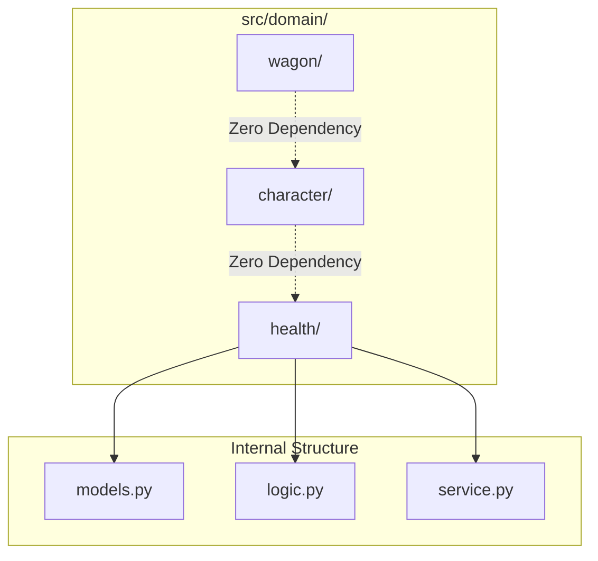

# Modular Architecture

**Modular Architecture** is a design practice that emphasizes separating the functionality of a system into independent, interchangeable modules. Each module contains everything necessary to execute a specific aspect of the system's overall functionality.

## Core Principles

1.  **Strict Boundaries**: Modules interact only through well-defined interfaces (Architecture Contracts).
2.  **High Cohesion**: Everything inside a module relates to a single responsibility (e.g., the `health` domain only handles health logic).
3.  **Low Coupling**: Modules do not depend on each other's internal implementation details.
4.  **Zero-Dependency Leaf Policy**: In the Oregon Trail engine, leaf packages (like `health` or `character`) are prohibited from importing sibling packages.

## Implementation in Oregon Trail

The project uses "Screaming Architecture" to organize these modules. Instead of grouping by technical role (models, views), we group by functional domain.



## Benefits

-   **Testability**: Individual domains can be unit-tested in complete isolation.
-   **Parallel Development**: Different developers can work on different domains without merge conflicts.
-   **Maintainability**: Changes in one domain (e.g., updating health calculations) cannot accidentally break another domain (e.g., wagon movement).

## Example: The "Zero-Dependency" Rule

A common mistake is allowing a `CharacterService` to import a `HealthService`. Under Modular Architecture, this is forbidden. Instead, the **Engine (Orchestrator)** or the **Service Container** coordinates the interaction.

```python
# WRONG (Tightly Coupled)
from src.domain.health.service import HealthService

class CharacterService:
    def tick(self, character):
        self.health_service.apply_starvation(character)

# RIGHT (Modular)
class CharacterService:
    def tick(self, character):
        # CharacterService only manages character data.
        # The Engine will separately trigger the HealthService.
        pass
```
