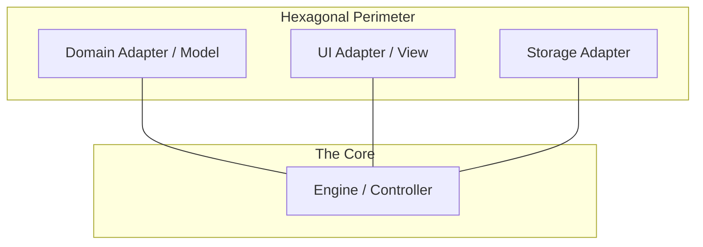

# MVC vs. Hexagonal Architecture

This project employs a **Hybrid Architecture** that combines the organizational strengths of **MVC** with the isolation and decoupling of **Hexagonal Architecture (Ports & Adapters)**.

## 1. MVC: The Organizational Hierarchy

MVC (Model-View-Controller) focuses on the **internal responsibility** of components. It answers the question: "What is this component's role in the system?"

-   **Model**: The Domain (Data and Logic).
-   **View**: The UI (Presentation).
-   **Controller**: The Engine (Orchestration).

### Best Use-Cases for MVC:
-   Standard web applications.
-   Clear hierarchical structures.
-   When the relationship between data, logic, and UI is direct and straightforward.

---

## 2. Hexagonal: The Boundary Pattern

Hexagonal Architecture focuses on the **external boundaries** and decoupling the **Core** from its dependencies. It answers the question: "How does the system talk to the outside world?"

-   **The Core (Inside)**: The Engine Kernel. It defines **Ports** (Protocols).
-   **The Adapters (Outside)**: Domain Packages, UI, Storage. They plug into the Ports.

### Best Use-Cases for Hexagonal:
-   Systems requiring high testability (can mock any adapter).
-   Plugin-based architectures (like a game engine with many domains).
-   When the technology (DB, UI) is likely to change or needs to be swapped.

---

## 3. How They Work Together (The Hybrid Approach)

In Oregon Trail, the two architectures are mapped together to create a robust system:

| Layer | MVC Role | Hexagonal Role | Responsibility |
| :--- | :--- | :--- | :--- |
| **Engine Kernel** | **Controller** | **The Core** | Orchestrates the flow and defines the Protocols (Ports). |
| **Domain Packages** | **Model** | **Adapters** | Implements the game logic and "plugs into" the Engine. |
| **UI Components** | **View** | **Adapters** | Handles interaction without knowing the Core logic. |

---

## 4. When They Should NOT Work Together

Combining these patterns adds complexity. You should avoid the hybrid approach if:
1.  **The Project is Small**: A simple script or small utility doesn't need the overhead of Hexagonal boundaries.
2.  **Performance is Absolute**: The extra layers of indirection (Protocols/Adapters) can introduce minor overhead (usually negligible in a text-based game).
3.  **Tightly Coupled Logic**: If your logic is deeply entwined with your UI or Database, trying to force Hexagonal boundaries will lead to "Over-Engineering" and frustration.

## 5. Summary

-   **MVC** organizes your code by **layer**.
-   **Hexagonal** protects your code by **boundary**.
-   **Together**, they ensure that the Oregon Trail engine is both easy to understand and extremely modular.
