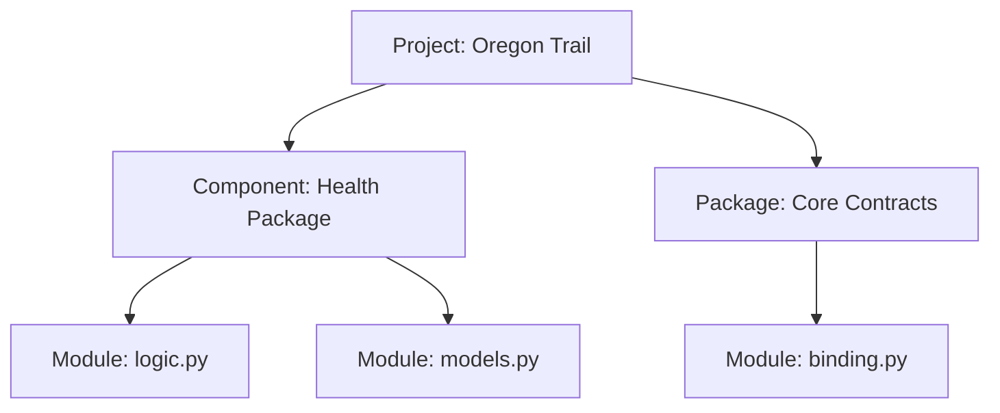

# Packages, Modules, and Components

In Python development, understanding the hierarchy of code organization is essential for maintaining a clean and professional project structure.

## 1. Modules: The Building Blocks

A **Module** is a single Python file (`.py`). it is the most basic unit of code organization.

-   **Role**: Contains specific functions, classes, or constants related to a narrow task.
-   **Example**: `src/domain/health/logic.py` is a module that contains pure health logic.

---

## 2. Packages: The Collections

A **Package** is a directory that contains an `__init__.py` file and one or more modules. Packages allow you to group related modules together under a common namespace.

-   **Role**: Organizes related modules into a functional group.
-   **Example**: `src/domain/health/` is a package containing `models.py`, `logic.py`, `service.py`, and `provider.py`.

---

## 3. Components: The Architectural Units

A **Component** is a conceptual unit of functionality. In this project, a Component is typically implemented as a **Package** that follows a specific **Archetype** (like the Universal Domain Blueprint).

-   **Role**: Represents a "Bounded Context" or a major sub-system (e.g., the Health Component, the Character Component).
-   **Note**: All Components are Packages, but not all Packages are Components. A Component implies a higher level of architectural responsibility and interface consistency.

---

## 4. The Hierarchy

## Summary Table

| Unit | Physical Form | Primary Goal | Example |
| :--- | :--- | :--- | :--- |
| **Module** | `.py` file | Code reuse. | `logic.py` |
| **Package** | Directory + `__init__.py` | Namespace organization. | `src/domain/health/` |
| **Component** | Standardized Package | Architectural modularity. | The Health Domain. |
