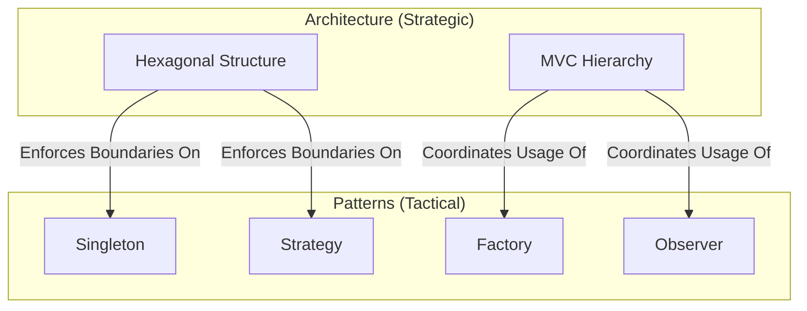

# Patterns vs. Architecture

Understanding the distinction between **Patterns** and **Architecture** is crucial for maintaining a clean and scalable codebase. While they are related, they operate at different levels of abstraction and scope.

## 1. The Core Difference

| Attribute | Pattern | Architecture |
| :--- | :--- | :--- |
| **Scope** | Local / Tactical | Global / Strategic |
| **Focus** | How to solve a specific problem. | How the whole system is structured. |
| **Analogy** | The blueprint for a door or window. | The blueprint for the entire house. |
| **Changeability** | Can often be swapped within a module. | Hard and expensive to change once established. |

### Architecture (The "Macro" View)
Architecture defines the high-level structure, the boundaries between major systems, and the "laws" of communication. It is the strategic decision-making that guides the entire project's evolution.

**Example in Oregon Trail:**
*   **Hexagonal Architecture**: Defines that the Engine is the core and everything else (Domain, UI, Storage) are pluggable adapters.
*   **Microkernel Architecture**: Defines the ServiceContainer as the hub for all extensions.

### Patterns (The "Micro" View)
Patterns are recurring solutions to specific, localized problems within the architectural layers. They provide a common language and proven approach for tactical implementation.

**Example in Oregon Trail:**
*   **Singleton Pattern**: Used within the ServiceContainer to ensure only one instance of a service exists.
*   **Observer Pattern**: Used for event-driven communication between domains.

---

## 2. Visualizing the Relationship

Architecture provides the "container" or "landscape," while patterns provide the "tools" and "structures" within that container.

---

## 3. When a Pattern Becomes Architecture

Sometimes, a pattern is applied so consistently across the entire system that it effectively becomes part of the architecture. This is often called an **Architectural Pattern**.

**Example: The Service Provider Pattern**
In this project, the Service Provider is used globally to handle the lifecycle of every module. While it is technically a pattern, it is a foundational "law" of the system's architecture.

## 4. Summary

-   **Architecture** is about **Organization and Constraints**. It answers "Where does this go?" and "Who can talk to whom?"
-   **Patterns** are about **Implementation and Problem-Solving**. They answer "How do I structure this specific logic?"
